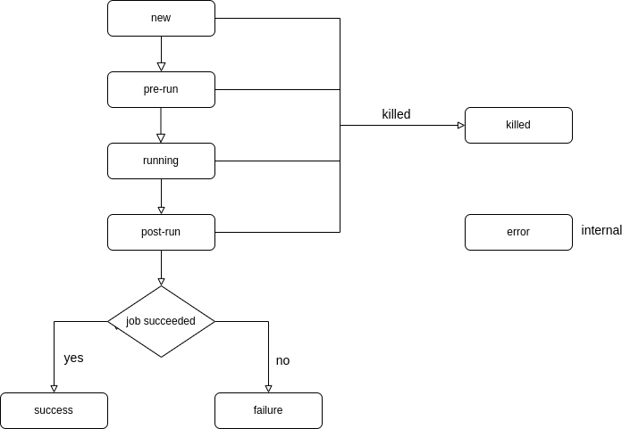
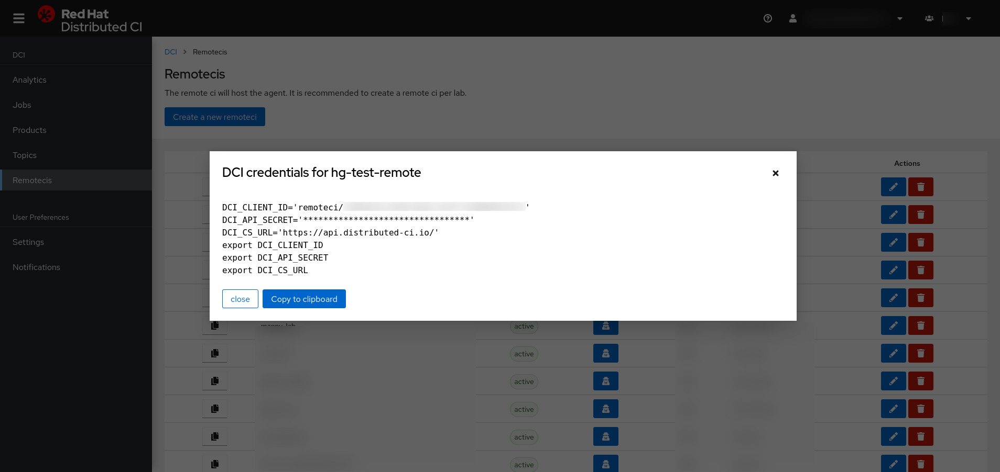

Title: Introduction to the Red Hat Distributed CI Python API
Date: 2022-04-04 10:24
Category: DCI
Tags: introduction, dci
Slug: introduction-to-the-red-hat-distributed-ci-python-api
Author: Haïkel Guémar
Github: hguemar
Summary: In a previous post, you have been introduced to Red Hat Distributed CI (DCI) infrastructure and how it enables Red Hat partners to integrate into Red Hat CI workflow. Now, we will be focusing on how to interact with DCI through the Python API.

## How to interact with DCI infrastructure

DCI provides multiple ways to interact:

- Web UI through distributed-ci.io
- Command-line with dcictl `pip install python-dciclient`
- REST API
- Python API

In this article, we will be focusing on Python API. The Python API is a convenient light wrapper to the REST API.
It will enable you to create reporting tools, utilities or even new agents.

## DCI HMAC-based authentication

To provide secure and robust authentication, DCI has implemented [AWS Signature v4](https://docs.aws.amazon.com/general/latest/gr/sigv4-signed-request-examples.html).
It works by using signed headers using your credentials and SHA-256 hash function, through [HMAC](https://en.wikipedia.org/wiki/HMAC).
The [dciauth](https://pypi.org/project/dciauth/) makes it easy to generate headers and validate requests in Python.

You absolutely need to be authenticated and have proper permissions to access

## DCI Python API

Please refer to the [introductory blog post to DCI](introduction-to-the-red-hat-distributed-ci.html) for higher level overview of our infrastructure as it is necessary to understand the following concepts.

Before we get started, let's dive into some important API resources:

### Products ###

A product is merely a Red Hat product that is distributed by DCI. (e.g: RHEL, RHOSP, OpenShift)

### Topics ###

A topic is a version/variant of a product. (e.g: RHEL8.7, RHEL8.1, RHEL7.9)

### Components ###

A component is an artifact (e.g: file, url) attached to a topic.
Artifacts can be downloaded through the [dci-downloader](https://github.com/redhat-cip/dci-downloader) utility by specifying the topic, some filters are available.

### Jobs

A job represent a run of an agent through a remoteci.

A Job goes through various states:

* pre-run: downloading required artifacts
* running: deploying the product
* running: running default and user-defined tests
* post-run: uploading some logs and tests results
* success, failure, error: final status

## Hands-on

First, you'll need your credentials in a dcirc.sh file which will look like this:

    :::bash
    DCI_CLIENT_ID='remoteci/XXXX'
    DCI_API_SECRET='XXXXXXX'
    DCI_CS_URL='https://api.distributed-ci.io/'
    export DCI_CLIENT_ID
    export DCI_API_SECRET
    export DCI_CS_URL

If needed, you can read the next paragraph to learn how to retrieve them, otherwise, you can skip it.

### Retrieving your credentials

You need to connect to the [DCI web board](https://distributed-ci.io), go to the remotecis tab on the left side.
Then, look for your remoteci and click on the blue button in the Authentication column (see image below).
A popup will display the cont

### Installing Python DCI libraries

Recommended way to install Python DCI libraries either by RPM package or Python native package (Pypi).

RPM installation:

    :::bash
    # On RHEL7
    $ yum -y install https://packages.distributed-ci.io/dci-release.el7.noarch.rpm
    $ yum install python-dciclient
    # On RHEL8
    $ yum -y install https://packages.distributed-ci.io/dci-release.el8.noarch.rpm
    $ yum install python-dciclient

Python native package installation:

    :::bash
    $ pip install dciclient

### Authentication

The first thing, you will need to do is to create an authentication context. Context are required
in all API calls to authenticate your requests.
Authentication context objects will authenticate your request, there are three types of context:

- Single Sign On: using your SSO credentials
- DCI: using your DCI web board credentials
- Signature: using your remoteci credentials

For this hands-on, we will be using signature types context.

    :::python
    import os
    from dciclient.v1.api import context

    # You need to source your dcirc.sh credentials file
    # before execution:
    # $ source dcirc.sh
    dci_client_id = os.getenv("DCI_CLIENT_ID")
    dci_api_secret = os.getenv("DCI_API_SECRET")
    ctx = context.build_signature_context(dci_client_id, dci_api_secret)

In the next paragraph, we will skip this part to keep examples shorts and readable.

### Our first API Calls

Let's to try list available topics to your remoteci.
For the sake of simplicity, we will use json module to parse the server REST API response.

    :::python
    import json
    from dciclient.v1.api import topic

    response = topic.list(ctx)
    status_code = response.status_code # value will be 200
    content = json.loads(response.content)

Two interesting values from the response object:

- status_code: indicates the status of your request according [REST best practices](https://developer.mozilla.org/en-US/docs/Web/HTTP/Status). e.g: '200' means success, '201' means a resource was created, '40X' indicate errors
- content: the content of the response from the server in the form of a json document.

But requests can also accepts filters:

    :::python
    response = topic.list(ctx, where="name:RHEL-8.6")
    status_code = response.status_code # 200
    content = json.loads(response.content)

Then, if we try to look what's inside the content:

    {'_meta': {'count': 1},
     'topics': [{'component_types': ['compose'],
       'component_types_optional': [],
       'created_at': '2021-10-11T11:00:11.692662',
       'data': {},
       'etag': '649dfc2cde7a45fbb7398ad6fcb9ae11',
       'export_control': True,
       'id': '3b8d7315-a941-467f-95ff-b789230bd50b',
       'name': 'RHEL-8.6',
       'next_topic': None,
       'next_topic_id': None,
       'product': {'created_at': '2017-08-21T13:22:41.891867',
        'description': 'RHEL is a Linux distribution developed by Red Hat and targeted toward the commercial market',
        'etag': '2a32426c22e893e988c5905f24d2bb69',
        'id': 'b3d8d6f3-8223-4553-bf08-9b2cecb869f2',
        'label': 'RHEL',
        'name': 'RHEL',
        'state': 'active',
        'updated_at': '2018-02-20T12:36:33.595643'},
       'product_id': 'b3d8d6f3-8223-4553-bf08-9b2cecb869f2',
       'state': 'active',
       'updated_at': '2022-02-28T17:12:53.874986'}]}

We can notice few fields:

- id: which will be used to reference the topic through the API
- etag: a fingerprint of the resource requested (see below)
- name: human readable name
- state: active/inactive
- next_topic: informations on the next version
- product: product informations
- created_at: date creation of the topic
- updated_at: last update date

Note that every resource in DCI that is available through the REST API has an unique identifier (id), and
that every response will include an [Entity Tag Header (ETag)](https://developer.mozilla.org/en-US/docs/Web/HTTP/Headers/ETag)
that identify a specific version of that resource. It saves bandwith by leveraging client-side cache, and prevent mid-air
collisions during concurrent write access.

For the next part, we will need to list components to create our first job.

    :::python
    id = response_topics['topics']['id']
    response = topic.list_components(ctx, '3b8d7315-a941-467f-95ff-b789230bd50b')
    content = json.loads(response.content)

Since the output is a tad long, we will truncate it

    {'_meta': {'count': 112},
     'components': [{'canonical_project_name': 'RHEL-8.6.0-20220404.2',
       'created_at': '2022-04-05T09:59:37.236451',
       'data': {'arches': ['x86_64', 's390x', 'ppc64', 'ppc64le'],
        'channel': 'nightly',
        'major': '8',
        'minor': '6',
        'name': 'RHEL-8.6.0-20220404.2',
        'patch': '0',
        'product': 'RHEL',
        'tags': ['nightly'],
        'type': 'compose',
        'url': 'http://download.eng.bos.redhat.com/rhel-8/nightly/RHEL-8/RHEL-8.6.0-20220404.2/',
        'url_hostname': 'download.eng.bos.redhat.com',
        'url_path': '/rhel-8/nightly/RHEL-8/RHEL-8.6.0-20220404.2/',
        'version': '8.6.0'},
       'etag': '6795c72e610d5399ba0ed7a1dc5cbfcd',
       'id': '17144fb6-7f4f-4f1e-86ae-b5c95b5675ef',
       'message': None,
       'name': 'RHEL-8.6.0-20220404.2',
       'released_at': '2022-04-05T09:59:37.237918',
       'state': 'active',
       'tags': ['nightly', 'kernel:4.18.0-372.5.1.el8'],
       'team_id': None,
       'title': None,
       'topic_id': '3b8d7315-a941-467f-95ff-b789230bd50b',
       'type': 'compose',
       'updated_at': '2022-04-05T14:56:37.696052',
       'url': 'http://download.eng.bos.redhat.com/rhel-8/nightly/RHEL-8/RHEL-8.6.0-20220404.2'},
     (..)
    ]}

Some relevant information:

- components: list of component as a dict
- name: name of the component (for RHEL, snapshot name)
- id: reference to the compoennt
- etag: a fingerprint of the resource requested
- data: contains some relevant information specific to the product. e.g: for RHEL, hardware arches, channel, major, minor version etc.
- tags: additional information. e.g: for RHEL, kernel version
- product: kinda explicit here ;-)
- type: component type. e.g: for RHEL, should be compose
- topic_id: reference to the parent topic
- created_at: date of creation of the component
- update_at: date of update of the component
- released_at: date of publication of the component in the Red Hat Release Engineering infrastructure

And now we're ready to create our first job !

### Our first DCI job

Let's a create a job from the API:

    :::python
    response = job.create(ctx, topic_id='a35675ca-e749-4e89-9b86-61191fc9fed4', components=["bc3766e0-35e9-4ab9-9e7a-b309c9e85270"])
    status_code = response.status_code # 201 (a resource was created)
    content = json.loads(response.content)

    {'job': {'client_version': 'python-dciclient_2.2.1',
      'comment': None,
      'configuration': None,
      'created_at': '2022-04-06T09:52:09.313737',
      'data': {},
      'duration': 0,
      'etag': 'a86cb94d3e7eeaf1996c67972a2427d7',
      'id': 'f0956ebf-5bdb-47b2-96c0-0f07a6ed4e02',
      'name': None,
      'previous_job_id': None,
      'product_id': 'b3d8d6f3-8223-4553-bf08-9b2cecb869f2',
      'remoteci_id': '334ddc4d-e350-4b9c-a07f-45a9044117fe',
      'state': 'active',
      'status': 'new',
      'status_reason': None,
      'tags': [],
      'team_id': '47513c50-d5a5-4d93-a63f-f6545a3313fc',
      'topic_id': 'a35675ca-e749-4e89-9b86-61191fc9fed4',
      'update_previous_job_id': None,
      'updated_at': '2022-04-06T09:52:09.313737',
      'url': None,
      'user_agent': 'python-dciclient_2.2.1'}}

Now we can delete our job using

    :::python
    response = job.delete(ctx, 'f0956ebf-5bdb-47b2-96c0-0f07a6ed4e02', 'a86cb94d3e7eeaf1996c67972a2427d7')
    status_code = response.status_code # 204 resource delete
    content = json.loads(response.content) # empty string :)

## Conclusion

It's just the tip of the iceberg, the DCI Python API is quite rich, and allows you to do a lot more including administration tasks. With this API, you can create new agents, dedicated dashboards, manipulate jobs, uploading test files etc.

For more insight on the Python, do not hesitate to ping us.

## Stay tuned !

[Distributed CI documentation](https://docs.distributed-ci.io)
