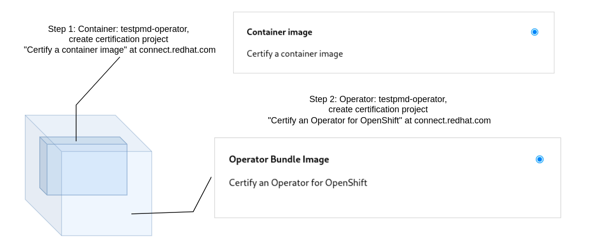
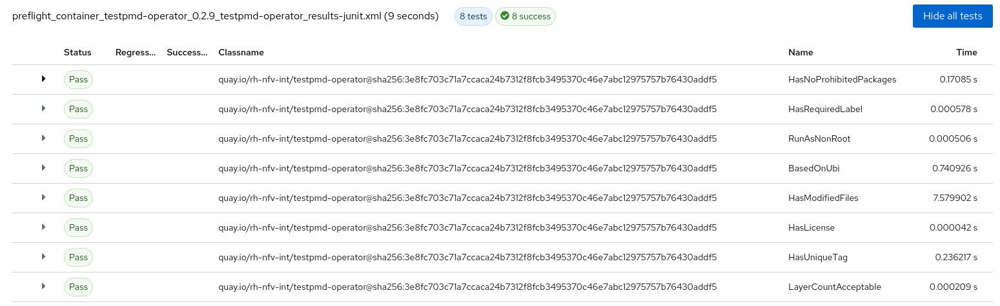
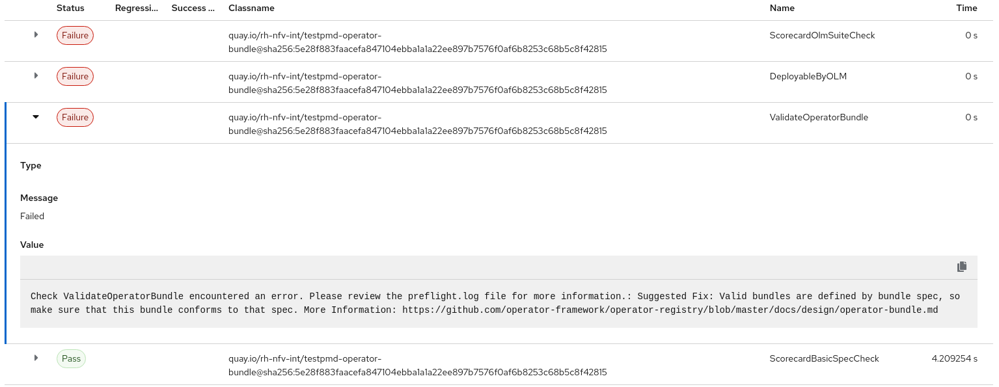
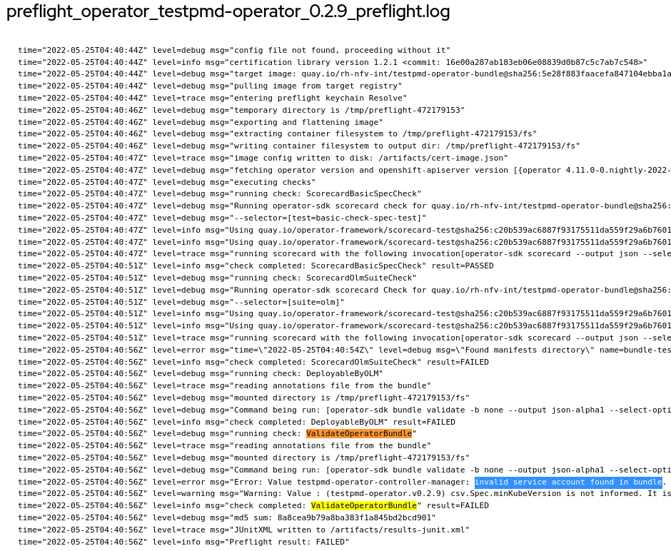
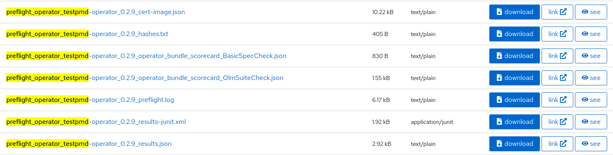
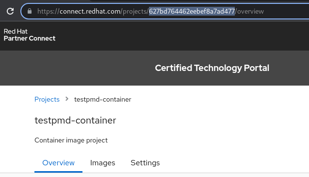
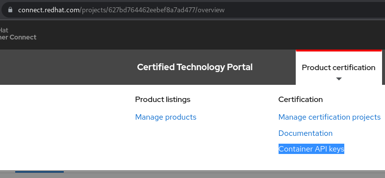
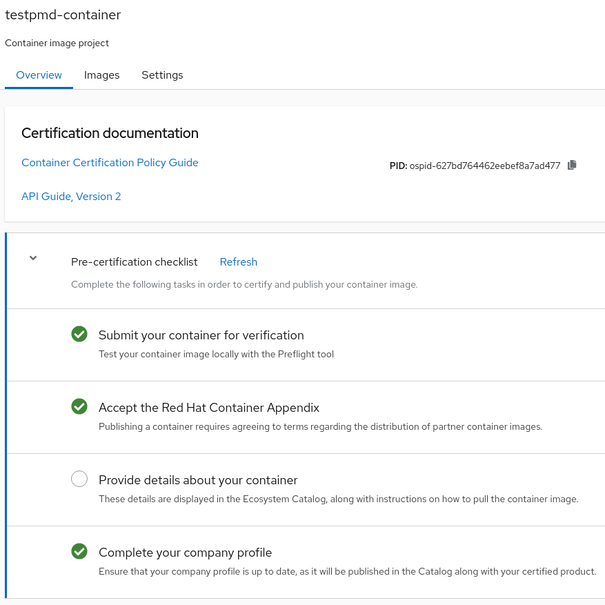

Title: Certification tests for OpenShift containers and operators: how to run with DCI
Date: 2022-05-30 10:00
Category: how-to
Tags: partners, certification, operator-certification, container-certification, preflight, dci-openshift-app-agent
Slug: preflight-integration-in-dci
Author: Tatiana Krishtop
Github: tkrishtop
Summary: This post has some practical information about running Preflight certification suites with DCI. You will learn how to run the tests, debug using log files, and submit the results for the certification. All this is an embedded functionality offered by DCI.

This post has some practical information about running Preflight certification suites with DCI. You will learn how to run the tests, debug using log files, and submit the results for the certification. All this is an embedded functionality offered by DCI.

Prerequisites:

- [DCI](https://blog.distributed-ci.io/introduction-to-the-red-hat-distributed-ci.html) is Red Hat Distributed CI, written in Ansible.

- [Preflight](https://github.com/redhat-openshift-ecosystem/openshift-preflight) is a command-line interface for validating if OpenShift operator bundles and containers meet minimum requirements for Red Hat OpenShift Certification.

## Certification suites required for the operator certification

[Preflight](https://connect.redhat.com/blog/container-certification-tooling-ready-takeoff) offers two certification suites: `check container` and `check operator`. To fully certify an operator, you have to certify all containers used by that operator and then certify the operator.

*Fig. 1. Certification steps.*
{:align=center}

Let’s run these test suites for the [testpmd-operator](https://github.com/rh-nfv-int/testpmd-operator), often used as an as-is forwarder for the traffic testing. It uses one container: testpmd-operator. That means you have two certification projects ahead of you: a container certification project to certify an operator image and an operator certification project to certify a bundle image. If you work in a disconnected environment and have to handle the mirroring, the overall certification scenario could become quite complex.

The good news is that DCI handles all this complexity for you. All you need is to manually create the certification projects in [connect.redhat.com](connect.redhat.com) and provide DCI with their IDs and bundle image reference.

## How to run Preflight tests with DCI

Let’s start with the situation when the OCP cluster is already up and running and the dci-openshift-app-agent is installed with RPM. Please follow the next three steps to execute all needed Preflight certification suites.

1. Export kubeconfig:

        export KUBECONFIG=/var/lib/dci-openshift-app-agent/kubeconfig

2. Create file [settings.yml](https://github.com/redhat-cip/dci-openshift-app-agent/tree/master/roles/preflight) in /etc/dci-openshift-app-agent/settings.yml and provide all the information about your certification projects. Let’s consider two standard scenarios here.

    a. If you have a connected environment with the private external registry.

        $ cat /etc/dci-openshift-app-agent/settings.yml
        ---
        # Job name and tags to be displayed in DCI UI
        dci_name: "Testpmd-Operator-Preflight"
        dci_tags: ["debug", "testpmd-operator"]

        do_preflight_tests: true

        # Optional, please provide these credentials
        # if your registry is private.
        partner_creds: "/opt/pull-secrets/partner_config.json"

        # List of operators to certify,
        # you could provide many operators at once.
        preflight_operators_to_certify:
        - bundle_image: "quay.io/rh-nfv-int/testpmd-operator-bundle:v0.2.9"
        # Mandatory for the connected environments.
        index_image: "quay.io/rh-nfv-int/nfv-example-cnf-catalog:v0.2.9"
        # Optional; provide it when you need to submit test results.
        # It's an id of your Container Image Project
        # https://connect.redhat.com/projects/my_nice_container_id
        pyxis_container_identifier: "my_nice_container_id"

        # Optional; provide it when you need to submit test results.
        # This token is shared between all your projects.
        # To generate it: connect.redhat.com -> Product certification ->
        # Container API Keys -> Generate new key
        pyxis_apikey_path: "/opt/cache/pyxis-apikey.txt"
        ...

    b. There is a disconnected environment with the self-signed local registry and operator images in the external private registry. In the case of a disconnected environment, DCI would handle all the mirroring and regenerate a catalog image.

        $ cat /etc/dci-openshift-app-agent/settings.yml
        ---
        # job name and tags to be displayed in DCI UI
        dci_name: "Testpmd-Operator-Preflight"
        dci_tags: ["debug", "testpmd-operator"]

        do_preflight_tests: true
        # Mandatory for disconnected environment,
        # this registry is used for mirrored images
        # and to store an index (catalog) image.
        provisionhost_registry: registry.local.lab:4443
        # Credentials for your private registries.
        # You could have several private registries:
        # local and another external, to store the operator.
        # In this case, please provide all credentials here.
        partner_creds: "/opt/pull-secrets/partner_config.json"

        # List of operators to certify,
        # you could provide many operators at once.
        preflight_operators_to_certify:
        # In disconnected environments provide a digest (SHA) and not a tag.
        - bundle_image: "quay.io/rh-nfv-int/testpmd-operator-bundle@sha256:5e28f883faacefa847104ebba1a1a22ee897b7576f0af6b8253c68b5c8f42815"

        # Optional, provide it when you need to submit test results.
        # It's an id of your Container Image Project
        # https://connect.redhat.com/projects/my_nice_container_id
        pyxis_container_identifier: "my_nice_container_id"

        # Optional; provide it when you need to submit test results.
        # This token is shared between all your projects.
        # To generate it: connect.redhat.com -> Product certification ->
        # Container API Keys -> Generate new key
        pyxis_apikey_path: "/opt/cache/pyxis-apikey.txt"
        # Optional, provide it if your registry is self-signed.
        preflight_custom_ca: "/var/lib/dci-openshift-agent/registry/certs/cert.ca"
        ...

3. Run dci-openshift-app-agent:

        $ dci-openshift-app-agent-ctl -s -- -v

## Debug test results using DCI UI

Once the job is executed, the results are displayed in the DCI UI. Let’s go through [an example job](https://www.distributed-ci.io/jobs/11a25fdd-4ad9-4a9f-850e-9bd959e6687d/tests) and figure out how to debug.

It’s convenient to start from the /tests tab to check the overall situation. Since there are two test suites to execute, you would typically see two JUnit files with the results: one for the container and one for the operator. In our case, container tests are 100% green and ready to be submitted.

*Fig. 2. Check container results for testpmd-operator.*
{:align=center}

There is more to fix about operator tests, and tips and suggestions are available right here.

*Fig. 3. Check operator results for testpmd-operator.*
{:align=center}

Let’s follow the suggestion to check the preflight.log file in the /files tab of the job. The ValidateOperatorBundle test failed because of an invalid service account found in the bundle.

*Fig. 4. Detailed logs in preflight.log.*
{:align=center}

In case of tricky errors, more log files and configuration snapshots are available in the same tab to help.

*Fig. 5. There are more log files to check.*
{:align=center}

## End-to-end certification of container images with DCI

Once the `check container` suite is green, you might want to submit test results and certify your container image. To do that with DCI, create a "Certify a Container Image" project in connect.redhat.com and provide its id in DCI settings.yml using the variable `pyxis_container_identifier`.

*Fig. 6. ID for container image project.*
{:align=center}

The last step is to generate an access token that would be shared between all your projects, save it into a file and provide a path to this file in a variable `pyxis_apikey_path`.

*Fig. 7. Generate Pyxis token.*
{:align=center}

Now everything is ready, and the new DCI job would run the tests and submit their results directly into the certification UI in [connect.redhat.com](connect.redhat.com). The "Certification test" tab contains all Preflight tests run by DCI.

*Fig. 8. Submitted results in connect.redhat.com.*
{:align=center}

One more tab, "Health index", is a security check utterly unrelated to the Preflight certification suite; [here is](https://redhat-connect.gitbook.io/catalog-help/container-images/container-health) the detailed explanation. The certification is almost done! The last step is to provide a container description for the RedHat Container catalog.

*Fig. 9. Last step - provide container description.*
{:align=center}

## Work in progress: operator end-to-end certification
Once you have all containers certified and nailed `check operator` to be green, you might want to submit the results for the operator certification. Currently, DCI is not providing that functionality; it only prepares the certification. The idea of the DCI integration is to simplify the debug and make all the tests green before submission. Currently, the only way to submit the operator certification is [to open a pull request to Certified Catalog or RedHat MarketPlace](https://github.com/redhat-openshift-ecosystem/certification-releases/blob/main/4.9/ga/hosted-pipeline.md).

 
 
