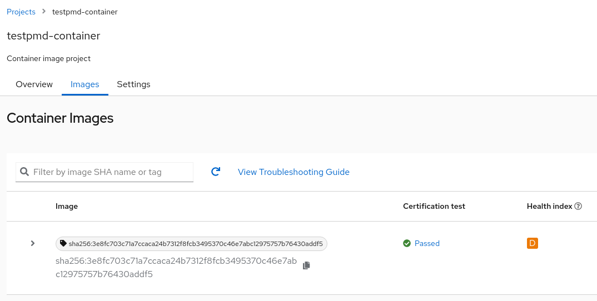
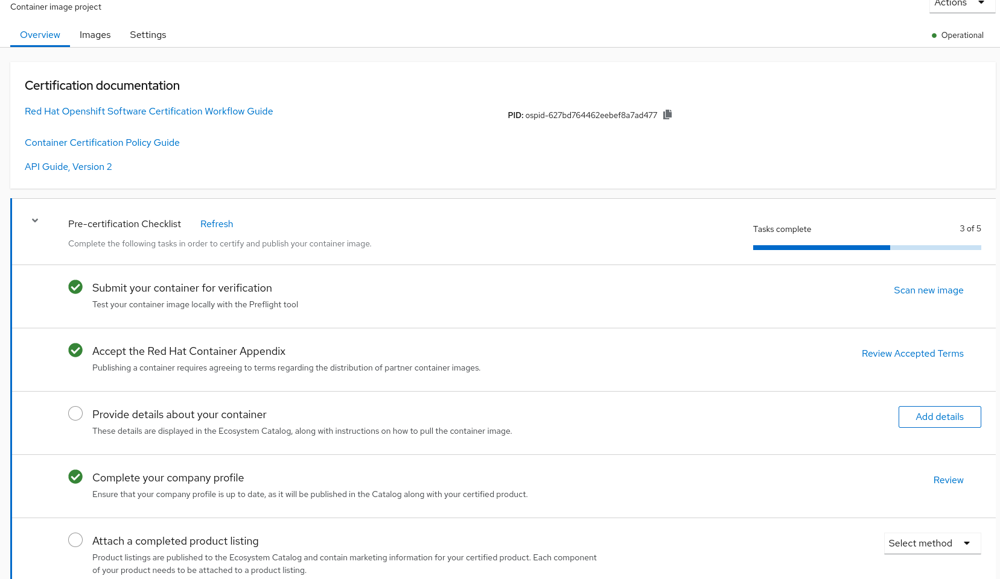

Title: Certification tests for OpenShift containers and operators: how to run with DCI
Date: 2022-05-30 10:00
Category: how-to
Tags: partners, certification, operator-certification, container-certification, preflight, dci-openshift-app-agent
Slug: preflight-integration-in-dci
Author: Tatiana Krishtop
Github: tkrishtop
Summary: This post has some practical information about running Preflight certification suites with DCI. You will learn how to run the tests, debug using log files, and submit the results for the certification. All this is an embedded functionality offered by DCI.

[TOC]

This post has some practical information about running Preflight certification suites with DCI. You will learn how to run the tests, debug using log files, submit the results for the certification, and publish containers and operators in the catalog. All this is an embedded functionality offered by DCI.

Prerequisites:

- [DCI](https://blog.distributed-ci.io/introduction-to-the-red-hat-distributed-ci.html) is Red Hat Distributed CI, written in Ansible.

- [Preflight](https://github.com/redhat-openshift-ecosystem/openshift-preflight) is a command-line interface for validating if OpenShift operator bundles and containers meet minimum requirements for Red Hat OpenShift Certification.

- [OSCAP-podman](https://www.redhat.com/sysadmin/container-vulnerabilities-openscap) tool to scan containers for vulnerabilities. Containers could be published in the catalog only if they are vulnerability-free.

## Certification suites required for the operator certification

To fully certify an operator, you must first certify all containers the operator uses and then certify the operator.

*Fig. 1. Certification steps.*

Here is the entire process at a glance:

1. Certify the container:

    a. Run [Preflight](https://connect.redhat.com/blog/container-certification-tooling-ready-takeoff) certification suite `check container` on the operator image and ensure it is fully green.

    b. Run [OSCAP-podman](https://www.redhat.com/sysadmin/container-vulnerabilities-openscap) check to ensure the container is vulnerability-free.

    c. Create certification project "Container image" at connect.redhat.com and push there all test results.

    d. Provide official information about your company and software to be displayed in the catalog and press the "publish" button to finish the certification process.

2. Certify the operator:

    a. Run [Preflight](https://connect.redhat.com/blog/container-certification-tooling-ready-takeoff) certification suite `check operator` on the bundle image and ensure it to be fully green.

    b. Create a certification project, "Operator Bundle Image", at connect.redhat.com, push Preflight test results into this project, and provide support and sales information for your operator.

    c. Open pull request in the repository [certified-operators](https://github.com/redhat-openshift-ecosystem/certified-operators/pulls), providing the operator's manifests and metadata. Once the formatting checks are fully green, you could merge your pull request. This merge will trigger operator publication in the catalog.

That means you have three test suites and at least two certification projects ahead of you: a container certification project to certify an operator image and an operator certification project to certify a bundle image. The overall certification scenario could become quite complex if you work in a disconnected environment and have to handle the mirroring.

The good news is that DCI handles this complexity for you. All you need is to provide DCI with bundle and index images. DCI could automatically extract all containers, run required tests for containers and the operator and help you to debug by providing detailed logs out of [DCI UI](https://www.distributed-ci.io/jobs). Once everything is green, DCI could automatically create the certification projects in [connect.redhat.com](connect.redhat.com) and push the test results there.

There are still some remaining manual steps: to provide official information about your software for the catalog and decide when to publish. To publish a container, press the button in the [certification UI](connect.redhat.com), and to publish an operator, open and then merge a pull request in [certified-operators repository](https://github.com/redhat-openshift-ecosystem/certified-operators/pulls).

## How to run certification tests with DCI

Let’s run these test suites for the [testpmd-operator](https://github.com/rh-nfv-int/testpmd-operator), often used as an as-is forwarder for the traffic testing. It uses one container: testpmd-operator.

We assume that the OCP cluster is already up and running and the dci-openshift-app-agent is installed with RPM. Please follow the next three steps to execute the required certification suites.

1. Export kubeconfig:

        export KUBECONFIG=/var/lib/dci-openshift-app-agent/kubeconfig

2. Modify file [settings.yml](https://github.com/redhat-cip/dci-openshift-app-agent/tree/master/roles/preflight) in /etc/dci-openshift-app-agent/settings.yml by providing all the information about your certification projects. Let’s consider two standard scenarios here.

    a. If you have a connected environment with a private external registry.

        $ cat /etc/dci-openshift-app-agent/settings.yml
        ---
        # Job name and tags to be displayed in DCI UI
        dci_name: "Testpmd-Operator-Preflight"
        dci_tags: ["debug", "testpmd-operator", "testpmd-container"]
        dci_topic: "OCP-4.7"
        # DCI component for every OCP version
        # could be checked here: https://www.distributed-ci.io/topics
        dci_component: ['8cef32d9-bb90-465f-9b42-8b058878780a']

        # Optional, please provide these credentials
        # if your registry is private.
        partner_creds: "/opt/pull-secrets/partner_config.json"

        # List of operators to certify,
        # you could provide many operators at once.
        preflight_operators_to_certify:
          - bundle_image: "quay.io/rh-nfv-int/testpmd-operator-bundle:v0.2.9"
            # Mandatory for the connected environments.
            index_image: "quay.io/rh-nfv-int/nfv-example-cnf-catalog:v0.2.9"
        ...

    b. There is a disconnected environment with the self-signed local registry and operator images in the external private registry. In the case of a disconnected environment, DCI would handle all the mirroring and regenerate a catalog image.

        $ cat /etc/dci-openshift-app-agent/settings.yml
        ---
        # job name and tags to be displayed in DCI UI
        dci_name: "Testpmd-Operator-Preflight"
        dci_tags: ["debug", "testpmd-operator", "testpmd-container"]
        dci_topic: "OCP-4.7"
        # DCI component for every OCP version
        # could be checked here: https://www.distributed-ci.io/topics
        dci_component: ['8cef32d9-bb90-465f-9b42-8b058878780a']

        # Mandatory for the disconnected environment,
        # this registry is used for mirrored images
        # and to store an index (catalog) image.
        provisionhost_registry: registry.local.lab:4443

        # Credentials for your private registries.
        # You could have several private registries:
        # local and another external, to store the operator.
        # In this case, please provide all credentials here.
        partner_creds: "/opt/pull-secrets/partner_config.json"
        
        # Optional, provide it if your registry is self-signed.
        preflight_custom_ca: "/var/lib/dci-openshift-agent/registry/certs/cert.ca"

        # List of operators to certify,
        # you could provide many operators at once.
        preflight_operators_to_certify:
          # In disconnected environments, provide a digest (SHA), not a tag.
          - bundle_image: "quay.io/rh-nfv-int/testpmd-operator-bundle@sha256:5e28f883faacefa847104ebba1a1a22ee897b7576f0af6b8253c68b5c8f42815"
        ...

3. Run dci-openshift-app-agent:

        $ dci-openshift-app-agent-ctl -s -- -v

## Debug test results using DCI UI

Once the job is executed, the results are displayed in the DCI UI. Let’s go through [an example job](https://www.distributed-ci.io/jobs/3b22a826-5600-4ee0-9013-cff28b50b709/jobStates) and figure out how to debug.

It’s convenient to start from the /tests tab to check the overall situation. Since there are three test suites to execute, you would typically see three JUnit files with the results: two for the container and one for the operator. 

In our case, Preflight container tests are 100% green and ready to be submitted.

*Fig. 2. Check container results for testpmd-operator.*

OSCAP-podman tests have some failures; usually, migrating to the latest UBI is enough to fix them.

*Fig. 3. oscap-podman (health-check) results for testpmd-operator.*

There is more to fix about operator tests, and tips and suggestions are available right here.

*Fig. 4. Check operator results for testpmd-operator.*

Let’s follow the suggestion to check the preflight.log file in the /files tab of the job. The ValidateOperatorBundle test failed because of an invalid service account found in the bundle.

*Fig. 5. Detailed logs in preflight.log.*

In case of tricky errors, more log files and configuration snapshots are available in the same tab to help.

*Fig. 6. There are more log files to check.*

## End-to-end certification of container images with DCI

Once both `check container` and `OSCAP-podman` suites are green, you might want to submit test results to [connect.redhat.com](connect.redhat.com) and certify your container image by publishing it in the [catalog](https://catalog.redhat.com/software). 

The first step is to generate an access token that would be shared between all your projects, save it into a file and provide a path to this file in a variable `pyxis_apikey_path`.

*Fig. 7. Generate Pyxis token.*

It's time to get a certification project in [connect.redhat.com](connect.redhat.com). DCI provides two options: automatically create a certification project or reuse the existing one.

1. To automatically create a certification project, add configuration `create_cert_projects: true` in the settings.yml

        ---
        # Optional; choose this option for the automated creation
        # of certification projects
        create_cert_projects: true

        # Optional; provide it when you need to submit test results.
        # This token is shared between all your projects.
        # To generate it: connect.redhat.com -> Product certification ->
        # Container API Keys -> Generate new key
        pyxis_apikey_path: "/opt/cache/pyxis-apikey.txt"

        # List of operators to certify,
        # you could provide many operators at once.
        preflight_operators_to_certify:
          - bundle_image: "quay.io/rh-nfv-int/testpmd-operator-bundle:v0.2.9"
            # Mandatory for the connected environments.
            index_image: "quay.io/rh-nfv-int/nfv-example-cnf-catalog:v0.2.9"

Using this config, DCI creates a new project automatically, displays its ID in the logs, and then submits the results of Preflight tests into this project.

*Fig. 8. DCI displays an ID of an automatically created project.*

2. The second option is to manually create a "Certify a Container Image" project at connect.redhat.com and provide its ID in DCI settings.yml using the variable `pyxis_container_identifier`.

*Fig. 9. ID for container image project.*

        ---
        # Optional; provide it when you need to submit test results.
        # This token is shared between all your projects.
        # To generate it: connect.redhat.com -> Product certification ->
        # Container API Keys -> Generate new key
        pyxis_apikey_path: "/opt/cache/pyxis-apikey.txt"

        # List of operators to certify,
        # you could provide many operators at once.
        preflight_operators_to_certify:
          - bundle_image: "quay.io/rh-nfv-int/testpmd-operator-bundle:v0.2.9"
            # Mandatory for the connected environments.
            index_image: "quay.io/rh-nfv-int/nfv-example-cnf-catalog:v0.2.9"
            # Optional; provide it when you need to submit test results.
            # It is an id of your Container Image Project
            # https://connect.redhat.com/projects/my_nice_container_id
            pyxis_container_identifier: "my_nice_container_id"

In both cases, the DCI job would run the tests and submit their results directly into the certification UI at [connect.redhat.com](connect.redhat.com). The "Certification test -> Certification test" column displays the Preflight tests run by DCI, and the "Health index" column is for [OSCAP-podman vulnerability check](https://redhat-connect.gitbook.io/catalog-help/container-images/container-health) results.

*Fig. 10. Submitted results in connect.redhat.com.*

The certification is almost done! The last step is to provide a container description for the RedHat Container catalog and marketing information about your certified product.

*Fig. 11. The last step - provide container description and marketing information.*

Once all requested information is here, click the publish button to add the container to the [catalog](https://catalog.redhat.com/software).

*Fig. 12. Click the publish button to display the container in the catalog.*

## End-to-end certification of operators with DCI
Once you have all containers certified and nailed `check operator` to be green, you might want to submit the results for the operator certification. Similarly to the container certification, DCI provides two options: automatically create a certification project or reuse the existing one.

1. To create a certification project automatically, add configuration `create_cert_projects: true` in the settings.yml. Note that this option will create two new certification projects: for your container and operator.

        # Optional; choose this option for the automated creation
        # of certification projects
        create_cert_projects: true

        # Optional; provide it when you need to submit test results.
        # This token is shared between all your projects.
        # To generate it: connect.redhat.com -> Product certification ->
        # Container API Keys -> Generate new key
        pyxis_apikey_path: "/opt/cache/pyxis-apikey.txt"

        # List of operators to certify,
        # you could provide many operators at once.
        preflight_operators_to_certify:
          - bundle_image: "quay.io/rh-nfv-int/testpmd-operator-bundle:v0.2.9"
            # Mandatory for the connected environments.
            index_image: "quay.io/rh-nfv-int/nfv-example-cnf-catalog:v0.2.9"

2. If you already have the certification projects, provide an ID for container project "Container image" as `pyxis_container_identifier` and an ID for operator project "Operator Bundle Image" as `pyxis_operator_identifier`.

        # Optional; provide it when you need to submit test results.
        # This token is shared between all your projects.
        # To generate it: connect.redhat.com -> Product certification ->
        # Container API Keys -> Generate new key
        pyxis_apikey_path: "/opt/cache/pyxis-apikey.txt"

        # List of operators to certify,
        # you could provide many operators at once.
        preflight_operators_to_certify:
          - bundle_image: "quay.io/rh-nfv-int/testpmd-operator-bundle:v0.2.9"
            # Mandatory for the connected environments.
            index_image: "quay.io/rh-nfv-int/nfv-example-cnf-catalog:v0.2.9"
            # Optional; provide it when you need to submit test results.
            # It is an id of your Container Image Project
            # https://connect.redhat.com/projects/my_nice_container_id
            pyxis_container_identifier: "my_nice_container_id"
            # Optional; provide it when you need to submit test results
            # for the operator certification.
            # It is an id of your Operator Bundle Image
            # https://connect.redhat.com/projects/my_nice_container_id
            pyxis_operator_identifier: "my_nice_operator_id"

The last step is to publish an operator in the catalog. For that, open and merge a pull request in the repository [certified-operators](https://github.com/redhat-openshift-ecosystem/certified-operators/pulls), providing the operator's manifests and metadata. This merge will trigger operator publication in the catalog.

 
 
