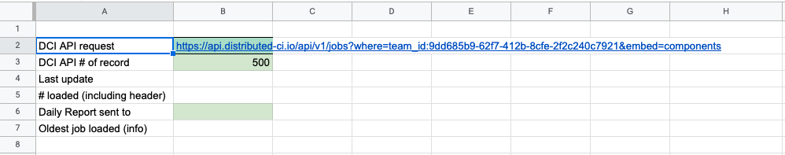
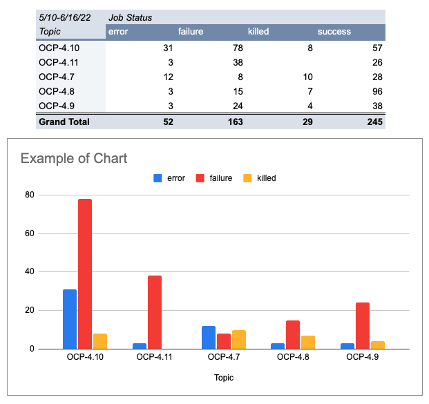

Title: How to build your own DCI dashboard
Date: 2022-06-17 10:00
Category: DCI
Tags: dci, data, dashboard, api
Slug: how-to-build-your-own-dci-dashboard
Authors: Olivier Petit
Summary: Everydays, Red Hat DCI platform runs hundreds of jobs from different teams and partners, with all our products, with different purposes: debugging, certifications, tests, daily activities, etc. You may need to build a dedicated dashboard to follow your own specific activity, display graphical results, study some specific data or identify specific job behaviors. For such requirements, Google spreadsheet can provide you facilities to implement your ideas in a few minutes. In this blog post, you will learn how to quickly build a dashboard with Google spreadsheet by requesting DCI data, getting it dynamically and sending a pdf report by email periodically.

Everydays, [Red Hat DCI platform](https://www.distributed-ci.io/jobs?page=1&perPage=20) runs hundreds of jobs from different teams and partners, with all our products, with different purposes: debugging, certifications, tests, daily activities, etc.

You may need to build a dedicated dashboard to follow your own specific activity, display graphical results, study some specific data or identify specific job behaviors. For such requirements, Google spreadsheet can provide you facilities to implement your ideas in a few minutes.

In this blog post, you will learn how to quickly build a dashboard with Google spreadsheet by requesting DCI data, getting it dynamically and sending a pdf report by email periodically.

## First, get your data through DCI API

### DCI API call

The first step is to define the DCI API call to collect all data required in a dedicated sheet tab (name it Data).
The [API DCI documentation](https://docs.distributed-ci.io/dci-control-server/docs/API/) describes all endpoints and data available by API.
In our example, we would like to collect the 500 last jobs launched by the rh-telco-ci team. So our API request looks like:

    https://api.distributed-ci.io/api/v1/jobs?where=team_id:9dd685b9-62f7-412b-8cfe-2f2c240c7921&embed=components&sort=-created_at

### Set up the dashboard

The following process describes step by step how to quickly set up your spreadsheet.

1. Initiate a new Google spreadsheet:
   - Create a new blank Google Spreadsheet
   - Rename the spreadsheet
2. Open the script editor window:
   - Menu Extensions/Apps Script
   - Name the project
3. Overwrite the default code.gs file by our template script:
   - Copy and paste the full sample script from https://github.com/dci-labs/Dashboards/blob/c7f4e8e73ac8e0fbb8b594533bcf029a87f48575/Sample_DCI_Dashboard_Script.gs to code.gs
   - Save it
   - In the script, replace gLogin and gPwd with your own login/password for DCI API access
   - Save the project
4. In the spreadsheet:

   - Rename the current tab to “Data”
   - In this Data tab, set some values to prepare API call (B2 and B3 mandatories)

   

5. Reload the spreadsheet to get new menu entry (Script Menu)
6. In new Script Menu entry,
   - Click export DCI Data:
   - Continue on Authorization Required
   - Select your Gmail account to use to call App Scripts
   - Allow data access to your account
   - Then, back to the spreadsheet, relaunch export DCI Data in Script Menu

Now, you can have the list of all 500 last jobs in the Data tab from cell A12 by selecting Script Menu / Export DCI Data.

### Script automation

DCI API export can be launched by menu. But we can automate this call with a time-driven trigger.

Here is the process to setup such trigger:

1. Open Apps Script Editor and got to Triggers (menu on left side - just icons)

2. Create a new trigger:
   - Click Add Trigger (bottom right)
   - Function to run: exportDCIData
   - Event Source: Time-driven
   - Time Based trigger: Hour timer
   - Hour interval: every 2 hours (as an example)
   - Save

All executions of the script can be followed on Executions part of Apps Scripts (manual and automated call)

### Some notes about the script

The script is organized on this way:

- onOpen(): to create Script Menu entry in spreadsheet and call functions.
  - This function is called each time you load/reload the sheet.
- Functions named with “\_” suffix are internal functions and they are not available in the sheet.
  - getDCIDataPagin\_(url,lim): to split large call
  - getDCITopicList(), getDCIRciList(), getDCITeamList\_() to enable Id to name conversion
  - setUTCtoLocalTime\_(s): enable UTC to local time for date
- exportDCIData() is the main function to customize to
  - Add/remove/transform data from JSON data exported to build a double array
  - Push the full array to spreadsheet
- exportSpreadSheet() is the function to build a pdf and send it by email (see below)

## Then, build the dashboard

After the DCI API call set up to get our data in the Data tab, there are different ways to build dashboards as usual spreadsheet tools.

### Dashboard with Pivot table

This is the quickest and easiest solution, useful to start and get quick results.
Prefer this way to analyze your data before building custom dashboards.

- Example: Show job status per topics
  - Select A12:V1000 (full Data), menu insert/pivot Table, new sheet
  - Add Topic for Rows, Job Status for Columns, Job Id for Values
  - Add filters: Job Id / Filter condition: Cell is not empty
  - Create a basic chart: Insert/Chart, select data on pivot table including header line

Here is the result:

## Send my report by email

Let's assume we use the last example in the tab renamed “myReport”.
Before to launch “Sent report by email” from Script Menu, you need to customize the script by catching SSID (spreadsheet id) and GID (sheet ID) of your current sheet from url: [Sheet URL sample](https://docs.google.com/spreadsheets/d/1JxWyHnslKRdosWaGujgKs8SrpKKCzXXXXXG8P4JfOc/edit#gid=665341234)

Then update the script in exportSpreadSheet() function:

- Line 310: set ssid
  - Ie: 1JxWyHnslKRdosWaGujgKs8SrpKKCzXXXXXG8P4JfOc
- Line 311: set gid
  - Ie: 665341234
- Set email addresses (comma separated) in Data’B6 Cell

- Review presentation parameters in the function if required

Now you can launch report generation by Script Menu and/or automate it with triggers (see above).

## Tips to build custom dashboard

### Use naming range

To manipulate a set of data by label versus relative position in a spreadsheet, the naming range feature is very useful, provides flexibility and a comprehensive formula.

Here is how to set a named range for Topic (Data!C13:C) in our example

    Menu Data / Named Ranges, name: Topic, Range: Data!E13:E

### Filters

Filter function can extend the pivot table feature with flexibility on data to transform and display.

Here is an example:

Let’s assume we need to extract the last not successful execution of a job in the last 5 days and show a concatenation of comment and reason data in a same cell:

    =filter({Created_At,pipeline_name,OCP_version,Status,"["&Comment&"] "&reason},date(year(Created_At),month(Created_At),day(Created_At))> today()-5,Status<>"success",Daily=TRUE)

### Presentation & other tips

To get more dynamic and easy-to-read dashboard, other tips are useful to customize your dashboard:

- Color cells according to contains (use Format / Conditional Formatting)
- Do not display 0 value in a cell in a table (use Format / Number / Custom number format: 0;-0;;@)
- Miniature chart in a single cell (Sparkline function)
- Get the last non empty cell data in a list (=ArrayFormula(max(if(A:A<>"",row(A:A)))))
- Catch error messages in a formula with IfError function
- Get limited number of result in filter with Array_Constraint function

## Conclusion

This blog post gives a short introduction to build some dashboard in Google spreadsheet.
Some interesting free websites provide some great tips on how to create professional dashboards like [Ben Collins website](https://www.benlcollins.com/).

Some dashboards already exist in the DCI portal through the DCI Analytics part and are still under development by the DCI Team.
