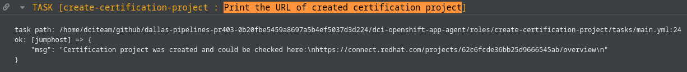

Title: Certification tests for OpenShift containers and operators: how to run with DCI
Date: 2022-10-20 10:00
Category: how-to
Tags: partners, certification, operator-certification, container-certification, preflight, dci-openshift-app-agent
Slug: preflight-integration-in-dci
Author: Tatiana Krishtop
Github: tkrishtop
Summary: This post has some practical information about running Preflight certification suites with DCI. You will learn how to run the tests, debug using log files, and submit the results for certification. All this is an embedded functionality offered by DCI.

[TOC]

This post has some practical information about running Preflight certification suites with DCI. You will learn how to run the tests, debug using log files, submit the results for the certification, and publish containers and operators in the catalog. All this is an embedded functionality offered by DCI.

Prerequisites:

- [DCI](https://blog.distributed-ci.io/introduction-to-the-red-hat-distributed-ci.html) is Red Hat Distributed CI, written in Ansible.

- [Preflight](https://github.com/redhat-openshift-ecosystem/openshift-preflight) is a command-line interface for validating if OpenShift operator bundles and containers meet minimum requirements for Red Hat OpenShift Certification.

- [OSCAP-podman](https://www.redhat.com/sysadmin/container-vulnerabilities-openscap) tool to scan containers for vulnerabilities. Containers could be published in the catalog only if they are vulnerability-free.

## Certification suites required for the operator certification

To fully certify an operator, you must first certify all containers the operator uses and then certify the operator.

*Fig. 1. Certification steps.*

Here is the entire process at a glance:

1. Certify the container:

    a. Run [Preflight](https://connect.redhat.com/blog/container-certification-tooling-ready-takeoff) `check container` certification suite on the operator image and ensure that they are entirely green.

    b. Run [OSCAP-podman](https://www.redhat.com/sysadmin/container-vulnerabilities-openscap) check to ensure the container is vulnerability-free.

    c. Create a "Container image" certification project at connect.redhat.com and push all test results there.

    d. Provide official information about your company and software to be displayed in the catalog and press the "publish" button to finish the certification process.

2. Certify the operator:

    a. Run [Preflight](https://connect.redhat.com/blog/container-certification-tooling-ready-takeoff) `check operator` certification suite on the bundle image and ensure that they are fully green.

    b. Create a certification project, "Operator Bundle Image", at connect.redhat.com, push Preflight test results into this project, and provide support and sales information for your operator.

    c. Open a pull request in the repository [certified-operators](https://github.com/redhat-openshift-ecosystem/certified-operators/pulls), providing the operator's manifests and metadata. Once the formatting checks are fully green, you can merge your pull request. This merge will trigger operator publication in the catalog.

That means you have three test suites and at least two certification projects ahead of you: a container certification project to certify an operator image and an operator certification project to certify a bundle image. The overall certification scenario could become quite complex if you work in a disconnected environment and have to handle the mirroring.

The good news is that DCI handles this complexity for you. All you need is to provide DCI with bundle and index images. DCI could automatically extract all containers, run required tests for containers and the operator and help you to debug by providing detailed logs out of [DCI UI](https://www.distributed-ci.io/jobs). Once everything is green, DCI could automatically create the certification projects in [connect.redhat.com](connect.redhat.com) and push the test results there.

There are still some remaining manual steps: to provide official information about your software for the catalog and decide when to publish. To publish a container, press the button in the [certification UI](connect.redhat.com), and to publish an operator, close and then re-open an automatically created pull request in [certified-operators](https://github.com/redhat-openshift-ecosystem/certified-operators/pulls) repository.

## How to run certification tests with DCI

Let’s run these test suites for the [testpmd-operator](https://github.com/rh-nfv-int/testpmd-operator), often used as an as-is forwarder for the traffic testing. It uses one container: testpmd-operator.

We assume that the OCP cluster is already up and running and the dci-openshift-app-agent and dci-pipeline are installed with RPM packages. Please follow the next three steps to execute the required certification suites.

1. Export kubeconfig:

        $ export KUBECONFIG=/var/lib/dci-openshift-app-agent/kubeconfig

2. Create dci-pipeline configuration files in the my-dci-pipeline-test/pipelines folder and provide all the information about your certification projects. Let's consider two standard scenarios here.

    a. If you have a connected environment with a private external registry.

        $ cat my-dci-pipeline-test/pipelines/testpmd-operator-preflight-pipeline.yml
        ---
        - name: testpmd-operator-preflight
          stage: workload
          # DCI component for every OCP version
          # could be checked here: https://www.distributed-ci.io/topics
          topic: OCP-4.16
          ansible_playbook: /usr/share/dci-openshift-app-agent/dci-openshift-app-agent.yml
          ansible_cfg: /var/lib/dci-openshift-app-agent/my-dci-pipeline-test/pipelines/ansible.cfg
          ansible_inventory: /var/lib/dci-openshift-app-agent/my-dci-pipeline-test/inventories/@QUEUE/@RESOURCE-workload.yml
          dci_credentials: /var/lib/dci-openshift-app-agent/.config/dci-pipeline/dci_credentials.yml
          ansible_extravars:
            dci_cache_dir: /var/lib/dci-openshift-app-agent/dci-cache-dir
            dci_config_dir: /var/lib/dci-openshift-app-agent/my-dci-pipeline-test/ocp-workload
            dci_gits_to_components:
              - /var/lib/dci-openshift-app-agent/my-dci-pipeline-test
            dci_local_log_dir: /var/lib/dci-openshift-app-agent/upload-errors
            dci_tags: ["debug", "testpmd-operator", "testpmd-container"]
            dci_workarounds: []

            # Reduce the job duration
            do_must_gather: false
            check_workload_api: false

            # Optional, please provide these credentials
            # if your registry is private.
            partner_creds: "/opt/pull-secrets/partner_config.json"
            
            # List of operators to certify,
            # you could provide many operators at once.
            preflight_operators_to_certify:
              - bundle_image: "quay.io/rh-nfv-int/testpmd-operator-bundle:v0.2.9"
                # Mandatory for the connected environments.
                index_image: "quay.io/rh-nfv-int/nfv-example-cnf-catalog:v0.2.9"

          use_previous_topic: true
          inputs:
            kubeconfig: kubeconfig_path
        ...

    b. There is a disconnected environment with the self-signed local registry and operator images in the external private registry. In the case of a disconnected environment, DCI would handle all the mirroring and regenerate a catalog image.

        $ cat my-dci-pipeline-test/pipelines/testpmd-operator-preflight-disconnected-pipeline.yml
        ---
        - name: testpmd-operator-preflight-disconnected
          stage: workload
          # DCI component for every OCP version
          # could be checked here: https://www.distributed-ci.io/topics
          topic: OCP-4.16
          ansible_playbook: /usr/share/dci-openshift-app-agent/dci-openshift-app-agent.yml
          ansible_cfg: /var/lib/dci-openshift-app-agent/my-dci-pipeline-test/pipelines/ansible.cfg
          ansible_inventory: /var/lib/dci-openshift-app-agent/my-dci-pipeline-test/inventories/@QUEUE/@RESOURCE-workload.yml
          dci_credentials: /var/lib/dci-openshift-app-agent/.config/dci-pipeline/dci_credentials.yml
          ansible_extravars:
            dci_cache_dir: /var/lib/dci-openshift-app-agent/dci-cache-dir
            dci_config_dir: /var/lib/dci-openshift-app-agent/my-dci-pipeline-test/ocp-workload
            dci_gits_to_components:
              - /var/lib/dci-openshift-app-agent/my-dci-pipeline-test
            dci_local_log_dir: /var/lib/dci-openshift-app-agent/upload-errors
            dci_tags: ["debug", "testpmd-operator", "testpmd-container"]
            dci_workarounds: []

            # Reduce the job duration
            do_must_gather: false
            check_workload_api: false

            # Mandatory for the disconnected environment,
            # this registry is used for mirrored images
            # and to store an index (catalog) image.
            provisionhost_registry: registry.local.lab:4443

            # Credentials for your private registries.
            # You could have several private registries:
            # local and another external, to store the operator.
            # In this case, please provide all credentials here.
            partner_creds: "/opt/pull-secrets/partner_config.json"

            # Optional; provide it if your registry is self-signed.
            preflight_custom_ca: "/var/lib/dci-openshift-agent/registry/certs/cert.ca"
            
            # List of operators to certify,
            # you could provide many operators at once.
            preflight_operators_to_certify:
              # In disconnected environments, provide a digest (SHA), not a tag.
              - bundle_image: "quay.io/rh-nfv-int/testpmd-operator-bundle@sha256:5e28f883faacefa847104ebba1a1a22ee897b7576f0af6b8253c68b5c8f42815"

          use_previous_topic: true
          inputs:
            kubeconfig: kubeconfig_path
        ...

3. Call dci-openshift-app-agent from dci-pipeline

   a) Connected

        $ KUBECONFIG=$KUBECONFIG dci-pipeline-schedule testpmd-operator-preflight

   b) Disconnected

        $ KUBECONFIG=$KUBECONFIG dci-pipeline-schedule testpmd-operator-preflight-disconnected

## Debug test results using DCI UI

Once the job is executed, the results are displayed in the DCI UI. Let’s go through [an example job](https://www.distributed-ci.io/jobs/3b22a826-5600-4ee0-9013-cff28b50b709/jobStates) and figure out how to debug.

It’s convenient to start from the /tests tab to check the overall situation. Since there are three test suites to execute, you would typically see three JUnit files with the results: two for the container and one for the operator.

In our case, Preflight container tests are 100% green and ready to be submitted.

*Fig. 2. Check container results for testpmd-operator.*

OSCAP-podman tests have some failures; usually, migrating to the latest UBI or [another base image from the catalog](https://catalog.redhat.com/software/containers/search) is enough to fix them.

*Fig. 3. oscap-podman (health-check) results for testpmd-operator.*

There is more to fix about operator tests, and tips and suggestions are available right here.

*Fig. 4. Check operator results for testpmd-operator.*

Let’s follow the suggestion to check the preflight.log file in the /files tab of the job. The ValidateOperatorBundle test failed because of an invalid service account found in the bundle.

*Fig. 5. Detailed logs in preflight.log.*

In case of tricky errors, more log files and configuration snapshots are available in the same tab to help.

*Fig. 6. There are more log files to check.*

Note: The DCI Pipeline configurations throughout the sections are just examples, where the Pipeline configs are saved in the my-dci-pipeline-test/pipelines folder.

## End-to-end certification of container images with DCI

Once both `check container` and `OSCAP-podman` suites are green, you might want to submit test results to [connect.redhat.com](connect.redhat.com) and certify your container image by publishing it in the [catalog](https://catalog.redhat.com/software).

The first step is to generate an access token that would be shared between all your projects, save it into a file and provide a path to this file in a variable `pyxis_apikey_path`.

*Fig. 7. Generate Pyxis token.*

It's time to get a certification project in [connect.redhat.com](connect.redhat.com). DCI provides two options: automatically create a certification project or reuse the existing one.

1. To automatically create a certification project for the container, add configuration `create_container_project: true`

        $ cat my-dci-pipeline-test/pipelines/testpmd-container-preflight-pipeline.yml
        ---
        # Generic DCI Pipeline config
        - name: testpmd-container-preflight
          stage: workload
          topic: OCP-4.16
          ansible_playbook: /usr/share/dci-openshift-app-agent/dci-openshift-app-agent.yml
          ansible_cfg: /var/lib/dci-openshift-app-agent/my-dci-pipeline-test/pipelines/ansible.cfg
          ansible_inventory: /var/lib/dci-openshift-app-agent/my-dci-pipeline-test/inventories/@QUEUE/@RESOURCE-workload.yml
          dci_credentials: /var/lib/dci-openshift-app-agent/.config/dci-pipeline/dci_credentials.yml
          ansible_extravars:
            dci_cache_dir: /var/lib/dci-openshift-app-agent/dci-cache-dir
            dci_config_dir: /var/lib/dci-openshift-app-agent/my-dci-pipeline-test/ocp-workload
            dci_gits_to_components:
              - /var/lib/dci-openshift-app-agent/my-dci-pipeline-test
            dci_local_log_dir: /var/lib/dci-openshift-app-agent/upload-errors
            dci_tags: ["debug", "recertification", "cert-project-creation", "testpmd-container"]
            dci_workarounds: []

            # Required to create and update cert projects.
            # Check the instructions below on where to retrieve it
            organization_id: "12345678"

            # Reduce the job duration
            do_must_gather: false
            check_workload_api: false
            preflight_run_health_check: false

            # Optional, please provide these credentials
            # if your registry is private.
            partner_creds: "/opt/pull-secrets/partner_config.json"

            # Optional; provide it when you need to submit test results.
            # This token is shared between all your projects.
            # To generate it: connect.redhat.com -> Product certification ->
            # Container API Keys -> Generate new key
            pyxis_apikey_path: "/opt/cache/pyxis-apikey.txt"

            # List of images to certify,
            # you could provide many containers at once.
            preflight_containers_to_certify:
              - container_image: "quay.io/rh-nfv-int/bla-bla-operator:v0.2.9"
                # Required when creating cert project but optional if not want to update mandatory parameters
                short_description: "Add 50+ characters image description here"
                # Optional; provide it when you need to create
                # a new "Container Image project" and submit test results in it.
                create_container_project: true
                pyxis_product_lists:
                  - "xxx"

            # Project certification setting (Optional)
            # This allows to fill the rest of the project settings after project creation
            # Any project for containers images certifications can use them
            # TODO: provide cert_settings example for every project type
            cert_settings:
              # Container
              # Set auto_pubish to true when container image needs to be automatic publish to the catalog
              auto_publish: false
              registry_override_instruct: "These are instructions of how to override settings"
              email_address: "email@email.com"
              application_categories: "Networking"
              privileged: false
              repository_description: "This is a test repository"
              build_categories: "Standalone image"
              os_content_type: "Red Hat Universal Base Image (UBI)"
              release_category: "Generally Available"

          use_previous_topic: true
          inputs:
            kubeconfig: kubeconfig_path
        ...

    Using this dci-pipeline config, DCI creates a new container certification project, update and attach product-listing automatically, displays its ID in the logs, and then submits the results of Preflight tests into this project.

    
    *Fig. 8. DCI displays an ID of an automatically created project.*

2. The second option is to manually create a "Certify a Container Image" project at connect.redhat.com and provide its ID in DCI settings.yml using the variable `pyxis_container_identifier`.

    
    *Fig. 9. ID for container image project.*

        $ cat my-dci-pipeline-test/pipelines/testpmd-container-preflight-pipeline.yml
        ---
        # Generic DCI Pipeline config
        - name: testpmd-container-preflight
          stage: workload
          topic: OCP-4.16
          ansible_playbook: /usr/share/dci-openshift-app-agent/dci-openshift-app-agent.yml
          ansible_cfg: /var/lib/dci-openshift-app-agent/my-dci-pipeline-test/pipelines/ansible.cfg
          ansible_inventory: /var/lib/dci-openshift-app-agent/my-dci-pipeline-test/inventories/@QUEUE/@RESOURCE-workload.yml
          dci_credentials: /var/lib/dci-openshift-app-agent/.config/dci-pipeline/dci_credentials.yml
          ansible_extravars:
            dci_cache_dir: /var/lib/dci-openshift-app-agent/dci-cache-dir
            dci_config_dir: /var/lib/dci-openshift-app-agent/my-dci-pipeline-test/ocp-workload
            dci_gits_to_components:
              - /var/lib/dci-openshift-app-agent/my-dci-pipeline-test
            dci_local_log_dir: /var/lib/dci-openshift-app-agent/upload-errors
            dci_tags: ["debug", "recertification", "cert-project-creation", "testpmd-container"]
            dci_workarounds: []

            # Required to create and update cert projects.
            # Check the instructions below on where to retrieve it
            organization_id: "12345678"

            # Reduce the job duration
            do_must_gather: false
            check_workload_api: false
            preflight_run_health_check: false

            # Optional, please provide these credentials
            # if your registry is private.
            partner_creds: "/opt/pull-secrets/partner_config.json"

            # Optional; provide it when you need to submit test results.
            # This token is shared between all your projects.
            # To generate it: connect.redhat.com -> Product certification ->
            # Container API Keys -> Generate new key
            pyxis_apikey_path: "/opt/cache/pyxis-apikey.txt"

            # List of images to certify,
            # you could provide many containers at once.
            preflight_containers_to_certify:
              - container_image: "quay.io/rh-nfv-int/testpmd-operator:v0.2.9"
                # Optional; provide it when you need to use
                # the existing project to submit test results.
                # It's an id of your Container Image Project
                # https://connect.redhat.com/projects/my_nice_container_id
                pyxis_container_identifier: "my_nice_container_id"

          use_previous_topic: true
          inputs:
            kubeconfig: kubeconfig_path
        ...

    Using this DCI pipeline configuration, DCI will submit the results of Preflight tests to the existing container certification project, not only for newly created but also for recertification use cases.

In both cases, the DCI job would run the tests and submit their results directly into the certification UI at [connect.redhat.com](connect.redhat.com). The "Images -> Certification test" column displays the Preflight tests run by DCI, and the "Health index" column is for [OSCAP-podman vulnerability check](https://redhat-connect.gitbook.io/catalog-help/container-images/container-health) results.

*Fig. 10. Submitted results in connect.redhat.com.*

The certification is almost done! The last step is to provide a container description for the Red Hat Container catalog and marketing information about your certified product.

*Fig. 11. The last step - provide container description and marketing information.*

Once all requested information is here, click the publish button to add the container to the [catalog](https://catalog.redhat.com/software).

*Fig. 12. Click the publish button to display the container in the catalog.*

## End-to-end certification of operators with DCI
Once all containers are certified and the `check operator` is green, you might want to submit the results in the certification UI. Unlike the container certification, there is an additional step to open a pull request in the [certified-operators](https://github.com/redhat-openshift-ecosystem/certified-operators/pulls) repository, and below, we use options `create_pr: true` and `merge_pr: true` to do it automatically with DCI. Do not forget [to generate a github token](https://github.com/redhatci/ansible-collection-redhatci-ocp/tree/main/roles/create_certification_project#github-token) before proceeding futher.

DCI provides two options: automatically create a certification project or reuse the existing one.

1. To create a certification project automatically, add `create_operator_project: true` for the operator.

        $ cat my-dci-pipeline-test/pipelines/testpmd-operator-e2e-pipeline.yml
        ---
        # Generic DCI Pipeline config
        - name: testpmd-operator-e2e
          stage: workload
          topic: OCP-4.16
          ansible_playbook: /usr/share/dci-openshift-app-agent/dci-openshift-app-agent.yml
          ansible_cfg: /var/lib/dci-openshift-app-agent/my-dci-pipeline-test/pipelines/ansible.cfg
          ansible_inventory: /var/lib/dci-openshift-app-agent/my-dci-pipeline-test/inventories/@QUEUE/@RESOURCE-workload.yml
          dci_credentials: /var/lib/dci-openshift-app-agent/.config/dci-pipeline/dci_credentials.yml
          ansible_extravars:
            dci_cache_dir: /var/lib/dci-openshift-app-agent/dci-cache-dir
            dci_config_dir: /var/lib/dci-openshift-app-agent/my-dci-pipeline-test/ocp-workload
            dci_gits_to_components:
              - /var/lib/dci-openshift-app-agent/my-dci-pipeline-test
            dci_local_log_dir: /var/lib/dci-openshift-app-agent/upload-errors
            dci_tags: ["debug", "testpmd-operator", "testpmd-container"]
            dci_workarounds: []

            # Required to create and update cert projects.
            # Check the instructions below on where to retrieve it
            organization_id: "12345678"

            # Reduce the job duration
            do_must_gather: false
            check_workload_api: false
            preflight_run_health_check: false

            # Optional, please provide these credentials
            # if your registry is private.
            partner_creds: "/opt/pull-secrets/partner_config.json"

            # Optional; provide it when you need to submit test results.
            # This token is shared between all your projects.
            # To generate it: connect.redhat.com -> Product certification ->
            # Container API Keys -> Generate new key
            pyxis_apikey_path: "/opt/cache/pyxis-apikey.txt"

            # Optional; provide this token when using create_pr option
            # while creating operator or helm-chart project
            # Check the instructions below on how to create it
            github_token_path: "/opt/cache/dcicertbot-token.txt"

            # List of operators to certify,
            # you could provide many operators at once.
            preflight_operators_to_certify:
              - bundle_image: "quay.io/rh-nfv-int/bla-bla-bundle:v0.2.1"
                # Mandatory for the connected environments.
                index_image: "quay.io/rh-nfv-int/bla-bla-catalog:v0.2.1"
                # Optional; provide it when you need to create
                # a new "Container Image project" and submit test results in it.
                create_container_project: true
                # Optional; provide it when you need to create
                # a new "Operator Bundle Image" and submit test results in it.
                create_operator_project: true
                # Required when creating cert project
                short_description: "Add 50+ characters image description here"
                # Optional; use it to automatically open cert PR
                # at the certified-operators repository
                create_pr: true
                # Optional; use it to automatically merge cert PR
                # at the certified-operators repository
                merge_pr: true
                # Product Listings to attach to the cert project (Optional)
                pyxis_product_lists:
                  - "yyy"
                  - "xxx"
  
            # Project certification setting (Optional)
            # This allows to fill the rest of the project settings after project creation
            # Any project for containers images certifications can use them
            # TODO: provide cert_settings example for every project type
            cert_settings:
              # Operator and Container
              # Set auto_publish to true when container image needs to publish to the catalog automatically
              # once all the criterias are met
              auto_publish: false
              registry_override_instruct: "These are instructions of how to override settings"
              email_address: "email@email.com"
              application_categories: "Networking"
              privileged: false
              repository_description: "This is a test repository"
              build_categories: "Standalone image"
              os_content_type: "Red Hat Universal Base Image (UBI)"
              release_category: "Generally Available"
                
          use_previous_topic: true
          inputs:
            kubeconfig: kubeconfig_path
        ...
    
    Using this dci-pipeline config, DCI creates a new container and operator certification projects, update and attach product-listing automatically, displays its ID in the logs, and then submits the results of Preflight tests into this project.

    
    *Fig. 13. DCI displays an ID of an automatically created project.*

2. If you already have a certification project, provide an ID for operator project "Operator Bundle Image" as `pyxis_operator_identifier`.

        $ cat my-dci-pipeline-test/pipelines/testpmd-operator-existed-project-pipeline.yml
        ---
        # Generic DCI Pipeline config
        - name: testpmd-operator-existed-project
          stage: workload
          topic: OCP-4.16
          ansible_playbook: /usr/share/dci-openshift-app-agent/dci-openshift-app-agent.yml
          ansible_cfg: /var/lib/dci-openshift-app-agent/my-dci-pipeline-test/pipelines/ansible.cfg
          ansible_inventory: /var/lib/dci-openshift-app-agent/my-dci-pipeline-test/inventories/@QUEUE/@RESOURCE-workload.yml
          dci_credentials: /var/lib/dci-openshift-app-agent/.config/dci-pipeline/dci_credentials.yml
          ansible_extravars:
            dci_cache_dir: /var/lib/dci-openshift-app-agent/dci-cache-dir
            dci_config_dir: /var/lib/dci-openshift-app-agent/my-dci-pipeline-test/ocp-workload
            dci_gits_to_components:
              - /var/lib/dci-openshift-app-agent/my-dci-pipeline-test
            dci_local_log_dir: /var/lib/dci-openshift-app-agent/upload-errors
            dci_tags: ["debug", "testpmd-operator", "testpmd-container"]
            dci_workarounds: []

            # Required to create and update cert projects.
            # Check the instructions below on where to retrieve it
            organization_id: "12345678"

            # Reduce the job duration
            do_must_gather: false
            check_workload_api: false
            preflight_run_health_check: false

            # Optional, please provide these credentials
            # if your registry is private.
            partner_creds: "/opt/pull-secrets/partner_config.json"

            # Optional; provide it when you need to submit test results.
            # This token is shared between all your projects.
            # To generate it: connect.redhat.com -> Product certification ->
            # Container API Keys -> Generate new key
            pyxis_apikey_path: "/opt/cache/pyxis-apikey.txt"

            # Optional; provide this token when using create_pr option
            # while creating operator or helm-chart project
            # Check the instructions below on how to create it
            github_token_path: "/opt/cache/dcicertbot-token.txt"

            # List of operators to certify,
            # you could provide many operators at once.
            preflight_operators_to_certify:
              - bundle_image: "quay.io/rh-nfv-int/testpmd-operator-bundle:v0.2.9"
                # Mandatory for the connected environments.
                index_image: "quay.io/rh-nfv-int/nfv-example-cnf-catalog:v0.2.9"
                # Optional; provide it when you need to use
                # the existing project to submit test results.
                # It's an id of your Container Image Project
                # https://connect.redhat.com/projects/my_nice_container_id
                pyxis_container_identifier: "my_nice_container_id"
                # Optional; provide it when you need to use
                # the existing project to submit test results.
                # It's an id of your Operator Bundle Image
                # https://connect.redhat.com/projects/my_nice_container_id
                pyxis_operator_identifier: "my_nice_operator_id"
                # Optional; use it to automatically open cert PR
                # at the certified-operators repository
                create_pr: true
                
          use_previous_topic: true
          inputs:
            kubeconfig: kubeconfig_path
        ...

    Using this DCI pipeline configuration, DCI will submit the results of Preflight tests to the existing container and operator certification projects, not only for newly created but also for recertification use case.

In both cases, the DCI job would run the tests and submit their results directly into the certification UI at [connect.redhat.com](connect.redhat.com). The "Test results -> Test result" column displays the Preflight tests run by DCI.

3. Call dci-openshift-app-agent from dci-pipeline

   a) Operator end-to-end

        $ KUBECONFIG=$KUBECONFIG dci-pipeline-schedule testpmd-operator-e2e

   b) Existing certification projects

        $ KUBECONFIG=$KUBECONFIG dci-pipeline-schedule testpmd-operator-existed-project

*Fig. 14. Submitted results in connect.redhat.com*

Here we have an error "Most recent pull request unsuccessful" because marketing information is missing in the overview tab. To fix that, add a repository description and product listing to be displayed in the catalog.

*Fig. 15. Provide operator description and marketing information.*

The last step is to take care of the automatically opened pull request. Similarly to automatically created certification projects,
the link to the automatically created pull request is displayed in the DCI UI.

*Fig. 16. Provide operator description and marketing information.*

Some formatting tests displayed in the pull requests comments will be in the failed state because the marketing information was not provided when DCI created pull request. To re-run the formatting tests, close and re-open the pull request. That should fix the issue, make the tests 100% green, and automatically merge the pull request.

*Fig. 17. Fully-green formatting tests.*

This merge will finish the certification by triggering operator publication in the [catalog](https://catalog.redhat.com/software/operators/search).

 
 
