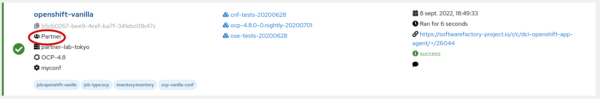
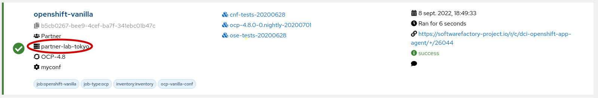
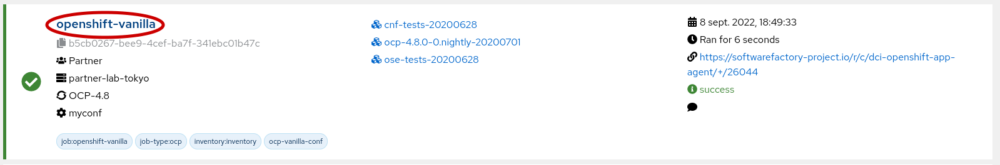
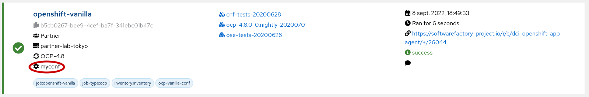
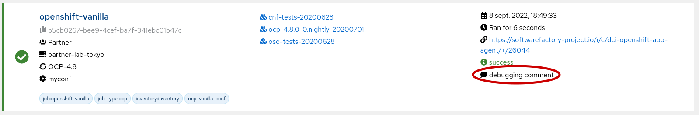
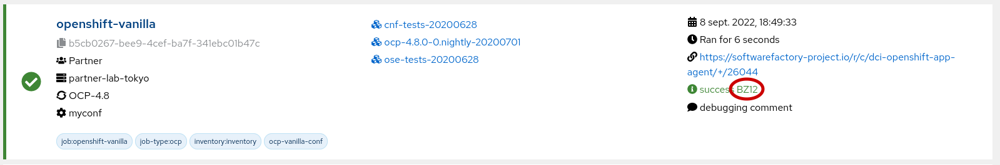
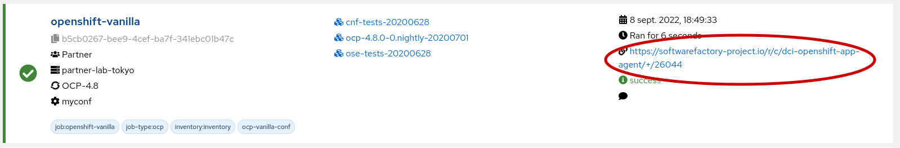
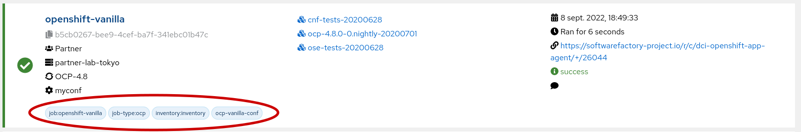

Title: Naming capabilities for DCI jobs
Date: 2022-09-08 07:00
Modified: 2022-11-04 07:15
Category: how-to
Tags: dci
Slug: naming-for-dci-jobs
Author: Frédéric Lepied
Github: fredericlepied
Summary: Good practices in naming for DCI jobs

[TOC]

## Introduction

Following good practices in naming your DCI jobs will help you visualize your jobs in the DCI User Interface and easily search them. It will also ease the creation of meaningful dashboards (See [How to build your own DCI dashboard](how-to-build-your-own-dci-dashboard.html)).

In this article, we are going to explore the various places where naming could have an impact.

## Team

The team name should start by the name of your company and if there are multiple teams in DCI for your company, add a name that will differentiate the various teams.

## Remote CI

A Remote CI represents the lab, so to easily find it, use the name of your company and something to identify your lab. For example, the lab's location or the type of hardware in your lab.

## Job name

The job name can be specified in your `settings.yml` file by using the `dci_name`. Use a name that is meaningful for your organization to help differentiate your various jobs.

## Configuration

`dci_configuration` is also a variable that can be configured in your `settings.yml` file. It represents the different scenarios or hardware configurations you want to use for a particular job.

## Comment

I recommend not to set the `dci_comment` variable in your `settings.yml` file and to keep it for analysis. Instead, you can build automation to put a comment based on the log analysis when a job is failing. Or you can have a process in your team to set a comment on failed jobs; this way, you know a job has been analyzed. Reach out to us if you need any help to put a process like this in place.

## Status reason

`status_reason` is a field of a job that can only be set after the job creation. It is usually used to track bug IDs for particular job failures. In addition, it is helpful for statistics on failures. You can use `dcictl` to set it like that:

        $ source dcirc.sh
        $ dcictl job-update --status_reason <reason> <job-id>

## URL

You can specify the URL representing a change you are testing from a GitHub PR or a Gerrit change using the `dci_url` variable. The URL is usually set on the command line when starting the agent rather than putting it in the `settings.yml` file, as at each invocation, it can change.

## Tags

Tags are a good way to organize jobs to be able to filter them. This can be set by using a list of strings on the `dci_tags` variable.

## Impact of naming on job comparison

DCI jobs look for a previous job to display improvements or regression in test results. What defines a previous job is the most recent job before the current one with the following attributes:

* same topic
* same remote CI
* same job name
* same configuration
* same URL
