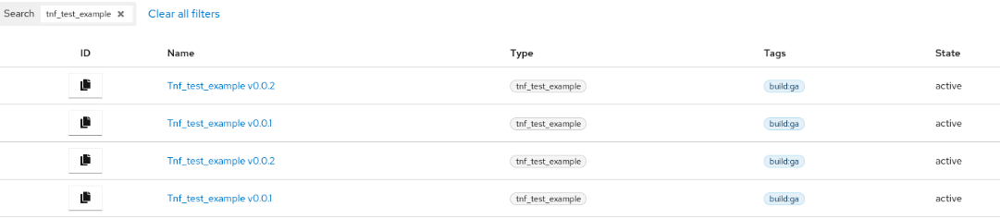
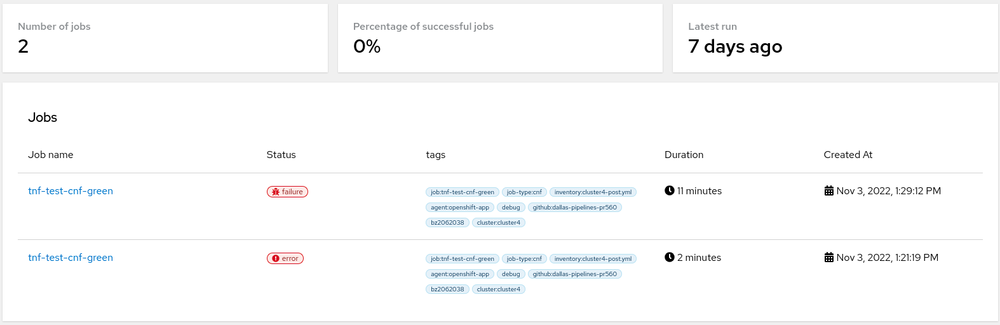
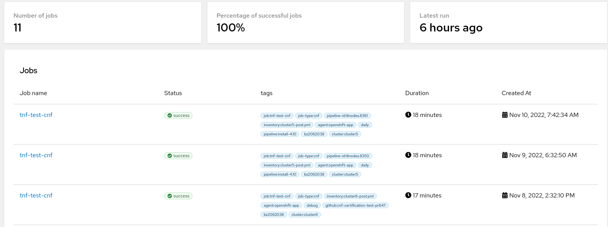
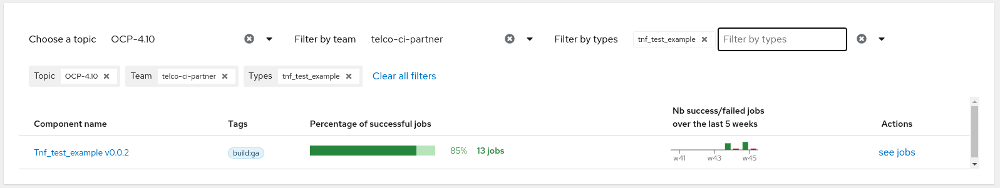
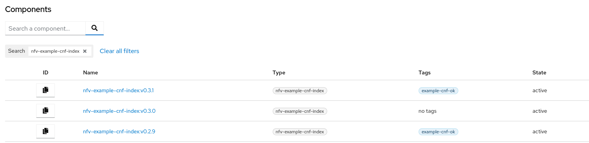
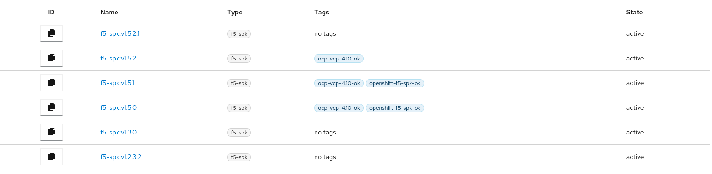
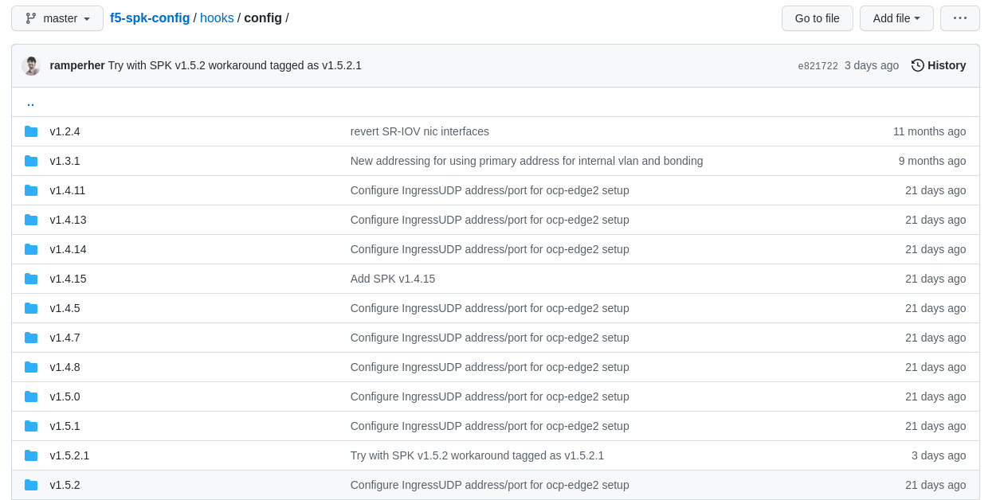

Title: Using DCI components in partner hooks
Date: 2022-11-15 10:00
Modified: 2022-12-14 10:00
Category: how-to
Tags: dci-components, partner-hooks, cnf-cert-suite, dci-openshift-app-agent, certification, partners
Slug: using-dci-components-in-partner-hooks
Author: Ramon Perez
Github: ramperher
Summary: DCI components are really useful for establishing efficient CI workflows with partner workloads. This blog post will cover the full workflow that a partner should follow, from creating the components to deploying DCI jobs using these components.

## Introduction

DCI components are really useful for establishing efficient CI workflows with partner workloads. This blog post will cover the full workflow that a partner should follow to:

1. Properly create a component.
2. Be able to visualize the component created on DCI GUI.
3. Use the components data in partner hooks.
4. Launch a DCI job using components.

To show this workflow, we will follow the [tnf_test_example](https://github.com/redhat-cip/dci-openshift-app-agent/tree/master/samples/tnf_test_example) from `dci-openshift-app-agent`, which is a good example that contains all the configuration needed to run components in DCI jobs, then retrieving the data needed from the component and using it in the hooks to run CNF Cert Suite over the deployed workloads.

Some other examples will be shown to see the different ways we can use DCI components.

Please check [How to automate DCI components creation](automate-dci-components.html) blog post to know more details about the description and general usage of DCI components.

## DCI components workflow

### Creation of components

Components are created with `dci-create-component` utility from [python-dciclient](https://github.com/redhat-cip/python-dciclient#dci-create-component) project. After launching it, [DCI Feeder](https://softwarefactory-project.io/r/plugins/gitiles/dci-feeder-api) is in charge of creating the Red Hat components continuously on DCI.

To create the component with this tool, you need to specify the following configuration:

- The credentials from your [remoteCI](https://www.distributed-ci.io/remotecis) or user because the component is attached to the team.
    - A component can only be attached to one single team (except the Red Hat or global components).
    - If you need to use the same component in different teams, you will have to create a different component for each team by using the proper credentials.
- The [OCP topic](https://www.distributed-ci.io/topics) (version) where the component will run.
    - If you want to use the component in more than one OCP topic, you will have to create a component for each OCP topic.
- The name of your component.
- The version of your component.
    - You can reference the component in your job configuration with `<name>:<version>` afterward.
- Release type of the component (dev, candidate, ga). If you consider your software is ready for production, please set up `ga` as release type, else select between `dev` or `candidate` depending on the current status of your software development.
- (Optional, but used to reorder components) Release date of the component.
    - If not specified, the release date will be the creation date of the component.
- (Optional, but really useful for automation purposes) Data embedded in the component.
    - Here, you can specify variables related to the workloads to be deployed.
    - This data can be retrieved in the partner hooks so that you can use them.
    - Take care of not including data that can be exclusive to a specific lab because a component should be immutable and portable. In that case, just move these data to variables defined directly in the hooks or in the configuration files used to define your variables (settings, pipelines, etc.)

For the case of `tnf_test_example`, let's see what we have to do to meet the following requirements:

- I want to create two versions of `tnf_test_example` component, called `v0.0.1` and `v0.0.2`, for OCP versions from 4.7 to 4.12.
- Also, I want to create these components for two different teams, each of them using a different lab (one is a connected environment, the other is a disconnected environment), so using two different remoteCIs.
- Data to be used in `v0.0.1` (in JSON format):

        {
          "tnf_app_image": "registry.dfwt5g.lab:4443/testnetworkfunction/cnf-test-partner:latest",
          "tnf_helm_chart_to_install": {
            "app_version": "1-42",
            "chart_url": "https://github.com/openshift-helm-charts/charts/releases/download/fredco-samplechart-0.1.3/fredco-samplechart-0.1.3.tgz",
            "image_repository": "registry.access.redhat.com/ubi8/nginx-118"
          },
          "tnf_operator_to_install": {
            "operator_bundle": "quay.io/telcoci/simple-demo-operator-bundle@sha256:6cfbca9b14a51143cfc5d0d56494e7f26ad1cd3e662eedd2bcbebf207af59c86",
            "operator_name": "simple-demo-operator",
            "operator_version": "v0.0.6"
          }
        }

- Data to be used in `v0.0.2` (in JSON format):

        {
          "tnf_app_image": "registry.dfwt5g.lab:4443/testnetworkfunction/cnf-test-partner:latest",
          "tnf_helm_chart_to_install": {
            "app_version": "1-42",
            "chart_url": "https://github.com/openshift-helm-charts/charts/releases/download/fredco-samplechart-0.1.3/fredco-samplechart-0.1.3.tgz",
            "image_repository": "registry.access.redhat.com/ubi8/nginx-118"
          },
          "tnf_operator_to_install": {
            "operator_bundle": "registry.connect.redhat.com/mongodb/enterprise-operator-bundle@sha256:f2127ed11f4fb714f5c35f0cc4561da00181ffb5edb098556df598d3a5a6a691",
            "operator_name": "mongodb-enterprise",
            "operator_version": "v1.17.0"
          }
        }

For each remoteCI, we would execute the following (component data must be provided in JSON):

        #!/bin/bash
        DCI_CLIENT_ID='<omitted>'
        DCI_API_SECRET='<omitted>'
        DCI_CS_URL='<omitted>'
        export DCI_CLIENT_ID
        export DCI_API_SECRET
        export DCI_CS_URL

        JSON_DATA_V1='<data_in_json_format>'
        JSON_DATA_V2='<data_in_json_format>'

        # iterate over all current OCP versions available
        for i in {7..12}; do
          echo OCP-4."$i"
          dci-create-component --format json OCP-4."$i" tnf_test_example v0.0.1 ga --data "${JSON_DATA_V1}"
          dci-create-component --format json OCP-4."$i" tnf_test_example v0.0.2 ga --data "${JSON_DATA_V2}"
        done

Finally, validate that the execution has provided a successful response, showing the `id` provided to your component and verifying that the `data` you have introduced is saved there.

### Visualization of components in DCI GUI

If you go to DCI GUI > Topics > `<select the OCP topic>`, you can see all the components ([example for OCP 4.10](https://www.distributed-ci.io/topics/818491de-8ee6-4ae8-a9bc-2d2ce62ef71c/components)) that are currently available for that OCP topic in the Components section.

Once there, you can also filter the components available for that OCP topic based on its name. This is a good way to verify that your components have been created correctly and that they are present in DCI.

For example, if we search tnf_test_example components created for OCP 4.10, four components are retrieved: two different versions (v0.0.1 and v0.0.2) that correspond to the components created on each team used.

By clicking in any component, we can also check the details of the component. Here you have a couple of examples to take a look of the information provided, also checking that the data saved in the component can be visualized here.

- Example from [tnf_test_example:v0.0.1 in OCP 4.10](https://www.distributed-ci.io/topics/818491de-8ee6-4ae8-a9bc-2d2ce62ef71c/components/fa748436-3e20-45b4-b023-f88bef91af4f).
- Example from [tnf_test_example:v0.0.2 in OCP 4.10](https://www.distributed-ci.io/topics/818491de-8ee6-4ae8-a9bc-2d2ce62ef71c/components/95d2c742-d3a3-4bb5-8b8c-7a9a3243eec7).

### Usage of components in partner hooks

Firstly, we need to reference the component in the configuration file we use to launch the job. This depends on the configuration used:

- Pipelines: you can use `components variable`. For example, for `tnf_test_example`:
    - Pinning the version to be used:

            ---
            - name: tnf-test-cnf
              type: cnf
              prev_stages: [ocp-upgrade, ocp]
              ansible_playbook: /usr/share/dci-openshift-app-agent/dci-openshift-app-agent.yml
              ansible_cfg: /var/lib/dci/pipelines/ansible.cfg
              ansible_inventory: /var/lib/dci/inventories/dallas/@QUEUE/@RESOURCE-post.yml
              dci_credentials: /etc/dci-openshift-app-agent/dci_credentials.yml
              ansible_extravars:
                dci_cache_dir: /var/lib/dci-pipeline
                dci_config_dir: /var/lib/dci-openshift-app-agent/samples/tnf_test_example
              (...)
              use_previous_topic: true
              components:
                - tnf_test_example=v0.0.1
              inputs:
                kubeconfig: kubeconfig_path
              success_tag: tnf-test-cnf-ok

    - If not pinning the version, latest component created (according to release date) is used:

            ---
            - name: tnf-test-cnf
              type: cnf
              prev_stages: [ocp-upgrade, ocp]
              ansible_playbook: /usr/share/dci-openshift-app-agent/dci-openshift-app-agent.yml
              ansible_cfg: /var/lib/dci/pipelines/ansible.cfg
              ansible_inventory: /var/lib/dci/inventories/dallas/@QUEUE/@RESOURCE-post.yml
              dci_credentials: /etc/dci-openshift-app-agent/dci_credentials.yml
              ansible_extravars:
                dci_cache_dir: /var/lib/dci-pipeline
                dci_config_dir: /var/lib/dci-openshift-app-agent/samples/tnf_test_example
              (...)
              use_previous_topic: true
              components:
                - tnf_test_example
              inputs:
                kubeconfig: kubeconfig_path
              success_tag: tnf-test-cnf-ok

  - Settings: you can use `dci_component` variable, but you need to specify the component ID that can be retrieved from DCI GUI (e.g. `dci_component: ["<component_id>"]`), which is not efficient in terms of CI automation. The best option for CI automation is to use `dci_components_by_query` variable, which allows to retrieve a component based on its name (type), version (name) of a combination of them. For `tnf_test_example`, a complete settings file to run the sample would be:

    - Pinning the version to be used:

            ---
            dci_tags: ["debug"]
            dci_config_dir: "/var/lib/dci-openshift-app-agent/samples/tnf_test_example"
            dci_components_by_query: ["type:tnf_test_example,name:v0.0.1"]
            do_cnf_cert: true
            tnf_config:
              - namespace: "test-cnf"
                targetpodlabels: [environment=test]
                target_crds: ["crdexamples.test-network-function.com"]
                operators_regexp: "simple-demo-operator"
                exclude_connectivity_regexp: ""
              - namespace: "production-cnf"
                targetpodlabels: [environment=production]
                target_crds: ["crdexamples.test-network-function.com"]
                operators_regexp: ""
                exclude_connectivity_regexp: ""
            ...

    - If not pinning the version, latest component created (according to release date) is used:

            ---
            dci_tags: ["debug"]
            dci_config_dir: "/var/lib/dci-openshift-app-agent/samples/tnf_test_example"
            dci_components_by_query: ["type:tnf_test_example"]
            do_cnf_cert: true
            tnf_config:
              - namespace: "test-cnf"
                targetpodlabels: [environment=test]
                target_crds: ["crdexamples.test-network-function.com"]
                operators_regexp: "mongodb-enterprise"
                exclude_connectivity_regexp: ""
              - namespace: "production-cnf"
                targetpodlabels: [environment=production]
                target_crds: ["crdexamples.test-network-function.com"]
                operators_regexp: ""
                exclude_connectivity_regexp: ""
            ...

After this, we need to update the hooks to make use of the component.

Both `dci-openshift-agent` and `dci-openshift-app-agent` use `job_info` variable to save context information about the DCI job currently running. This variable can be used to look for the component and all its information.

For example, in `tnf_test_example`, that variable is used to retrieve the data contained in the component:

        - name: Get tnf variables from tnf_test_example component
          set_fact:
            tnf_app_image: "{{ item['data']['tnf_app_image'] }}"
            tnf_operator_to_install: "{{ item['data']['tnf_operator_to_install'] }}"
            tnf_helm_chart_to_install: "{{ item['data']['tnf_helm_chart_to_install'] }}"
          with_items: "{{ job_info.job.components }}"
          when: item["type"] == "tnf_test_example"

Thanks to this, we do not need to hardcode the configuration in the hooks or in the settings/pipeline: it is directly saved in the component and we only need to retrieve it.

### Running DCI jobs using components

With all this done, you are now ready to run your DCI jobs using components!

Let's suppose the following examples of DCI jobs that come from `tnf_test_example` component, which show why we need two versions for this particular component:

1. We started using `v0.0.1`, our super-first release of our component, to be tested with CNF Cert Suite. But the job [failed](https://www.distributed-ci.io/jobs/048fbffb-e2dc-4f49-9d62-ae438d7446f7/jobStates?sort=date), the results from certification suite were not the expected ones! Note that, in the job, you can see the component under the Components list as `Tnf_test_example v0.0.1`
2. After troubleshooting, it was discovered that the operator used was not certified by Red Hat, so the development team released `v0.0.2`, using a certified operator. We relaunched the job by just changing the component version (or directly using the latest, without specifying version), and now… it [worked](https://www.distributed-ci.io/jobs/04d8713d-9480-4741-8f10-deabc13d746c/jobStates?sort=date)! Again, you can see that `Tnf_test_example v0.0.2` component is present under the Components list, and that a success fix is calculated for the CNF Cert Suite tests (because there is now one test that is passing and it was not passing in the previous component version) as the same component type is used for the same OCP topic.

And if we go to DCI GUI and return again to the component view, we will be able to see some statistics:

- `v0.0.1:`

- `v0.0.2:`

Also, if you go to Analytics section in DCI GUI, you can retrieve some interesting dashboards related to your component coverage! Here's an example from `tnf_test_example:v0.0.2`:

## Other examples of DCI components usage

### example-cnf hooks

For example, in [example-cnf](https://github.com/rh-nfv-int/nfv-example-cnf-deploy), we use a component called `nfv-example-cnf-index`. Here we have some components from OCP 4.10 as examples:

The data embedded in the component contains the URL of the public catalog. Here you can see an [example](https://www.distributed-ci.io/topics/818491de-8ee6-4ae8-a9bc-2d2ce62ef71c/components/7d0132dd-56ef-4aaf-8a26-5fe4405c4d6c) of this.

This data is, in fact used in the hooks to save the index image:

        - name: Get example-cnf component details from job.components
          set_fact:
            operator_version: "{{ item['name'] }}"
            example_cnf_index_image: "{{ item['data']['url'] }}:{{ item['name'] }}"
          with_items: "{{ hostvars.localhost.job_info.job.components }}"
          when: item["type"] == "nfv-example-cnf-index"

### VZ-related partner hooks

For example, in F5 SPK (Service Proxy for Kubernetes) hooks, we have components for each SPK version, without data embedded. These are examples for OCP 4.10:

Note that, in this particular case, we are not including any data in the component. Here you can see an [example](https://www.distributed-ci.io/topics/818491de-8ee6-4ae8-a9bc-2d2ce62ef71c/components/e87c6ae0-9ebb-4b58-b66c-fd2a43fd9eb1) of this, which is `v1.5.2` for OCP 4.10).

In the hooks, we retrieve the version used, and based on that, we use the SPK binaries, CRDs, configuration, etc. according to the version.

With this code, for example, we retrieve `spk_version` from the component name (e.g. `v1.5.2`):

        - name: "Get SPK version from job.components"
          set_fact:
            spk_version: "{{ item['name'] }}"
          with_items: "{{ hostvars.localhost.job_info.job.components }}"
          when:
            - spk_version is undefined
            - item["type"] == "f5-spk"

And using this variable, we load the configuration according to the version retrieved from the component. For instance:

        - name: Load SPK DNS46 configuration variables
          include_vars:
            file: "config/{{ spk_version }}/{{cluster}}.dns46.json"

This will check in `config/<spk_version>/...`:

## Conclusions

DCI components are the artifacts used to define software releases within DCI scope. They can embed data that can be used later on in partner hooks to automate the workload deployment process.

In this way, no hardcoded configuration is needed in the hooks or in the pipelines/settings; you only need to select the proper component version. As a result, they make evaluating and comparing job results easier.

### References to have in mind

Please check the following documentation as references that supports this work:

- Main repositories:
    - [python-dciclient](https://github.com/redhat-cip/python-dciclient).
    - [dci-pipeline](https://github.com/redhat-cip/dci-pipeline).
    - [dci-openshift-agent](https://github.com/redhat-cip/dci-openshift-agent).
    - [dci-openshift-app-agent](https://github.com/redhat-cip/dci-openshift-app-agent).
        - Focusing on [tnf_test_example](https://github.com/redhat-cip/dci-openshift-app-agent/tree/master/samples/tnf_test_example).
- Blog posts:
    - [How to automate DCI components creation](automate-dci-components.html).
    - [Customizable Ansible pipelines for Telco partners using DCI](customizable-ansible-hooks.html).
    - [Running CNF Cert Suite certification with dci-openshift-app-agent](cnf-cert-suite-with-dci-openshift-app-agent.html).

---
