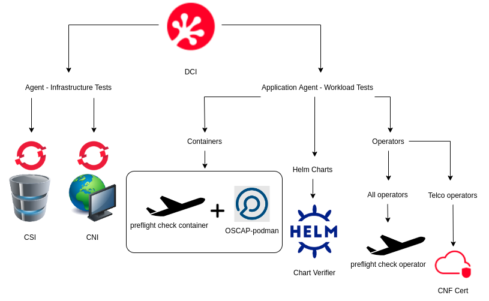
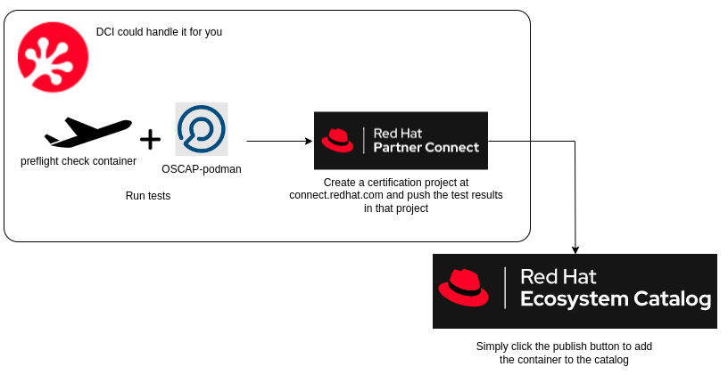
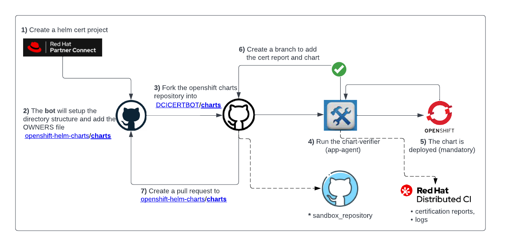
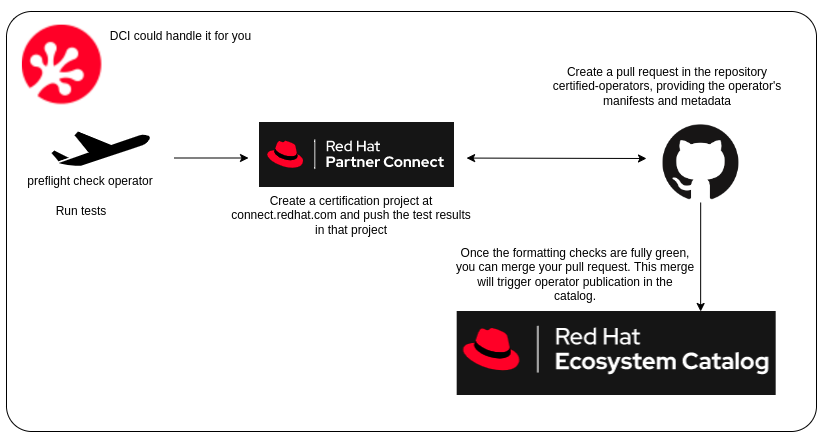
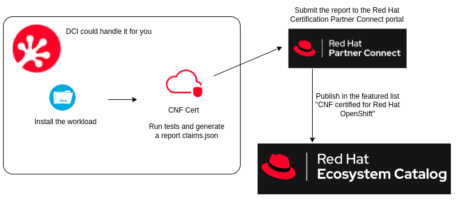

Title: Exploring Certification Test Suites Integrated in DCI: A Comprehensive Review
Date: 2022-12-22 10:00
Modified: 2024-07-31 10:00
Category: overview
Tags: partners, certification, operator-certification, container-certification, preflight, cnf, cni, csi, helm-chart
Slug: certification-test-suites-in-dci
Author: Beto Rodriguez, Ramon Perez, Tatiana Krishtop
Github: tkrishtop
Summary: This post aims to provide an overview of the certification test suites integrated in DCI and help you plan your certification journey.

Red Hat Distributed CI ([DCI](introduction-to-the-red-hat-distributed-ci)) is a great CI tool written in Ansible that can help you install OpenShift on baremetal, automate the deployment of your plugins and workloads, and run various tests. In this article, we will focus on the certification test suites that Red Hat has created for cloud-native applications to verify their adherence to best practices. DCI simplifies the setup required for these suites, allowing you to focus on improving your workload.

[TOC]

# Agent - Infrastructure Tests

## CNI Plugin Certification

The Container Network Interface ([CNI](https://redhat-connect.gitbook.io/openshift-badges/badges/container-network-interface-cni/overview)) plugin certification is designed for applications that provide network services on OpenShift via a CNI plugin. By using the [dci-openshift-agent](https://github.com/redhat-cip/dci-openshift-agent) for an OpenShift cluster deployment, a CNI plugin creator can continuously validate that their product complies with the CNI specifications. To enable the tests, it is only necessary to activate the `dci_do_cni_tests` flag. This will run the recommended Red Hat tests and generate a report for submission to the certification team for validation.

## CSI Plugin Certification

The Container Storage Interface ([CSI](https://redhat-connect.gitbook.io/openshift-badges/badges/container-storage-interface-csi-1/overview)) plugin certification is designed for storage providers working on integrating their solutions with OpenShift using a CSI driver. The test suites will validate that the plugin complies with the CSI specifications and best practices recommended by Red Hat. To run the certification tests during a new cluster deployment using DCI, it is necessary to provide a [manifest file](https://gist.github.com/bertinatto/4dab35cc4455f21b356a56c82b1fd0b4) with the plugin details and its capabilities. The job will produce a test report that can be used to submit to the certification team for validation. To enable the test, please review the `dci_openshift_csi_test_manifest` setting in the [dci-openshift-agent](https://github.com/redhat-cip/dci-openshift-agent) documentation.

# Application Agent - Workload Tests

## Containers' certification: Preflight and OSCAP-podman

To become certification-ready, your container must pass all the test suites provided by two tools: [Preflight for containers](https://github.com/redhat-openshift-ecosystem/openshift-preflight/blob/main/docs/RECIPES.md#container-policy) and [OSCAP-podman](https://www.redhat.com/sysadmin/container-vulnerabilities-openscap). Preflight for containers checks for basic best practices: "do not run as root", "base on UBI", "provide license", "limit layer count", etc. OSCAP-podman scans for vulnerabilities, running over a thousand biweekly-updated tests. To trigger these tests from DCI, you could customize [an example configuration](https://github.com/redhatci/ansible-collection-redhatci-ocp/tree/main/roles/preflight#certification-of-standalone-containers) for your needs and use a [debug guideline](preflight-integration-in-dci.html#debug-test-results-using-dci-ui) in case of any failing tests. You can also opt for [end-to-end container certification](preflight-integration-in-dci.html#end-to-end-certification-of-container-images-with-dci) from DCI by requesting that DCI automatically create a certification project at [connect.redhat.com](https://connect.redhat.com) and push the test results in that project. This allows you to simply click the publish button to add the container to the [catalog](https://catalog.redhat.com/software).

## Helm Chart Verifier

[Chart Verifier](https://github.com/redhat-certification/chart-verifier) allows you to validate the Helm chart against a configurable list of checks. The tool ensures that the Helm chart includes the associated metadata and formatting, and is distribution ready. The ultimate goal of Helm chart certification is to get your chart merged into the [OpenShift Helm Repository](https://github.com/openshift-helm-charts), and DCI can offer you a [full service](https://github.com/redhatci/ansible-collection-redhatci-ocp/tree/main/roles/chart_verifier) by running all the required tests and even automatically opening a pull request. Please note that not all Helm chart workloads can be certified; for example, the "certification-green" Helm chart [must not contain any CRDs](https://github.com/redhat-certification/chart-verifier/blob/main/docs/helm-chart-troubleshooting.md#not-contains-crds-v10). CRDs should be defined using operators.

## All Operators: Preflight Certification

General-purpose operators could be certified using the [Preflight check-operator](https://github.com/redhat-openshift-ecosystem/openshift-preflight/blob/main/docs/RECIPES.md#operator-policy) tool, that currently runs four tests. Three of these tests are basic formatting validations provided by the [operator-sdk](https://github.com/operator-framework/operator-sdk), and the fourth one, called `DeployableByOLM`, verifies if the operator could be deployed by OLM, having its Subscription and CustomServiceVersion up and running. Similarly to Preflight check-container, here are [several example configurations](preflight-integration-in-dci.html#how-to-run-certification-tests-with-dci) that you can customize for your needs, a [debug guideline](preflight-integration-in-dci.html#debug-test-results-using-dci-ui) and the possiblity to run an [end-to-end](preflight-integration-in-dci.html#end-to-end-certification-of-operators-with-dci) certification process, which tests and merges your operator into the [certified-operators repository](https://github.com/redhat-openshift-ecosystem/certified-operators).

## CNF Certification - Red Hat Best Practices Test Suite for Kubernetes

The ([Red Hat Best Practices Test Suite for Kubernetes](https://github.com/test-network-function/cnf-certification-test)) certification suite (former CNF Cert Suite) is a set of CNF tests and a framework for building more. Its main goal is not to certify the workloads under test (which can be pods and operators), but rather to measure compliance with the good practices defined in [CNF Requirements document](https://connect.redhat.com/sites/default/files/2022-05/Cloud%20Native%20Network%20Function%20Requirements%201-3.pdf) published by Red Hat. This suite is run by the [dci-openshift-app-agent](https://github.com/redhat-cip/dci-openshift-app-agent), which uses DCI configuration to [autodiscover](https://github.com/redhatci/ansible-collection-redhatci-ocp/tree/main/roles/k8s_best_practices_certsuite) the workloads. It then tests their interaction with OpenShift, and generates the report to be submitted to the [Red Hat Certification Partner Connect portal](https://rhcert.connect.redhat.com/). We have also created a [blog-post with an example configuration](cnf-cert-suite-with-dci-openshift-app-agent.html) and an [extended video presentation](https://drive.google.com/file/d/12Hyl5I_nm-1uF-ouCZgFVj9S7BPYleTF/view) if you would like to learn more.
