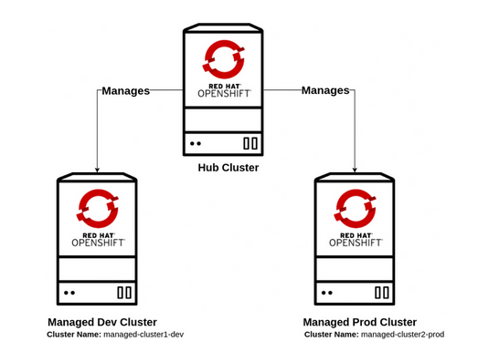
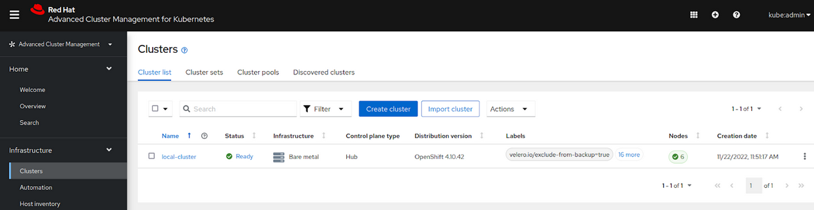

Title: ACM integration in DCI
Date: 2022-12-21 09:30
Category: DCI
Tags: dci, integration, SNO, OpenShift, OCP, ACM
Slug: dci-acm-part
Author: Beto Rodriguez
Github: betoredhat
Summary: ACM is a tool that allows deploying, and managing OCP clusters and workloads on top of it. Now the DCI Agent has the support to automate the creation of SNO instances by the integration of the ACM roles.

[TOC]

## ACM in DCI

[Red Hat Advanced Cluster Management for Kubernetes](https://www.redhat.com/en/technologies/management/advanced-cluster-management) (ACM) controls and deploys Openshift clusters.

ACM provides:

* SNO and multi-node cluster deployments.
* Built-in security policies.
* Allows deploying applications.
* Enforces policies across infrastructure platforms.
* Resources governance.
* An easy to use console.

ACM is an easy method to deploy and manage OCP clusters. Now DCI supports installing SNO instances using ACM.

## ACM architecture

ACM is available in the Red Hat Catalog, installing it is just a matter of creating a subscription. Then create a multi-cluster engine resource and wait for the installation to complete. It requires a storage class that will store information about the managed clusters.

We will use the following ACM terminology to refer to the two kinds of clusters:

- Hub: The cluster running the ACM operator.
- Spoke: The cluster(s) deployed/managed by the Hub.

*Fig. 1. ACM architecture.*

## The ACM Ansible Roles

The dci-openshift-agent uses two roles to deploy a Hub and spoke clusters.

- The [acm-setup](https://github.com/redhat-cip/dci-openshift-agent/blob/master/roles/acm-setup/README.md) role validates the requirements, deploys and configures the ACM operator. This operator provides a graphical console to perform its management.

- The [acm-sno](https://github.com/redhat-cip/dci-openshift-agent/blob/master/roles/acm-sno/README.md) role interacts with the Hub to request and deploy an SNO instance. From installation to importing the resource into the ACM console.

*Fig. 2. ACM console.*

The roles do not have any dependency, as the only need to execute them is to provide a KUBECONFIG file as input. This file will allow interaction with the Openshift clusters. Some examples of how to use the roles for multiple scenarios is available on the corresponding role’s readme.

## The integration with DCI

Creating the roles was the first stage, after that we included them as part of the skeleton of the DCI Agent. This is to take advantage of the known benefits of using DCI to deploy and test OCP.

The DCI Agent takes care of the following tasks and generates some of the parameters passed to the ACM roles.

* Performs the OCP release mirroring.
* Downloads container images and ISOs for disconnected environments. In connected-mode, it identifies the asset's URL in public repositories.
* Saves logging information and collects cluster information.
* Deploys OLM operators.

## Running a deployment

The recommended method to interact with DCI is by using pipelines. Some configurations need an inventory that provides details for the target assets. The following steps will help to generate the required configuration files:

### 1. Create the inventory file

The YAML file contains information about the SNO instance, the target hosts, and how to connect to its BMC.

`inventory.yml`

    all:
    hosts:
        jumphost:
        ansible_connection: local
        provisioner:
        ansible_connection: local
        ansible_user: dciteam
    vars:
        cluster: serverX-sno
        dci_disconnected: true
        acm_force_deploy: true
        acm_cluster_name: sno1
        acm_base_domain: sno.mydomain.lab
        acm_bmc_address: 192.168.10.NN
        acm_boot_mac_address: 3c:fd:fe:c2:11:11
        acm_machine_cidr: 192.168.NNN.0/24
        acm_bmc_user: REDACTED
        acm_bmc_pass: REDACTED
        provision_cache_store: "/opt/cache"

### 2. Created the hub pipeline

The file provides parameters for DCI. It sets the target OCP version for the ACM hub, and the outputs that can be available for the next jobs. Please note one of the important settings is enable_acm: true. This instructs the agent to deploy and configure the ACM as a post-deployment task.

`ocp-4.10-acm-hub-pipeline.yml`

    ---
    - name: openshift-acm-hub
    stage: acm-hub
    ansible_playbook: /usr/share/dci-openshift-agent/dci-openshift-agent.yml
    ansible_cfg: /var/lib/dci/pipelines/ansible.cfg
    ansible_inventory: /var/lib/dci/inventories/<lab>/8nodes/inventory.yml
    dci_credentials: /etc/dci-openshift-agent/<dci_credentials.yml>
    pipeline_user: /etc/dci-openshift-agent/pipeline_user.yml
    ansible_extravars:
        dci_config_dirs:
        - /var/lib/dci/<lab>-config/dci-openshift-agent
        dci_local_log_dir: /var/lib/dci-pipeline/upload-errors
        dci_gits_to_components:
        - /var/lib/dci/<lab>-config/dci-openshift-agent
        - /var/lib/dci/inventories
        - /var/lib/dci/pipelines
        dci_tags: []
        dci_cache_dir: /var/lib/dci-pipeline
        dci_base_ip: "{{ ansible_default_ipv4.address }}"
        dci_baseurl: "http://{{ dci_base_ip }}"
        enable_acm: true
        dci_teardown_on_success: false
    topic: OCP-4.10
    components:
        - ocp
    outputs:
        kubeconfig: "kubeconfig"
    success_tag: ocp-acm-hub-4.10-ok

### 3. Created the SNO pipeline

The below pipeline definition sets the install_type as ACM.  In this case, it is mandatory that the previous stage was of type "acm-hub". It should not be an issue if you are sure that the cluster is already running ACM. The file sets the target version for the SNO. This also requires the installation of the performance add-on operator.

`ocp-4.10-acm-sno-pipeline.yml`

    ---
    - name: openshift-acm-sno
    type: ocp
    prev_stages: [acm-hub]
    ansible_playbook: /usr/share/dci-openshift-agent/dci-openshift-agent.yml
    ansible_cfg: /var/lib/dci/pipelines/ansible.cfg
    dci_credentials: /etc/dci-openshift-agent/dci_credentials.yml
    pipeline_user: /etc/dci-openshift-agent/pipeline_user.yml
    ansible_inventory: /home/dciteam/inventories/dallas/sno/sno1-cluster4.yml
    ansible_extravars:
        install_type: acm
        acm_cluster_type: sno
        dci_local_log_dir: /var/lib/dci-pipeline/upload-errors
        dci_gits_to_components:
        - /var/lib/dci/dallas-config/dci-openshift-agent
        - /var/lib/dci/inventories
        - /var/lib/dci/pipelines
        dci_tags: []
        dci_cache_dir: /var/lib/dci-pipeline
        dci_base_ip: "{{ ansible_default_ipv4.address }}"
        dci_baseurl: "http://{{ dci_base_ip }}"
        dci_teardown_on_success: false
        enable_perf_addon: true
    topic: OCP-4.10
    components:
        - ocp
    inputs:
        kubeconfig: hub_kubeconfig_path
    outputs:
        kubeconfig: "kubeconfig"
    success_tag: ocp-acm-sno-4.10-ok

### 4. Running a full pipeline

Now that we have the required components, executing these 2 jobs will go through the following tasks:

* Install OCP and the ACM operator on top. It generates a  KUBECONFIG file.
* The second job uses the KUBECONFIG to interact with ACM and deploy the SNO instance.
* The generation of a second KUBECONFIG happens, this time for the SNO instance.
* Completing the installation of operators is the last step.

        #!bash
        $ dci-pipeline-schedule ocp-4.10-acm-hub ocp-4.10-acm-sno

### 5. Re-using an ACM hub

It is not required to deploy an ACM hub each time, it can be re-used to deploy many clusters. Setting the HUB_KUBECONFIG path environment variable before executing the acm-sno pipeline is enough. Once the installation is complete. There should be many managed clusters listed in the ACM console.

        #!bash
        $ export HUB_KUBECONFIG=/acm-hub-kubeconfig-path
        $ dci-pipeline-schedule ocp-4.10-acm-sno

## Troubleshooting

In case of issues during the deployment. Please run the following commands. Those will  help to identify issues that may happen during deployments:

* ACM being unable to pull the images.
* The selected OCP release is wrong.
* Unable to connect to the BMC.
* Incorrect cluster settings.

        #!bash
        $ oc logs -n multicluster-engine -l app=assisted-service
        $ oc logs -n multicluster-engine -l app=assisted-image-service
        $ oc project <cluster_name>
        $ oc describe infraenv <cluster_name>
        $ oc describe bmc <cluster_name>
        $ oc describe agentclusterinstall <cluster_name>

## References

For more information about the variables used in the examples. Please read the ACM's roles and DCI documentation.

* [acm-setup/readme](https://github.com/redhat-cip/dci-openshift-agent/blob/master/roles/acm-setup/README.md)
* [acm-sno/readme](https://github.com/redhat-cip/dci-openshift-agent/blob/master/roles/acm-setup/README.md)
* [dci-openshift-agent/readme](https://github.com/redhat-cip/dci-openshift-agent/blob/master/README.md)

## Wrap up

Do you feel overwhelmed with all the requirements to install OCP using UPI/IPI? Do you need something easy to manage your distributed fleet of OCP clusters? then give it a try to [ACM](https://www.redhat.com/en/technologies/management/advanced-cluster-management).

And if you want to start testing SNO via ACM to expand your CI, please try the DCI integration.
