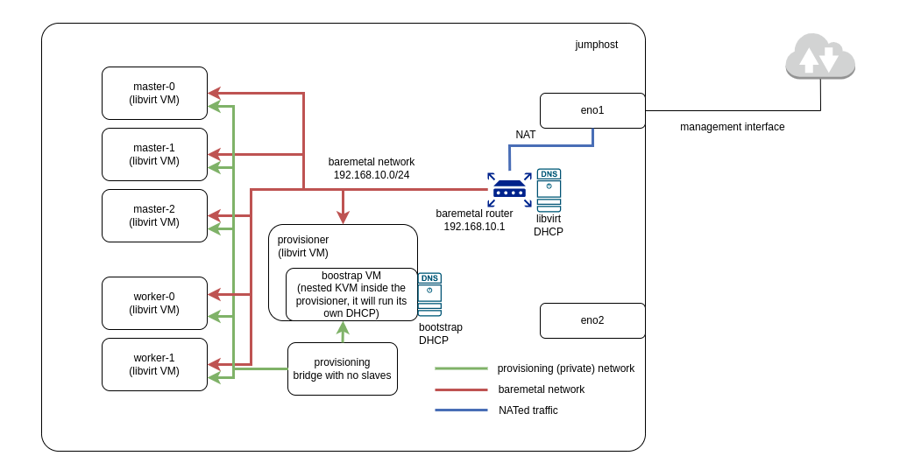

Title: Using DCI to Easily Install an OpenShift Libvirt Cluster on a Single Baremetal Server
Date: 2023-01-09 10:00
Category: how-to
Tags: dci, libvirt, kvm, baremetal, ocp, openshift, installation
Slug: install-openshift-on-baremetal-using-dci
Author: Tatiana Krishtop, Ramon Perez
Github: tkrishtop
Summary: This post is a tutorial on how to install a standard three-masters and two-workers OpenShift cluster on one powerfull baremetal server. The idea is to first create all required virtual machines and networks using libvirt API for KVM driver, and then install OpenShift on that virtual cluster using DCI.

Here is the schema of the OpenShift cluster we are going to create on a baremetal server. We will do that by using Red Hat Distributed CI ([DCI](introduction-to-the-red-hat-distributed-ci)). DCI is a great CI tool written in Ansible that can help you install OpenShift on baremetal, automate the deployment of your plugins and workloads, and run various tests.

*Fig. 1. Virtual machines and networks.*

[TOC]

# Cluster Overview

## Hardware Resources and VMs

First, estimate whether you have enough resources for the desired cluster. As a bare minimum, you will need resources for the jumphost, provisionhost, and three masters. Then, depending on the workload, reserve some vCPU, RAM and space for the workers. For example, the following resource distribution could work for an Intel 96 vCPU (Intel(R) Xeon(R) Gold 6248R CPU @ 3.00GHz), 144GB total RAM, and 500GB disk space:

    | Machine                 | RAM          | vCPU         | disk space |
    | ----------------------- | ------------ | ------------ | ---------- |
    | jumphost RHEL 8.7       | 16G RAM      | 4 vCPU       | 50G        |
    |                         |              |              |            |
    | cluster provisionhost   | 16G RAM      | 8 vCPU       | 50G        |
    | cluster master0         | 16G RAM      | 8 vCPU       | 50G        |
    | cluster master1         | 16G RAM      | 8 vCPU       | 50G        |
    | cluster master2         | 16G RAM      | 8 vCPU       | 50G        |
    | cluster worker0         | 32G RAM      | 30 vCPU      | 100G       |
    | cluster worker1         | 32G RAM      | 30 vCPU      | 100G       |
    |                         |              |              |            |
    | cluster in total        | 144G RAM     | 96 vCPU      | 450G       |

## Networks

During the cluster creation, DCI will create all of these virtual machines as well as two networks (see Fig. 1):

- The `provisioning` network is an internal network used during the creation of libvirt VMs by a bootstrap.

- The `baremetal` network connects all the OCP nodes and automatically creates a virtual router to perform NAT for external connections. This allows the OCP nodes to reach the internet, but does not allow connections from the internet. The `baremetal` network also deploys a virtual dnsmasq instance to provide basic DHCP and DNS configuration. Each VM will receive an available IP address from the DHCP pool managed by this dnsmasq instance.

# Software Prerequisites

## RHEL on Jumphost

Let's start from [installing RHEL 8.7](https://access.redhat.com/documentation/en-us/red_hat_enterprise_linux/8/html/performing_a_standard_rhel_8_installation/index) on your jumphost machine. Note that we require RHEL and not Ubuntu in order to have all the dependencies needed to automatically create VMs and networks. If you don't have all the licenses yet, you can use the [Red Hat Product Trial Center](https://www.redhat.com/en/products/trials) to try RHEL and OCP for free. To get started, make sure to [activate your RHEL subscription](https://access.redhat.com/solutions/253273) to enable the installation of all required packages.

## Enable Nested KVM

Check Fig.1 and you'll notice that the provisionhost machine contains a nested boostrap VM. To enable the possibility of its creation, [enable nested KVM on the jumphost](https://access.redhat.com/documentation/en-us/red_hat_enterprise_linux/7/html/virtualization_deployment_and_administration_guide/sect-nested_virt_setup).

## DCI packages

Next, you'll need to install the DCI packages. During the next steps, you'll use DCI twice: first, to automatically create the libvirt cluster and required networks, and then to easily install OCP on that cluster.

First, install the DCI repository:

        $ sudo dnf -y install https://packages.distributed-ci.io/dci-release.el8.noarch.rpm
        $ dnf repolist | grep dci

Then install the `dci-ansible` package, to pin the Ansible version to 2.9:

        $ sudo subscription-manager repos --enable ansible-2.9-for-rhel-8-x86_64-rpms
        $ sudo dnf install dci-ansible
        $ ansible --version | grep core

Next, install the EPEL repositories, which are required by `dci-openshift-agent`:

        $ sudo dnf install https://dl.fedoraproject.org/pub/epel/epel-release-latest-8.noarch.rpm
        $ sudo dnf config-manager --set-enabled epel
        $ sudo dnf config-manager --set-enabled epel-modular

Finally, install and verify the agent:

        $ sudo dnf install dci-openshift-agent
        $ dci-openshift-agent-ctl -h

## SSH Keys

Copy your public SSH key to `/etc/dci-openshift-agent/id_rsa.pub` to enable git clone for the DCI tool.
Then, copy your private and public keys to `~/.ssh` and ensure that they have the proper permissions.

        $ chmod 600 ~/.ssh/id_rsa
        $ chmod 600 ~/.ssh/id_rsa.pub

# Create Virtual Cluster

## YAML Configuration

Let's follow [the example configuration](install-openshift-on-baremetal-using-dci#cluster-overview) we discussed above and describe it in the form of a YAML config to feed DCI during the creation of the virtual cluster.

Log in as `dci-openshift-agent` (this user was created during the installation of DCI packages) and create a folder with the cluster configuration in its home `/var/lib/dci-openshift-agent`.

        $ sudo su - dci-openshift-agent
        $ mkdir cluster && cd cluster

Create two files in this directory. The first one, hosts, is a basic Ansible inventory.

        $ cat cluster/hosts
        [vm_host]
        localhost ansible_connection=local prov_nic=eth0 pub_nic=eth1

The second one, cluster-libvirt-resources.yml, is a YAML description of Fig. 1 for DCI.

        $ cat cluster/cluster-libvirt-resources.yml
        all:
        vars:
            prov_nic: eth0
            pub_nic: eth1
            provisionhost_user: dci
            cluster: cluster
            domain: johnsmith.lab
            masters_prov_nic: ens3
            cluster_domain: "{{ cluster }}.{{ domain }}"
            baremetal_net_ipv6: false
            redfish_inspection: false
            image_url: https://cloud.centos.org/centos/8-stream/x86_64/images/CentOS-Stream-GenericCloud-8-20210603.0.x86_64.qcow2
            enable_conserver: true
            # use local dnsmasq provided by libvirt
            apps_ip_address: 192.168.10.10
            api_ip_address: 192.168.10.5
            dns_vip_address: 192.168.10.6
            # save VM storage in a different place than /var/lib/libvirt/images (root space)
            libvirt_image_path: /home
            networks:
            - name: baremetal
                ip: 192.168.10.1
                dhcp_start: 192.168.10.100
                dhcp_end: 192.168.10.150
                domain: "{{ cluster_domain }}"
                bridge: baremetal
                forward_mode: nat
                dns:
                forwarders:
                    - domain: "apps.{{ cluster_domain }}"
                    addr: 127.0.0.1
                hosts:
                    - ip: 192.168.10.5
                    hostnames:
                        - api
            - name: provisioning
                bridge: provisioning
            hosts:
            - name: provisionhost
                domain: "{{ cluster_domain }}"
                users:
                - name: "{{ provisionhost_user }}"
                    gecos: Admin User
                    groups: wheel
                    sudo: ALL=(ALL) NOPASSWD:ALL
                    lock_passwd: false
                run_commands:
                - "sudo -u {{ provisionhost_user }} ssh-keygen -t rsa -b 4096 -f ~{{ provisionhost_user }}/.ssh/id_rsa -N ''"
                - dnf install epel-release -y
                driver: kvm
                memory: 16384
                vcpus: 8
                arch: x86_64
                boot_dev: hd
                cpu_mode: host-passthrough
                image_src: "{{ image_url }}"
                disk_size: 50G
                disk_cache: unsafe
                disk_bus: virtio_scsi
                networks:
                - name: provisioning
                - name: baremetal
                    mac: "52:54:00:00:02:00"
            - name: dciokd-master-0
                domain: "{{ cluster_domain }}"
                users: []
                run_commands: []
                driver: kvm
                memory: 16384
                vcpus: 8
                arch: x86_64
                boot_dev: hd
                cpu_mode: host-passthrough
                image_src: "{{ image_url }}"
                disk_size: 50G
                disk_cache: unsafe
                disk_bus: virtio_scsi
                networks:
                - name: provisioning
                - name: baremetal
                    mac: "52:54:00:00:02:01"
            - name: dciokd-master-1
                domain: "{{ cluster_domain }}"
                users: []
                run_commands: []
                driver: kvm
                memory: 16384
                vcpus: 8
                arch: x86_64
                boot_dev: hd
                cpu_mode: host-passthrough
                image_src: "{{ image_url }}"
                disk_size: 50G
                disk_cache: unsafe
                disk_bus: virtio_scsi
                networks:
                - name: provisioning
                - name: baremetal
                    mac: "52:54:00:00:02:02"
            - name: dciokd-master-2
                domain: "{{ cluster_domain }}"
                users: []
                run_commands: []
                driver: kvm
                memory: 16384
                vcpus: 8
                arch: x86_64
                boot_dev: hd
                cpu_mode: host-passthrough
                image_src: "{{ image_url }}"
                disk_size: 50G
                disk_cache: unsafe
                disk_bus: virtio_scsi
                networks:
                - name: provisioning
                - name: baremetal
                    mac: "52:54:00:00:02:03"
            - name: dciokd-worker-0
                domain: "{{ cluster_domain }}"
                users: []
                run_commands: []
                driver: kvm
                memory: 32768
                vcpus: 30
                arch: x86_64
                boot_dev: hd
                cpu_mode: host-passthrough
                image_src: "{{ image_url }}"
                disk_size: 100G
                disk_cache: unsafe
                disk_bus: virtio_scsi
                networks:
                - name: provisioning
                - name: baremetal
                    mac: "52:54:00:00:02:04"
            - name: dciokd-worker-1
                domain: "{{ cluster_domain }}"
                users: []
                run_commands: []
                driver: kvm
                memory: 32768
                vcpus: 30
                arch: x86_64
                boot_dev: hd
                cpu_mode: host-passthrough
                image_src: "{{ image_url }}"
                disk_size: 100G
                disk_cache: unsafe
                disk_bus: virtio_scsi
                networks:
                - name: provisioning
                - name: baremetal
                    mac: "52:54:00:00:02:05"

## VMs and Networks

We now have everything we need to run the creation of the virtual cluster. To do so, execute the following commands:

        $ sudo su - dci-openshift-agent
        $ cd /var/lib/dci-openshift-agent/samples/ocp_on_libvirt/
        $ ansible-playbook -v libvirt_up.yml -i /var/lib/dci-openshift-agent/cluster

This playbook will:

- Create 1 virtual machine to be used as a provisioning node.
- Create 5 virtual machines to be used later for the OCP installation: 3 masters and 2 workers.
- Create 2 virtual networks: `provisioning` and `baremetal`.
- Generate the relative hosts file to be used later as an inventory for the OCP installation.

Once the execution is complete, you can list the created virtual machines with the following command:

        $ sudo virsh list --all

You should see the following output:

        Id   Name            State
        --------------------------------
        87   provisionhost   running
        -    dciokd-master-0 shut off
        -    dciokd-master-1 shut off
        -    dciokd-master-2 shut off
        -    dciokd-worker-0 shut off
        -    dciokd-worker-1 shut off

You can also list the virtual networks with the following command:

        $ sudo virsh net-list --all

You should see the following output:

        Name            State   Autostart   Persistent
        ------------------------------------------------
        baremetal       active  yes         yes
        default         active  yes         yes
        provisioning    active  yes         yes

If you need to remove the libvirt resources, use the following commands:

        $ cd /var/lib/dci-openshift-agent/samples/ocp_on_libvirt/
        $ ansible-playbook -v libvirt_destroy.yml -i /var/lib/dci-openshift-agent/cluster

# Install OpenShift

The last step is to use the created virtual cluster to install OpenShift.

## Configure DCI

To configure DCI, follow these steps:

1. Login as the `dci-openshift-agent` user (note, that DCI installation configured its home to be at `/var/lib/dci-openshift-agent`):

        $ sudo su - dci-openshift-agent

2. Create a new folder to store the configuration for the OpenShift cluster:

        $ cd $HOME && mkdir dci-config

3. Tell DCI the location of this folder by setting the path in the file `/etc/dci-openshift-agent/config`:

        $ cat /etc/dci-openshift-agent/config
        CONFIG_DIR=/var/lib/dci-openshift-agent/dci-config

4. During the creation of the VMs and networks, DCI `ocp_on_libvirt` already generated the hosts file describing your cluster resources. Copy that file into the configuration folder:

        $ cd /var/lib/dci-openshift-agent/samples/ocp_on_libvirt
        $ cp hosts /var/lib/dci-openshift-agent/dci-config/hosts

5. To unlock an automated OpenShift installation, copy the pull-secret file you got with your OpenShift subscription into `/var/lib/dci-openshift-agent/dci-config/pull-secret.txt`.

6. To set an OpenShift version to install, add `settings.yml` file in the DCI configuration folder

        $ cat $HOME/dci-config/settings.yml
        ---
        dci_name: johnsmith-ocp-install
        dci_agent: openshift
        dci_topic: OCP-4.11

        cluster: "cluster"
        dci_tags: ["debug"]

        # vms do not support redfish
        redfish_inspection: false

7. To get the job displayed in the DCI UI, [create remote-ci credentials](https://www.distributed-ci.io/remotecis), and copy them into the file `dcirc.sh`, then source it:

        $ source /var/lib/dci-openshift-agent/dci-config/dcirc.sh

## Install OpenShift

Now everything is ready to start the OCP installation.
To begin, navigate to the directory containing the DCI OpenShift configuration:

        $ cd /var/lib/dci-openshift-agent/dci-config

Then run the command to start the OCP installation:

        $ dci-openshift-agent-ctl -s -- -v

To follow the installation progress, you can tail the log file on the provisionhost VM. The keys are already exchanged, so you can directly ssh:

        $ ssh dci@provisionhost
        $ tail -f /home/dci/clusterconfigs/.openshift_install.log

Once the cluster is installed, you will find all the resources required to interact with the cluster in `$HOME/clusterconfigs`: both `oc` and `kubectl` binaries, as well as `kubeconfig` file.

To connect to the cluster nodes, you can pass by the provisionhost, for example, here is how to access the master-0 node:

        $ ssh dci@provisionhost
        $ ssh core@dciokd-master-0

Don't forget to push the contents of `$HOME/cluster` and `$HOME/dci-config` to a private Git repository so you can easily reuse it if needed.

# Redeploy OpenShift or Destroy the Cluster

We hope this automated installation was smooth and easy.

To redeploy or use another version of OpenShift, there is no need to destroy the VMs. Simply repeat the [Install OpenShift step](install-openshift-on-baremetal-using-dci#install-openshift).

If you need to remove the libvirt resources, VMs and networks, use the following commands:

        $ cd /var/lib/dci-openshift-agent/samples/ocp_on_libvirt/
        $ ansible-playbook -v libvirt_destroy.yml -i /var/lib/dci-openshift-agent/cluster
