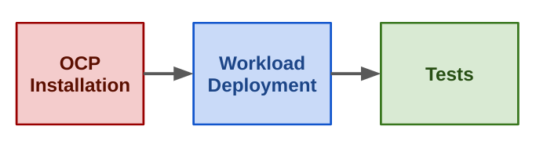

Title: Start using dci pipeline
Date: 2023-01-26 10:00
Category: divulgation
Tags: introduction, dci, dci-pipeline
Slug: dci-pipeline
Author: Pierre Blanc
Github: pierreblanc
Summary: This post will describe what is a pipeline in the dci world and how to use it step by step to create workflows in our testing environment.

[TOC]

# Introduction

dci-openshift-agent and dci-openshift-app-agent have long been the most used method to deploy and test openshift with DCI.

Dci-pipeline was released to offer a way to chain jobs.

We have been using it now for years, it is stable and offers definitely more flexibility than agents.

> **That is why dci-pipeline is now the recommended way to deploy and test openshift with DCI.**

With dci-pipeline you can easily :

- Deploy openshift, as you did it with dci-openshift-agent.
- Test your workload, as you did it with dci-openshift-app-agent.
- Chain multiple jobs, deployment and/or test.
- Share information between jobs.
- Split the declaration of your job in multiple files.
- And more…

Another [blog post](https://blog.distributed-ci.io/customizable-ansible-hooks.html) posted a few months ago describes a dci-pipeline use case, we definitely recommend reading it. In this present blog post, we will explain how to use it from the beginning. No prerequisites are necessary.

# Installation

dci-pipeline is an Open Source project hosted in [github](https://github.com/redhat-cip/dci-pipeline)
The repository provides you a way to install it from sources.

To simplify access to the tools, rpm package for rhel 7, 8 and 9 are also available [here](https://packages.distributed-ci.io/).

Always refer you to the [official documentation](https://doc.distributed-ci.io/dci-pipeline/) to know the updated way to install dci-pipeline.

# Usage

## The command line
Once installed, we can start to play with:

        $ dci-pipeline --help
        Usage: /usr/bin/dci-pipeline [<jobdef name>:<key>=<value>...] [<pipeline file>]

The command only accepts two type of arguments:

- Pipeline : which is the declaration of the job, multiple files can be used.
- Variables : to easily override a variable on these **pipeline files**.

It is a good practice to have in the name of the pipeline the prefix **-pipeline.yml**
And also using the absolute path of your pipelines.

It may be also wise to use the job name as the name of the file. Example:

        $ grep name deploy-ocp-pipeline.yml
        - name: deploy-ocp

If you use multiple files to configure one job, you can ignore this advice.

## Pipeline files

A pipeline file is the declaration in yaml of one or several job definitions.

Even if we can have only one file to declare multiple jobs, it is often more sensible to have one file per job or even split your job into multiple jobs regarding your use case.

Let’s see how is compose these famous files:

        - name: openshift-vanilla ¹
          stage: ocp ²
          ansible_playbook: /usr/share/dci-openshift-agent/dci-openshift-agent.yml ³
          ansible_inventory: /etc/dci-pipeline/inventory ⁴
          dci_credentials: /etc/dci-openshift-agent/dci_credentials.yml ⁵
          topic: OCP-4.11 ⁶
          components: ⁷
            - ocp

- ¹ : This is the name of the job. If you use multiple pipeline files with the same name, it will be merged in only one job.
- ² : Used to order jobs, will be explain below.
- ³ : Playbook used, you can modify this parameter to use dci-openshift-app-agent playbook.
- ⁴ : Inventory used.
- ⁵ : Credential to access to dci, it contents DCI_* and quay_* variables.
- ⁶ : OCP release used.
- ⁷ : List of components needed.

This file contains one job named openshift-vanilla which will install openshift 4.11.

If you want to split you job in multiple file, you just need to use the same job name.

        $ cat openshift-custom-pipeline.yaml
        - name: openshift-custom
          stage: ocp
          ansible_playbook: /usr/share/dci-openshift-agent/dci-openshift-agent.yml
          ansible_inventory: /etc/dci-pipeline/inventory
          dci_credentials: /etc/dci-openshift-agent/dci_credentials.yml
        $ cat ocp-4.10-pipeline.yaml
        - name: openshift-custom
          topic: OCP-4.10
          components:
            - ocp

Now, to execute this job, we just have to specify this two pipeline files:

        $ dci-pipeline ~/openshift-custom-pipeline.yaml ~/ocp-4.10-pipeline.yaml

This feature can be very useful to avoid duplications of configuration.

## Override pipeline

First, any part in the pipeline files can be overridden on the command line using the syntax <job name>:<field>=<value>. For example if you want to change the topic version in the openshift-vanilla job from the previous example, use:

        $ dci-pipeline openshift-vanilla:topic=OCP-12 ~/ocp-vanilla-pipeline.yaml

Also we often need to customize variables of the playbook, in this case use the key `ansible_extravars`.

        - name: openshift-vanilla
          stage: ocp
          ansible_playbook: /usr/share/dci-openshift-agent/dci-openshift-agent.yml
          ansible_inventory: /etc/dci-pipeline/inventory
          ansible_extravars:
            variable1: value1
          dci_credentials: /etc/dci-openshift-agent/dci_credentials.yml
          topic: OCP-4.11
          components:
            - ocp

In the [official documentation](https://doc.distributed-ci.io/dci-pipeline/) it also explains how to customize environment variables, use the variables files and more.

## Order your jobs

To create an order on the execution of your jobs two configuration keys are used:
stage : to define the actual step (string)
prev_stages: to specify what are the previous job (array)

Let's now go through an example of a common use case:

We shrunk the jobs by just showing the important part for the configuration

So, the first job deploys openshift.

        $ cat openshift-vanilla-pipeline.yaml
        - name: openshift-vanilla
          stage: ocp
          [...]

This second job installs the workflow on the infrastructure, the prev_stages value specifies what is the previous job.

        $ cat deploy-app1-pipeline.yaml
        - name: deploy-app1
          stage: workflow
          prev_stages: [ocp]
          [...]

The final job doing test of the workload.

        $ cat http-test-pipeline.yaml
        - name: http-test
          stage: test
          prev_stages: [ocp, workflow]
          [...]

This job needs to be executed in the last, prev_stages contains all previous stages.

Well, now maybe you want to pass variables between jobs. Perfect, a mechanism exists to share information between jobs with the output/input configuration keys.
It explains in detail in [this section](https://doc.distributed-ci.io/dci-pipeline/#sharing-information-between-jobs).

# Conclusion

To summarize, dci-pipeline is the recommended way to deploy and test openshift with DCI, it replaces the agents and offers much more flexibility to create complex workflows

This blog post partially covered its major behaviors, others posts will follow with more advanced scenarios and features.
