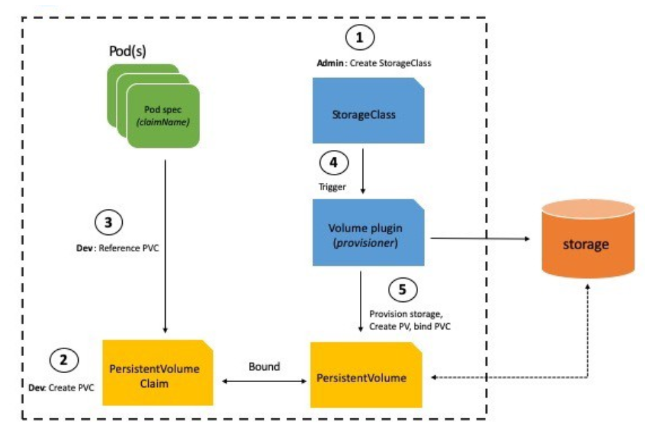
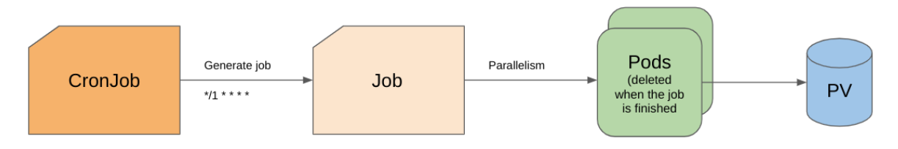
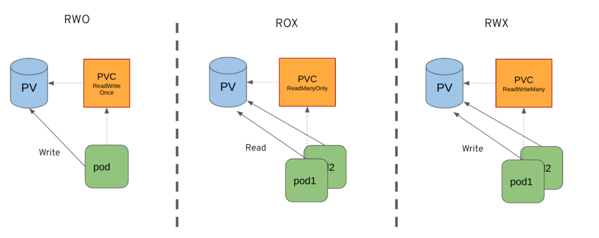

Title: Testing the storage services during an OCP upgrade 
Date: 2023-01-30
Category: Openshift
Tags: upgrade, OCP, DCI
Slug: storage-upgrade-tester
Author: Charles Caporali
Github: capolrik
Summary: The storage tester role is shipped in the Dic-Openshift-Agent that allows the user to test a storage class behavior during an upgrade. It can be seen as an example of what can be done with DCI to customize the cluster.

[TOC]

## Introduction

When administering a cluster of machines, upgrading is not a trivial task yet, especially when there are critical services running on it. It is hard to estimate the risks of the running services or their potential downtime. Hopefully, Openshift provides tools to handle this problem like the Migration Toolkit for Containers (MTC) operator which helps controlling the migration.

In order to test workload and applications during the daily CI tests, some infrastructure plugins need to be set up first, like a specific storage software solution. In Openshift, it comes as drivers implementing CSI specification (Container Storage Interface). A developper can decide to code a new one for OCP using this framework in order to handle a specific hardware, which is not so exotic in the storage world. The specification comes with a bunch of tests to ensure that the install of the CSI driver is done properly. But when it comes to an upgrade, how can we measure the impact on the infrastructure plugin needed for the other workload?

This article will use the use case of the storage service behavior during the upgrade to illustrate the flexibility of DCI for customizing the set up and the test of a workload, even if it implies some specific infrastructure solution.

## Reminder on how storage is managed in OCP

In Openshift and K8s, storage is handled by volumes: pods are referencing a Persistent Volume Claim (or PVC) which is bound to a Persistent Volume (or PV). This is the high level view for the developer of the application but under the hood, PV and PVC are managed by a Storage Class. It is responsible for deploying the plugin on the OCP nodes in order to communicate with the actual storage.

*Fig. 1. How storage is managed in OCP*

## The approach

To test the impact the upgrade on the storage solution, a end-to-end approach will be used here, for several reasons:
It is more aligned with the final user experience. What we want to measure here is the downtime on the storage to see if it impacts the workload running on top of it.
It has a more flexible approach. Working on the user side requires less permission and will be easier to clean up afterward.
It is easier to implement. No need to modify the CSI driver or develop a specific operator, using regular pods and the built-in monitoring solution will be enough.

This method is translated in the cluster as a simulation of a workload that uses the storages in different scenarios.

## The implementation by an Ansible role

As DCI is using Ansible playbook, storage tester procedures should be shipped as an Ansible role. The main goal is to test the storage during the upgrade of Openshift platform, so the role can be called during an upgrade pipeline by setting the boolean ‘storage_upgrade_tester’ to true. It will set up the k8s objects needed for the tests in a dedicated namespace during the pre-run stage of the upgrade.

    :::yaml
    - name: "Storage service test (during upgrade only)"
      include_role:
        name: storage-tester
        apply:
          environment:
            KUBECONFIG: "{{ kubeconfig_path }}"
      vars:
        storage_class: "{{ tester_storage_class | default(omit) }}"

Note that the ‘tester_storage_class’ variable is optional and allows you to choose which storage class you want to test. By default, it is using the default storage class of the cluster.

The test method is based on the usage of k8s CronJobs which work in a similar way than the Cron Job on a linux system. Every minute, a CronJob will generate a k8s Job which will deploy some pods that use Persistent Volume provided by the storage class tested. Once the pods have finished their tasks, they are removed and the job is marked as completed and a new job will be created in the next minute. If the previous job is not finished when a new one is created, then the older one is marked as failed and all failed jobs are logged in the history of the CronJob object.

*Fig. 2. CronJob behavior.*

As the CronJobs are launched before the upgrade, they will keep generating jobs during it and if the storage class is not available, jobs will fail and it will keep a trace of it.

## Three different scenarios

For now, the role creates 3 different CronJobs, which one corresponding to a different scenario testing each one a binding method:
ReadWriteOnce (RWO): A pod is binding to a new PersistentVolume and is doing a simple test of writing inside this volume. This is the simplest case that ensures that the basic functionalities are covered.
ReadManyOnly (ROX): Two pods are bound to the same PersistentVolume that have been prepared before the test. Pods are reading values written inside the Volume
ReadWriteMany(RWX): Two pods are bound to the same PersistentVolume and are simultaneously writing new files inside the volume.

*Fig. 3. Three different test cases.*

The three CronJobs will keep generating Job during the on-going upgrade, as it was a regular workload running on the OCP platform. At the end of the upgrade process, the analysis of the output will give an estimation of the downtime as an end-user perspective.

## Gathering results

There are several ways to estimate the impact of the upgrade on the storage-service. The first one consists of checking the number of failed jobs iteration for each CronJob. As it keeps the history of all the failures that happen, the timestamps can be retrieved to know the period of unavailability of the storage service. Another method could be to analyze the content of the PersistentVolume used during the tests, specially for the tests that involve writing permissions. As it has a predictable behavior, a certain amount of lines is expected and the lines missing correspond to a number of failures. Those two methods are combined to get the first meaningful result.
The last method consists of consuming the metrics provided by the built-in Prometheus of the cluster and then displaying the results in charts with Grafana. This feature will be used when the configuration of Prometheus will be standardized in the DCI pipelines. 

## Conclusion

The tests made on the storage class show well the flexibility provided by DCI. By using a custom Ansible role, tests or workloads on specific parts of the cluster, like storage, can be customized according to your needs. It is not just limited to on top workload, even infrastructure can be easily adapted and it is widely used by our partner, such as specific PerformanceProfile. 

## Stay tuned !

[Distributed CI documentation](https://docs.distributed-ci.io)
[Storage Tester role documentation](https://softwarefactory-project.io/r/plugins/gitiles/dci-openshift-agent/+/refs/heads/master/roles/storage-tester/)