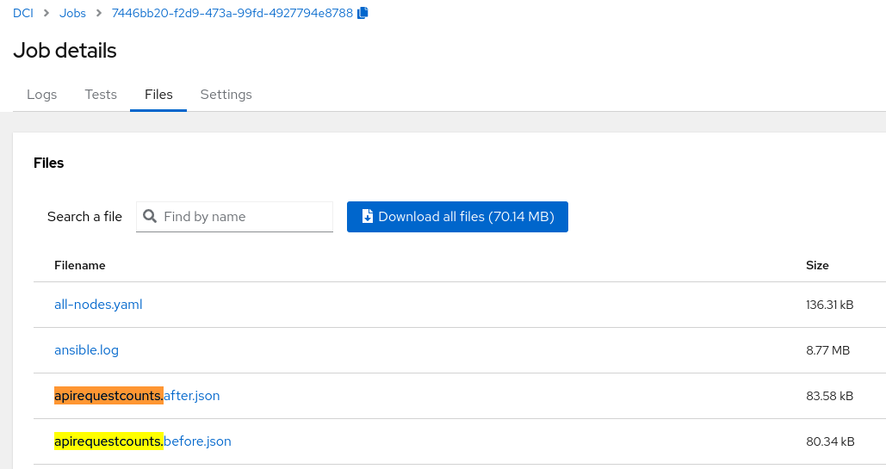
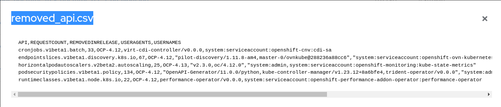

Title: Upgrading to OCP 4.12? Watch Out for Deprecated API in Your OpenShift Applications
Date: 2023-02-28 10:00
Category: how-to
Tags: dci, upgrade, ocp, api, deprecation
Slug: deprecated-api-in-ocp-4-12
Author: Tatiana Krishtop
Github: tkrishtop
Summary: One of the main challenges during the workload migration to OCP-4.12 is the massive deprecation of beta APIs. In this post, we will discuss how to identify the APIs that are going to be deprecated and how DCI could simplify this task for you.

[TOC]

# Overview of API Deprecation in OCP-4.12

Kubernetes and OCP both use the same API versioning scheme: alpha, beta, and GA (generally available).

- Versions like v1alpha1, v1alpha2, v2alpha1, and so on are called _alpha_ versions and are considered unstable. They might disappear in the next version or change in any incompatible way.

- Versions like v1beta1, v1beta2, v2beta1, and so on are called _beta_ versions. They are a bit more stable than alpha, and they usually survive several OCP versions and remain compatible.

- Versions like v1, v2, and so on are stable and _generally available_ APIs. They will stay and be compatible.

Kubernetes v1.25 and OCP-4.12 started a [massive API deprecation](https://kubernetes.io/docs/reference/using-api/deprecation-guide/#v1-25). The tricky part is that many "mostly stable" v1beta1 and v2beta1 versions have been deprecated. This requires more attention from the maintainers of large applications. Your workload may survive many migrations and then suddenly break on OCP-4.12, as it happened with our test application [example-cnf](https://github.com/rh-nfv-int/nfv-example-cnf-deploy).

# Workload Errors: "Not Found" as a Marker of Deprecated API

A deprecated API can be hidden in either the deployment manifest or in a Kubernetes-native application that uses a Kubernetes client. In the deployment manifest, the deprecated API may be specified as follows:

        apiVersion: events.k8s.io/v1beta1
        kind: Event
        metadata:
          name: my-event
          namespace: default

In a Kubernetes-native application that uses a Kubernetes client, the deprecated API may be used as follows:

        from kubernetes import client
        events_api = client.EventsV1beta1Api()

Using a deprecated API can cause the application to break in a way that is often difficult to debug. The only error message you may see is an unclear "Not Found" message in the pod logs:

        Exception on creating Event: (404)
        Reason: Not Found

To avoid the workload to break and cause pain while debugging, you can anticipate API deprecation and speak with your dev team in advance about starting the migration.

# Use OCP Console to Detect APIs that Will Be Removed

## Identifying APIs To Be Removed

OpenShift provides a dedicated command to display all the APIs that the cluster and workload are using.

        $ oc get apirequestcounts | head -5
        NAME                                                                       REMOVEDINRELEASE   REQUESTSINCURRENTHOUR   REQUESTSINLAST24H
        alertmanagerconfigs.v1alpha1.monitoring.coreos.com                                            17                      279
        alertmanagers.v1.monitoring.coreos.com                                                        168                     1318
        apirequestcounts.v1.apiserver.openshift.io                                                    0                       153190
        apiservers.v1.config.openshift.io                                                             119                     1013

By using `-o yaml`, we can obtain more detailed information about every API:

        $ oc get apirequestcount endpointslices.v1beta1.discovery.k8s.io -o yaml
        apiVersion: apiserver.openshift.io/v1
        kind: APIRequestCount
        metadata:
          name: endpointslices.v1beta1.discovery.k8s.io
          -- snip --
        spec:
          numberOfUsersToReport: 10
        status:
          currentHour:
          -- snip --
          last24h:
          -- snip --
          removedInRelease: "1.25"
          requestCount: 115

The most interesting fields are the API name, the Kubernetes release in which it will be removed, and the overall request count. Below, we only display APIs that are to be deprecated by requiring the presence of the `.status.removedInRelease` field:

        $ oc get apirequestcounts -o json \
        | jq -r '.items[] \
        | select(.status.removedInRelease!=null) \
        | [.metadata.name, .status.removedInRelease, .status.requestCount]' 

        [
        "endpointslices.v1beta1.discovery.k8s.io",
        "1.25",
        113
        ]
        [
        "podsecuritypolicies.v1beta1.policy",
        "1.25",
        218
        ]
        -- snip --

## Identifying Which Workloads Use To-Be-Removed APIs  

The next step is to identify the workload that uses the APIs to be deprecated.
For that, the `apirequestcount` displays detailed information in the `byUser` sections, providing both `userAgent` and `username`:

        $ oc get apirequestcount endpointslices.v1beta1.discovery.k8s.io -o yaml
        -- snip --
        - byUser:
          - byVerb:
            - requestCount: 14
              verb: watch
            requestCount: 14
            userAgent: pilot-discovery/1.11.8-am4
            username: system:serviceaccount:istio-system:istiod
          - byVerb:
            - requestCount: 7
              verb: watch
            requestCount: 7
            userAgent: master-0/ovnkube@6cfa168d3ed2
            username: system:serviceaccount:openshift-ovn-kubernetes:ovn-kubernetes-controller

For large workloads, you may have hundreds of such sections. To build a nice overview for the developpement team, you could use some [advanced bash](https://access.redhat.com/articles/6955985) or jq-filtering.
Alternatively, you could use [DCI](introduction-to-the-red-hat-distributed-ci) to install your workload and automatically get a CSV containing all the information about the to-be-deprecated APIs at every run.

# Use DCI to List APIs That Will Be Deprecated

DCI stands for [Distributed CI](introduction-to-the-red-hat-distributed-ci). It is a great CI tool written in Ansible that can help you install OpenShift on baremetal, automate the deployment of your plugins and workloads, and run various tests.
If you never used DCI before, please check this great post on how to start with [DCI pipelines](dci-pipeline), to pipeline OCP installation, workload installation and tests. Here we are going to focus on the information about the deprecated APIs that DCI job for the workload installation could provide automatically, without any required actions on your side.

*Fig. 1. DCI dumps soon-to-be-deprecated APIs before and after workload.*

The logic is to dump `oc get apirequestcount` for the soon-to-be deprecated APIs before and after the workload installation, creating two files: `apirequestcounts.before.json` and `apirequestcounts.after.json`. DCI uses these two files to compare the request count for every API, to distinguish OCP-related and workload-related to-be-deprecated APIs. DCI excludes the API which request count did not change during the workload installation and tests. This approach is not always precise but helps to filter out some OCP-only APIs. DCI then generates `removed_api.csv` file in the following format, listing all user agents and use names that were using every API (here you have an output for the example workload containerazing TRex application):

        $ cat removed_api.csv
        API,REQUESTCOUNT,REMOVEDINRELEASE,USERAGENTS,USERNAMES
        cronjobs.v1beta1.batch,33,OCP-4.12,virt-cdi-controller/v0.0.0,system:serviceaccount:openshift-cnv:cdi-sa
        endpointslices.v1beta1.discovery.k8s.io,67,OCP-4.12,"pilot-discovery/1.11.8-am4,master-0/ovnkube@288236a88cc6","system:serviceaccount:openshift-ovn-kubernetes:ovn-kubernetes-controller,system:serviceaccount:istio-system:istiod"
        horizontalpodautoscalers.v2beta2.autoscaling,25,OCP-4.13,"v2.3.0,oc/4.12.0","system:admin,system:serviceaccount:openshift-monitoring:kube-state-metrics"
        podsecuritypolicies.v1beta1.policy,134,OCP-4.12,"OpenAPI-Generator/11.0.0/python,kube-controller-manager/v1.23.12+8a6bfe4,trident-operator/v0.0.0","system:admin,system:kube-controller-manager,system:serviceaccount:trident:trident-operator"
        runtimeclasses.v1beta1.node.k8s.io,22,OCP-4.12,performance-operator/v0.0.0,system:serviceaccount:openshift-performance-addon-operator:performance-operator

*Fig. 2. Soon-to-be-deprecated APIs in the CSV format.*

Hopefully, this automatically generated information could help you managing and coordinating the upcoming APIs deprecation on OCP-4.12 and later.

# Links and Next Steps

- [What is DCI](introduction-to-the-red-hat-distributed-ci).

- [How to Start with DCI by Using DCI Pipelines](dci-pipeline).

- [DCI Source Code to Compute Soon-To-Be-Deprecated APIs](https://github.com/redhat-cip/dci-openshift-app-agent/tree/master/roles/deprecated-api).

- [Using DCI to Easily Install an OpenShift Libvirt Cluster on a Single Baremetal Server](install-openshift-on-baremetal-using-dci).
