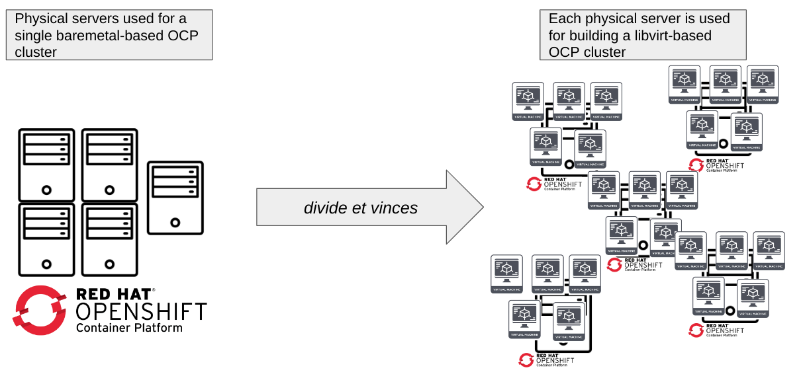
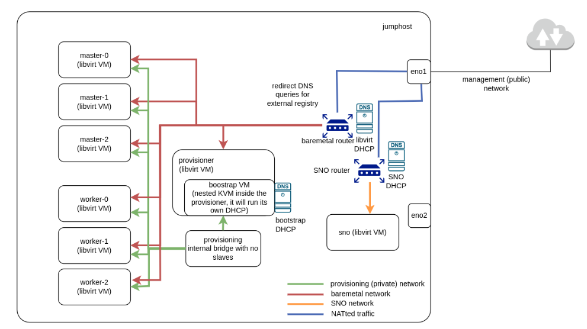

Title: Distributed Deployment of Libvirt-Based OpenShift Clusters: Requirements and Challenges in Terms of Networking
Date: 2023-03-16 10:00
Category: how-to
Tags: dci, ocp, development, libvirt, kvm, baremetal, openshift, installation, networking
Slug: distributed-libvirt-clusters
Author: Ramon Perez, Manuel Rodriguez
Github: ramperher
Summary: In previous blog posts, we have learned about the OCP on Libvirt project and the benefits it brings to us, with regards to the flexible deployment of OCP clusters where the nodes are virtual machines deployed on Libvirt. However, we have only covered the case of one single physical server. Can we use multiple physical servers to set up a lab with multiple, distributed deployment on Libvirt-based OCP clusters? The answer is yes! And we will explain the main requirements and challenges in terms of networking in this blog post.

[TOC]

## Introduction

In previous blog posts, we have learned about the OCP on Libvirt project and the benefits it brings to us, with regards to the flexible deployment of OCP clusters where the nodes are virtual machines deployed on Libvirt.

If you remember, we started by commenting how to [set up a virtual development environment for OCP agent](libvirt-dev-env-for-ocp-agent.html), and then we continued by describing how to [use DCI to easily install an OCP cluster based on Libvirt in a single baremetal server](install-openshift-on-baremetal-using-dci.html).


However, in both cases, we have only covered the case of one single physical server. Can we use multiple physical servers to set up a lab with multiple, distributed deployment on Libvirt-based OCP clusters? The answer is yes! And we will explain the main requirements and challenges in terms of networking in this blog post.

In particular, our intention is to make you learn the following:

- A solution to deploy multiple OCP clusters based on libvirt nodes, using [Distributed-CI (DCI)](introduction-to-the-red-hat-distributed-ci.html).
- The potential use case of this kind of solutions, currently ongoing in the Telco Partner CI team.
- The challenges to have in mind when working with this.

### Context of this work

This work can be seen from different perspectives:

- In particular, from partners' perspective, this work allows to speed-up testing specific OpenShift versions and workloads deployed on top of it with really flexible deployments that can be destroyed and re-created on a simple basis, while the number of clusters available can be scaled if required. This can be a useful resource for partners and customers in order to have as many OpenShift virtualized clusters as they need, with different configurations and sizing, to cater to their needs.
- But also, from Red Hat Hybrid Cloud's perspective, this work fits in extending Red Hat to Cloud Services and Edge, as it makes the deployment of multiple OpenShift clusters more flexible and robust, as well as allowing the evolution of customer success, as this deployment can be easily reproduced in partners and customers.

### Key points

We detect the following **benefits** from this integration:

- Speed-up the process of deploying and testing the cluster.
- Enable the possibility of having a fully automated and virtualized laboratory, with a farm of OCP clusters with virtual nodes, each of them having different configurations and being used for different purposes.
- Maximize the resources available.

But also, we foresee several **challenges** to address, that will be reviewed in the blog post:

- Consider that each and every team or even individuals have their own way to deploy OCP clusters on top of Libvirt.
- A wrong design or implementation may lead to various implications in terms of networking, such as ensuring the isolation between clusters.

## Why Libvirt-based OCP clusters?

The rationale of this idea is not a chance. It's just a natural, good practice that comes up when having multiple resources that can be splitted in order to maximize its usage.

So, imagine you have several powerful physical servers to build a single cluster to deploy OpenShift. You may think that having such a powerful environment to test OCP deployments and/or workloads would be great, but in the end, sometimes (mostly when dealing with testing and troubleshooting, not being in production), it's like using a sledgehammer to crack a nut! Then, you need to ask yourself: do I really need this powerful cluster to just test OCP? Am I really using properly and efficiently the resources I am taking?

If we split the cluster and dedicate each physical server to deploy a virtualized OCP cluster, using libvirt-based virtual machines, we would eventually benefit from the advantages of Cloud Computing, maximizing the usage of the underlying physical resources and also allowing the parallelization of your development work, as you can dedicate different OCP clusters for each to-do task.

We can summarize this process with the following picture, where the Latin expression *"divide et vinces"* appears in its full splendor.



Of course, this is not an *easy* work, but it is not impossible. The case that we will analyze in this blog post, which is already in place in Telco Partner CI team’s testing environment, might inspire you to adopt this kind of environments. In particular, our work is based on the following:

- Distributed IPI/SNO deployment of OCP clusters fully virtualized with Libvirt.
- 10 physical servers used for this setup.
- Distributed-CI (DCI) is used for the automation of the deployment (using Ansible, among others).

### And how can DCI help us here?

You have to consider that deploying an OpenShift cluster with a particular version, custom configuration, workloads on top, etc., is not as easy as it may seem at the beginning. And also, different users and partners may decide on using their own tools and processes to address this, as commented before, so the probability of having failures or issues and not finding proper documentation or troubleshooting guidelines to try to overcome them would increase in these cases.

Here's where DCI appears to try to make your life easier. Just highlighting some concepts from its [own workflow](https://docs.distributed-ci.io/#workflow), we have to clarify that the hardware to be used allows to use:

- Multiple options for OCP deployment (IPI, SNO, Assisted, etc.).
- Multiple hardware configurations (baremetal, libvirt VMs, etc.).

So, in the end, it's a platform prepared to do this kind of integrations on a CI basis, following a pipeline-and-component-based logic to install OCP and deploy workloads on top of it, regardless of the hardware used to create the cluster.

## Requirements

Mainly, you would need to meet the following requirements, which are mainly estimations based on the work we have done in our own labs:

- Enough compute resources to deploy as many VMs you want to deploy.
    - 1 VM as provisionhost. At least 16 GB RAM @ 8 vCPU.
    - 1 VM for each worker/master node to be used (SNO would only need 1 VM).
        - SNO: at least 8 GB RAM @ 6 vCPU, but more recommended to install operators and workloads.
        - Multi-node cluster: at least 16 GB RAM @ 8 vCPU per node (x2 in workers).
- At least RHEL 8 OS.
    - + RHEL subscription for the Host servers.
- Install DCI agent packages.
- Enable nested KVM.
- 1 Network Interface with access to the Internet.
    - Need to plan the IP addressing in advance.

## Network setup

### Starting with a single server

If we check the scenarios deployed in the blog posts referenced above, we will see that we only have one server, which holds the OCP clusters and acts as a jumphost to access to the nodes.



In that case, VMs are connected with an internal network for provisioning, and a NATted network is used as baremetal network, allowing the virtual machines to have connectivity towards Internet (in the case of a connected cluster like this). This is managed by a virtual router created by libvirt, which has its own dnsmasq process to provide DHCP and DNS configuration to the VMs connected to that network.

Also, you can see in the figure above that we can combine the presence of different OCP clusters in the same physical server; such as IPI and SNO, as long as we define different virtual networks to isolate them.

### Moving to multiple servers

Then, what do we need to do to move to a distributed deployment by using multiple servers? This is summarized in the next picture.


Essentially, we need to bear in mind the following distribution of servers:

- One server will act as jumphost to access all VMs, including all the network configuration required (dnsmasq, DHCP, etc.).
    - The dnsmasq configuration will no longer be run in the server that deploys the virtual machines; it will be delegated in the physical server acting as jumphost.
- Other servers deploy the libvirt VMs to create the OCP clusters.
    - But here, it’s not enough to use NATted networks in the baremetal network, because they can only manage outbound traffic, but not inbound.
    - In this case, a bridged network is required instead, forcing the VMs to ask for IP configuration to the jumphost (e.g. based on MAC address).

Consequently, the key points of this solution are:

- The usage of a Linux bridge on each server, mastering the physical network interface of the server that connects it with the jumphost, which will be the slave of this Linux bridge.
    - This Linux bridge allows the layer-2 connectivity between all the virtual machines deployed in the server, but for layer-3 configuration, we need to go one step further.
- The centralized network configuration applied from the jumphost. All the VMs will receive configuration from the jumphost.
    - Our approach is based on static IP-MAC assignment; so, if we hardcode the MAC address to be used by each virtual machine in the virtual network that connects it to the Linux bridge, we can configure dnsmasq in the jumphost to provide a specific IP address to the virtual machine in that interface, then allowing the layer-3 connectivity.
    - Of course, this jumphost would also apply the DNS resolution for all the VMs, not only being the point of the network from which we can SSH to the virtual machines, but also allowing the virtual machines to reach resources (e.g. registries) from outside.

## Deployment and automation

You know that, with DCI, it is feasible to automate this kind of deployments. For example, with `dci-openshift-agent`, you can do the following with each server:

- Define all VM settings in variables to easily adjust configurations.
- Use different files for the variables related to each OCP cluster (on each different physical server).
- Use scripts to create and destroy VMs for clean setups.
- Define stages for OCP pre-configuration, installation, and post-setup.

However, this is true when acting over each phyisical server isolatedly. But what about achieving a real automation of the *whole* lab? Our recommended option is to apply the automation in the jumphost, so that you can rely on utilities packaged on DCI that we have already covered in several blog posts, such as [prefixes](using-prefixes.html), [dci-queue](dci-queue.html) or [dci-pipeline](dci-pipeline.html).

### How to deploy at a high level

Let's briefly review, from a high level perspective, how you can deploy this kind of environments, to make you understand the final picture you will have.

Of course, the first step from your side would be to install and configure the DCI-related tools in your system, among other [requirements](#requirements) we already commented.

Then, adjust the variables to be used by `dci-openshift-agent` for your deployment. We recommend you to have different inventory files for each physical server used to deploy OCP, and also a different file for each deployment type (IPI, SNO...) you may want to use.

Here's an example for an IPI deployment, with OCP on Libvirt, of a 3-worker and 3-master OCP cluster:

```
all:
  vars:
    prov_nic: eth0
    pub_nic: eth1
    provisionhost_user: dci
    cluster: server
    domain: our.pretty.lab
    masters_prov_nic: ens3
    cluster_domain: "{{ cluster }}.{{ domain }}"
    baremetal_net_ipv6: false
    redfish_inspection: false
    image_url: https://cloud.centos.org/centos/8-stream/x86_64/images/CentOS-Stream-GenericCloud-8-20210603.0.x86_64.qcow2
    enable_conserver: true
    networks:
      - name: baremetal
        bridge: br0
        forward_mode: bridge
      - name: provisioning
        bridge: provisioning
    hosts:
      - name: provisionhost
        domain: "{{ cluster_domain }}"
        users:
          - name: "{{ provisionhost_user }}"
            gecos: Admin User
            groups: wheel
            sudo: ALL=(ALL) NOPASSWD:ALL
            lock_passwd: false
        run_commands:
          - "sudo -u {{ provisionhost_user }} ssh-keygen -t rsa -b 4096 -f ~{{ provisionhost_user }}/.ssh/id_rsa -N ''"
          - dnf install epel-release -y
        driver: kvm
        memory: 16384
        vcpus: 8
        arch: x86_64
        boot_dev: hd
        cpu_mode: host-passthrough
        image_src: "{{ image_url }}"
        disk_size: 42G
        disk_cache: unsafe
        disk_bus: virtio_scsi
        networks:
          - name: provisioning
            type: network
          - name: baremetal
            type: network
            mac: "52:54:00:00:02:00"
      - name: dciokd-master-0
        domain: "{{ cluster_domain }}"
        users: []
        run_commands: []
        driver: kvm
        memory: 16384
        vcpus: 8
        arch: x86_64
        boot_dev: hd
        cpu_mode: host-passthrough
        image_src: "{{ image_url }}"
        disk_size: 42G
        disk_cache: unsafe
        disk_bus: virtio_scsi
        networks:
          - name: provisioning
            type: network
          - name: baremetal
            type: network
            mac: "52:54:00:00:02:01"
      - name: dciokd-master-1
        domain: "{{ cluster_domain }}"
        users: []
        run_commands: []
        driver: kvm
        memory: 16384
        vcpus: 8
        arch: x86_64
        boot_dev: hd
        cpu_mode: host-passthrough
        image_src: "{{ image_url }}"
        disk_size: 42G
        disk_cache: unsafe
        disk_bus: virtio_scsi
        networks:
          - name: provisioning
            type: network
          - name: baremetal
            type: network
            mac: "52:54:00:00:02:02"
      - name: dciokd-master-2
        domain: "{{ cluster_domain }}"
        users: []
        run_commands: []
        driver: kvm
        memory: 16384
        vcpus: 8
        arch: x86_64
        boot_dev: hd
        cpu_mode: host-passthrough
        image_src: "{{ image_url }}"
        disk_size: 42G
        disk_cache: unsafe
        disk_bus: virtio_scsi
        networks:
          - name: provisioning
            type: network
          - name: baremetal
            type: network
            mac: "52:54:00:00:02:03"
      - name: dciokd-worker-0
        domain: "{{ cluster_domain }}"
        users: []
        run_commands: []
        driver: kvm
        memory: 32768
        vcpus: 16
        arch: x86_64
        boot_dev: hd
        cpu_mode: host-passthrough
        image_src: "{{ image_url }}"
        disk_size: 42G
        disk2_size: 150G
        disk_cache: unsafe
        disk_bus: virtio_scsi
        networks:
          - name: provisioning
            type: network
          - name: baremetal
            type: network
            mac: "52:54:00:00:02:04"
      - name: dciokd-worker-1
        domain: "{{ cluster_domain }}"
        users: []
        run_commands: []
        driver: kvm
        memory: 32768
        vcpus: 16
        arch: x86_64
        boot_dev: hd
        cpu_mode: host-passthrough
        image_src: "{{ image_url }}"
        disk_size: 42G
        disk2_size: 150G
        disk_cache: unsafe
        disk_bus: virtio_scsi
        networks:
          - name: provisioning
            type: network
          - name: baremetal
            type: network
            mac: "52:54:00:00:02:05"
      - name: dciokd-worker-2
        domain: "{{ cluster_domain }}"
        users: []
        run_commands: []
        driver: kvm
        memory: 32768
        vcpus: 16
        arch: x86_64
        boot_dev: hd
        cpu_mode: host-passthrough
        image_src: "{{ image_url }}"
        disk_size: 42G
        disk2_size: 150G
        disk_cache: unsafe
        disk_bus: virtio_scsi
        networks:
          - name: provisioning
            type: network
          - name: baremetal
            type: network
            mac: "52:54:00:00:02:06"
```

In this description, you can check that:

- We are creating a baremetal network, which will be a bridged virtual network where the master, Linux bridge will be `br0`.
- Each virtual machine connected to the baremetal network will define the MAC address that will be also configured in the jumphost's dnsmasq to provide the proper IP address to the VM. For example:

```
dhcp-host=52:54:00:00:02:00,192.168.16.20,provisionhost.server.our.pretty.lab
dhcp-host=52:54:00:00:02:01,192.168.16.21,dciokd-master-0.server.our.pretty.lab
dhcp-host=52:54:00:00:02:02,192.168.16.22,dciokd-master-1.server.our.pretty.lab
dhcp-host=52:54:00:00:02:03,192.168.16.23,dciokd-master-2.server.our.pretty.lab
dhcp-host=52:54:00:00:02:04,192.168.16.24,dciokd-worker-0.server.our.pretty.lab
dhcp-host=52:54:00:00:02:05,192.168.16.25,dciokd-worker-1.server.our.pretty.lab
dhcp-host=52:54:00:00:02:06,192.168.16.26,dciokd-worker-2.server.our.pretty.lab
```

With this in mind, you would be ready, from the jumphost, to:

- Deploy the VMs in the target server, which will be ready to be used for OCP installation.
- Install OCP, then the jumphost will have a kubeconfig available to interact with the cluster afterwards. And since the jumphost can reach all the VMs deployed in the other servers, there will not be any issue in this interaction.

## Challenges faced and lessons learned

This solution may sound really great, but as we were commenting, it was not a trivial or simple integration. Mainly, when moving from single server to multiple servers, we had to deal with the following issues, already commented:

- Usage of bridged network for machineNetwork instead of Libvirt isolated network.
- Centralize DHCP/DNS services to assign IP addresses to the VMs and DNS resolution.

Also, just note that, depending on the OCP deployment mode, we need to check extra configurations to allow the scenario to be working fine. For example, Libvirt OCP clusters running ACM and deploy Baremetal SNO also need to use bridged networks for machineNetwork and provisioning network.

And finally, just remark that, in labs with multiple servers, you need to plan in advance your IP addressing assignment to really know the number of clusters that you will be able to use. You can have a lot of computing resources to create multiple virtual machines, but depending on the number of IP address that you have available in your scenario, you may have limitations in the number of clusters that you can deploy.

## Wrap up

We hope this blog post is useful for you, in case of thinking about moving to this kind of solutions. Note that this blog post is based on the following [Red Hat Networking Summit presentation](https://docs.google.com/presentation/d/1PXwxO0IDzx-jjTHr-5qe7LBoN_hWrGjjWLwrWfLPFlE/edit#slide=id.ge3926fd305_0_867), which was also [recorded](https://drive.google.com/file/d/1dNE9T4NoP5OflSpsNz9j0qMTwnuvw56E/view) (only for Red Hatters), in case you want to take a look.

If you need further support, don't hesitate to reach Telco CI team to discuss about your solution and to exchange ideas about the setup. We will be glad to hear from you and try to help you!
