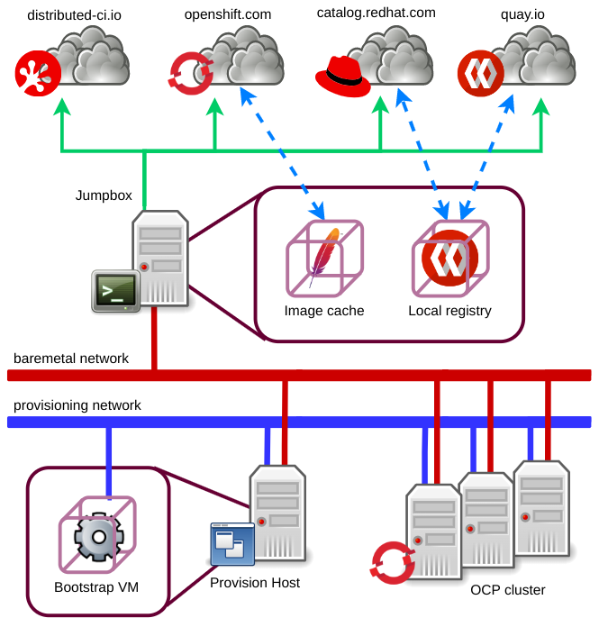

Title: Disconnected Environments: Overview
Date: 2023-04-15 10:00
Category: overview
Tags: partners, topology, disconnected, restricted
Slug: disconnected-environments-overview
Author: Nacho Silla
Github: nsilla
Summary: In introduction to DCI labs implementation of disconnected environments.

A use case for the Red Hat OpenShift Container Platform (OCP) often seen in Telco networks is the Disconnected Environment.

In this scenario, the cluster nodes are located in a restricted network and thus, don't have any access to the internet, which limits the capability of the Installer Provisioned Infrastructure (IPI) installer to have the cluster nodes and the provision host downloading resources such as boot images and containers.

This is the first of a couple of articles which describe how the Red Hat Distributed CI (DCI) solution overcomes the problems associated to working with disconnected environments. Here we will provide an overview of the problem and the solution, while in the coming article we'll describe the exact process to have a DCI lab reproducing such environments.

## A clarification first

The DCI solution, as a continuous integration framework is able to expose the OCP cluster under test to a restricted network as described above, so access to the internet would not be available either for downloading resources or serving any URL. However, this disconnection does not apply to the DCI agent and the host it runs from (jumpbox) themselves, which still need internet access in order to update the jobs status in the DCI control panel, as well as to manage the target versions and make them available (download and serve) to the disconnected cluster. As a result, the DCI OpenShift Agent will be able to automatically set up the resources and conditions in the lab that would be required to be manually set up on a restricted production environment.

In the following section you have a diagram which depicts the topology of such network solution.

## Topology of the disconnected environment

In the diagram above we observe the main elements relevant to a disconnected environment.

In the restricted zone we have the OCP cluster nodes and the provision host which is used to run the IPI installation resources.

These hosts are connected to both, the baremetal and the provisioning networks, where the provisioning network is only used during the boot up of the cluster nodes and the initial installation phases, and the baremetal network is the one carrying the cluster control and data traffic.

In the DMZ we have the jumpbox which, besides acting as the Ansible controller and a SSH landing host, will host an Apache web server instance and a Quay registry instance in order to serve, respectively, the boot and container images to the cluster nodes.

Therefore, the jumbpox is connected to the baremetal network in order to have access to/from the restricted nodes and to the internet so:

- The DCI agents can connect to the DCI control server to update the jobs status and download information such as that of components.

- The boot images can be mirrored from the OpenShift developers portal.

- The operator and other container images can be mirrored from the Red Hat registry, Quay.io and other public registries.

Finally, SSH access to the jumpbox must be available for remote users to operate it, as well as to be able to jump to the cluster nodes and the provision host.

## How does DCI implement disconnected environments

All the infrastructure described so far, including the hosts, network setup and services must be provisioned in advance of starting using the DCI agents. However, we have some of these tasks automated for your convenience in the [dci-lab-setup ansible resources](https://github.com/dci-labs/dci-lab-setup).

Then, information such as the URL and paths to the web server and registry must be exposed to the DCI agents from the inventory file. We'll elaborate on this in the coming article but, for now, let's advance that the first variable the dci-openshift-agent needs to be fed with is the "dci_disconnected" variable which, when set to "true", triggers all the disconnected environment logic.

This entails:

### 1. Forging a custom pull-secret

In regular deployments a default pull-secret file which grants access to the subscription based public registries is downloaded from the OpenShift portal and made avaialable to the OCP installer and cluster to download container images.

In a Disconnected Environment setup, the role of the public registries is replaced by the local image registry and a custom pull-secret must be created to grant access to its resources.

### 2. Mirroring the OCP release

OCP installation resources are shipped within a special container image referred to as the OCP release.

When running a Disconnected Environment job we have to:

    1. Extract the OCP tool binaries and make them available to the provision host through the local cache service.

    2. Download disk images associated to the target version and serve them through the local cache. This includes images such as the bootstrap VM boot image and the cluster nodes Red Hat CoreOS images.

    3. Mirror the ocp release container image into the local registry and prepare a custom ImageContentSourcePolicy for the installer.

### 3. Set a custom ImageContentSourcePolicy

Besides the OCP release ImageContentSourcePolicy, any operator selected to be installed must be mirrored into the local image registry service and the cluster must be instructed to use this as the source for the operator images.

### 4. Install the cluster

This is done by using the resources that were previously mirrored into the local web cache and registry services.

### 5. Create a custom catalog and push it into the local registry

In this stage a catalog is built which only contains references to the operators we wish to have installed in the cluster for the current DCI job.

Once the catalog is built, it's pushed to the local registry and the required operator images are mirrored so the cluster may pull them.

### 6. Update the catalog source information

For the cluster to install the operators from our local registry, we must disable the default catalog sources and create a custom one resolving to the catalog source we just created.

### 7. Deploy the operators

The final step would be installing the operators we requested to the DCI Agent which it previously made available to the cluster in the steps above.

## Last words

So, wrapping up, DCI for OpenShift does support disconnected environments in the form of labs where the cluster nodes (and the provision host for IPI installations) are placed in a restricted network and the jumpbox acts as the DMZ component, so the DCI agents can retrieve the resources needed from the internet and make them available to the restricted nodes in an automated way.

For this to work, some preliminary steps are needed, like provisioning a web server and container image registry to mirror the internet resources. We can either run this actions manually, or resort to the dci-lab-setup ansible automation.

This article gave us a general overview on how we approach disconnected environments from the DCI stand point. In a future post, we'll guide you through the process of configuring and running your DCI jobs to deploy a cluster in a Disconnected Environment.

## *References*

- [1] [Installing a user-provisioned bare metal cluster on a restricted network](https://docs.openshift.com/container-platform/4.12/installing/installing_bare_metal/installing-restricted-networks-bare-metal.html)