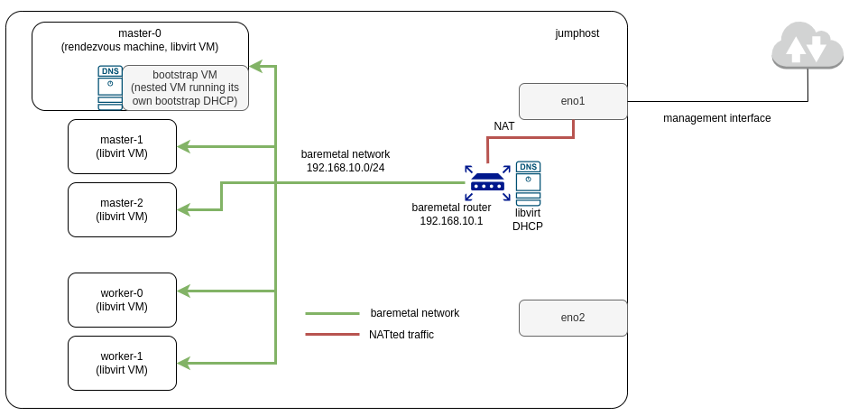

Title: Addressing Challenges in Transitioning from IPI to ABI Installation
Date: 2024-06-25 10:00
Category: how-to
Tags: partners, libvirt, openshift, assisted, baremetal
Slug: from-ipi-to-abi
Author: Ramon Perez, Bill Peck, Tatiana Krishtop
Github: tkrishtop
Summary: In this post, we share how to deploy an entire Openshift Container Platform (OCP) cluster on a single baremetal server using the Assisted - Agent Based Installer (ABI) in a virtual environment with Libvirt VMs nodes. We highlight the benefits of ABI installation compared to the Installer Provisioner Infrastructure (IPI) installation that was our de-facto method.

[TOC]

# Our resources

We operate within the private lab of our Telco partner. This test environment is focused on conducting Red Hat certifications, optimizing our Telco partner's software for cloud-native environments, performing custom partner functionalities, and SR-IOV-related testing. The lab is a compact deployment, having as host a single large baremetal server with the following specifications: Intel 96 vCPU (Intel(R) Xeon(R) Gold 6248R CPU @ 3.00GHz), 376GB total RAM, 1.8 TB disk space.

# Previous Lab Setup with IPI and Motivation to Move to ABI

For about a year, we employed a two-step process using IPI to deploy OCP in the lab:

1. First, we generated the inventory using our [homemade Ansible playbook](https://github.com/redhat-cip/dci-openshift-agent/tree/master/samples/ocp_on_libvirt), configuring Libvirt VMs for workers and master nodes, along with two virtual networks: baremetal and provisioning.

2. Next, we used the IPI installer to deploy OCP on top of this setup.

However, the IPI setup lacks flexibility when it comes to specific network configurations. In our case, we needed to directly integrate SR-IOV VF configuration into the Libvirt VM node's dumpxml template, to make this interface available for a pod later on. During the cluster installation on top of virtual infrastructure, our IPI automation resets both provisioning and baremetal network (here’s [an example](https://github.com/redhatci/ansible-collection-redhatci-ocp/blob/main/roles/node_prep/tasks/40_bridge.yml) where baremetal network is restarted). This resulted in the loss of our SR-IOV configuration on the node VM, necessitating its manual re-application on the OpenShift node after installation. That required all nodes to be rebooted one by one and it took about 40 additional minutes to apply our relatively straightforward configuration to add a Virtual Function (VF) interface.

For ABI, the networking is more flexible and simpler, allowing for a custom baremetal network that ensures cluster connectivity later on. This network remains untouched during the installation, and that allows us to maintain our SR-IOV VF setup without having to reapply it, avoiding the 40-minute node reboots.

# Desired Configuration

For the ABI deployment, we used Distributed-CI, following [the documentation to run Assisted Installer installation](https://docs.distributed-ci.io/dci-openshift-agent/docs/a-i/). This new deployment allows us to mix virtual and baremetal more easily. Unlike IPI, Assisted deployments eliminate the need for a provisioning server and network, consolidating this functionality into a rendez-vous master node.

We supported our deployment process with [the assisted_on_libvirt sample available in the dci-openshift-agent code](https://github.com/redhat-cip/dci-openshift-agent/tree/master/samples/assisted_on_libvirt), which automates the generation of the inventory required for the ABI installation. We generated a base inventory from this template and made modifications as needed.
Our desired scenario included 3 control plane nodes, 2 data plane nodes, and a network to serve the running cluster.

*Fig. 1. Desired Configuration.*

To replicate this deployment in your environment, you can rely on the official documentation and [a helpful blog post](https://blog.distributed-ci.io/ocp-assisted-libirt-quick-start.html) that outlines the main prerequisites for running the Assisted Installer.

# Deployment Process

The deployment process was challenging and took us about two weeks to achieve a working setup. Let's go through some of the deployment steps and the challenges we faced.

## DHCP Traffic isolation

In the past, when launching IPI installation, we encountered a confusing situation where the DHCP was not isolated from outside, making the production machines on the same network as our test machine undiscoverable. This required us to set up the network configuration using a NAT bridge.

So, this time, we learned our lesson and accounted for the need for a NAT bridge again. This option was not available out-of-the-box (the only networking mode available in the ABI automation at that time was the bridged networking mode, which did not fit in our case since the host network interfaces could not be modified in any case), so [we had to add the NAT networking mode to the Assisted deployment automation](https://github.com/redhatci/ansible-collection-redhatci-ocp/pull/92/files) to ensure that VMs could access external networks while being isolated from direct external access.

With this configuration, not only the virtual networks in NAT mode were created, but also some DNSmasq configuration was generated on the fly and applied to achieve the desired scenario. For this to work, we needed to disable the automatic creation of the DNSmasq config made by Libvirt, just to rely on the steps defined in the Assisted automation to customize it.

A recurring issue during troubleshooting was that early failures in the Assisted deployment left incomplete setups of the hanging DNSmasq configuration. This caused DNS conflicts in subsequent deployments. Therefore, cleaning up these network resources was necessary to make progress with new deployments.

## Web-store and Conflicting Ports

ABI deployment requires the onboarding of some services that are provided as containers running in the server. For example:

- HTTP server to serve images to be consumed during the installation process.

- Assisted service.

- Sushy tools service.

What happened to us is that these services were bound to some default ports that, in our case, were already used by other services running on the server. In consequence, the Assisted automation was changed to allow the provision of these ports, allowing the services to listen in specific ports if required. And also, firewall-cmd rules were needed to open these ports to allow traffic.

## Adapt the partition layout according to ABI needs

The installation of ABI requires enough disk space in the file system to deal with the installation process with a successful result. Some of the tasks that are impacted by storage are the following:

- Creation of virtual disks used by each virtual machine.

- Provision of the Libvirt images used for the cluster nodes.

- Bootstrap process that runs in the rendezvous machine.

When transitioning to ABI, we discovered that our previous configuration of `home 1700 GB, root 70 GB` was no longer viable. This is because the ABI automation is using the default libvirt storage for VM disks in the root partition rather than the user's home directory, making 70 GB insufficient. We had to resize our partitions, transferring 950 GB from home to root, and resulting in a configuration of `home 950 GB, root 830 GB`. This adjustment enabled us to spawn the following inventory:

    | Machine                 | RAM           | vCPU         | Disk space  |
    | ----------------------- | ------------- | ------------ | ----------- |
    | jumphost RHEL 8.7       | 16G RAM       | 4 vCPU       | 250G        |
    |                         |               |              |             |
    | master-0 (rendezvous)   | 16G RAM       | 8 vCPU       | 50G         |
    | master-1                | 16G RAM       | 8 vCPU       | 50G         |
    | master-2                | 16G RAM       | 8 vCPU       | 50G         |
    | worker-0                | 148G RAM      | 30 vCPU      | 250G        |
    | worker-1                | 148G RAM      | 30 vCPU      | 250G        |

## Hidden Issue with Bootstrap of the DHCP on Rendezvous Machine

This last issue was tricky to debug. Although the installation passed the bootstrap phase, it remained stuck on "Wait for install complete" and never finished. Multiple re-runs didn’t resolve the situation.

### Investigation

The SSH connection to our rendezvous machine `core@dciokd-master-0` worked fine, and `journalctl` logs showed that the `agent.service` booted without any issues or errors. Additionally, the agent itself was running among other processes.

### Discovery of the Root Cause

We discovered an error indicating that there was no HTTP connection from the rendezvous machine to the cluster's API:

        level=error msg=Attempted to gather ClusterOperator status after wait failure:
        Listing ClusterOperator objects:
        Get "https://api.cluster.perf.keysight.lab:6443/apis/config.openshift.io/v1/clusteroperators":
        dial tcp 192.168.10.5:6443: connect: no route to host

We confirmed this issue by sending a simple curl request:

        [core@dciokd-master-0 ~]$ curl https://192.168.10.5:6443/
        curl: (7) Failed to connect to 192.168.10.5 port 6443: No route to host

### Resolution

Finally, it turned out that the bootstrap DHCP needed for the nodes to communicate with each other was not running due to insufficient disk space on the rendezvous machine. Surprisingly, 50GB was not enough. Increasing the disk space from 50GB to 120GB for masters resulted in a successful installation.

# Conclusion

To wrap up, here are the benefits we’ve got from transitioning from IPI to ABI installation:

- Achieved a more flexible and stable network setup.

- Eliminated the need for an extra provisioning VM and network.

- Realized the importance of correct storage distribution; ABI revealed partition issues hidden by IPI.

- Now rely on an officially supported Red Hat installation, as IPI on Libvirt is no longer supported.

- Another aspect we appreciate about the Assisted Installer process is its enhanced diagnostic capability, making it easier to pinpoint why an installation didn't complete. This simplifies the overall experience compared to IPI.

This allowed us to reach this final node inventory setup, leaving it here as a reference in case you need to replicate it in a similar testing environment:

    | Machine                 | RAM           | vCPU         | Disk space  |
    | ----------------------- | ------------- | ------------ | ----------- |
    | jumphost RHEL 8.7       | 16G RAM       | 4 vCPU       | 250G        |
    |                         |               |              |             |
    | master-0 (rendezvous)   | 16G RAM       | 8 vCPU       | 120G        |
    | master-1                | 16G RAM       | 8 vCPU       | 120G        |
    | master-2                | 16G RAM       | 8 vCPU       | 120G        |
    | worker-0                | 148G RAM      | 30 vCPU      | 250G        |
    | worker-1                | 148G RAM      | 30 vCPU      | 250G        |
    |                         |               |              |             |
    | total                   | 360G RAM      | 88 vCPU      | 1.1T        |

To conclude, while the ABI deployment makes OCP installation more straightforward, we thought it was important to share the issues that arose along the way. From creating a production disaster to spending several late nights desperately trying to figure out why the bootstrap DHCP wasn't booting, we had a lot of fun during the process, and we hope you found it amusing to read about our experiences.

# References

Gathering here all the references quotes in the blog post related to Assisted Installation, so that you can take a look at them from a single source:

- [Distributed-CI Documentation: Assisted Installer Based Installation](https://docs.distributed-ci.io/dci-openshift-agent/docs/a-i/)

- [DCI Blog Post: OCP Assisted Install on Libvirt](https://blog.distributed-ci.io/ocp-assisted-libirt-quick-start.html)

- [dci-openshift-agent sample code: assisted_on_libvirt](https://github.com/redhat-cip/dci-openshift-agent/tree/master/samples/assisted_on_libvirt)
