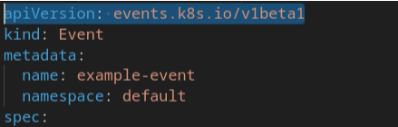
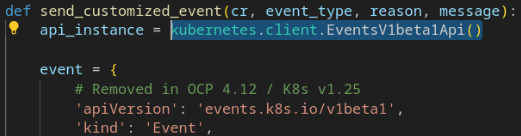
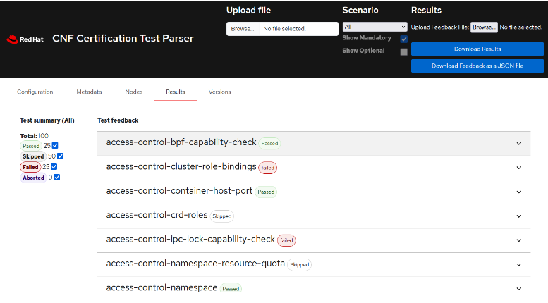
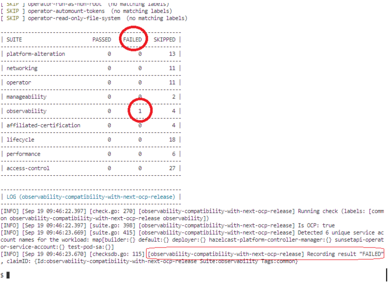
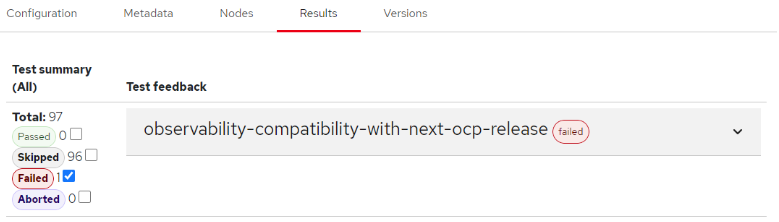
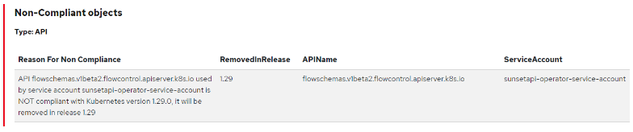

Title: Detecting To-Be-Removed APIs for Kubernetes Upgrade Readiness with Red Hat Best Practices Certification for k8s
Date: 2024-09-25 10:00
Category: how-to
Tags: partners, certsuite, openshift, upgrade
Slug: detecting-to-be-removed-apis-with-cnf
Author: Tatiana Krishtop, Gonzalo Reyero Ferreras
Github: tkrishtop
Summary: As Kubernetes continues to evolve, new features are introduced while older, deprecated APIs are phased out. This cycle ensures the platform remains cutting-edge, but it also presents a significant challenge during upgrades, especially for applications relying on deprecated APIs. In this post, we'll discuss Kubernetes upgrade readiness, the complexities of API deprecation, and how we can detect soon-to-be-removed APIs—both statically and dynamically invoked—using Red Hat Best Practices Certification for k8s.

[TOC]

# Understanding Kubernetes API Deprecation

Kubernetes follows a defined API versioning scheme:

- Alpha Versions (e.g., v1alpha1, v2alpha1): Unstable and may lose backward compatibility or disappear in future versions.
- Beta Versions (e.g., v1beta1, v2beta1): More stable but still deprecated over several releases.
- GA (Generally Available) Versions (e.g., v1, v2): Stable and long-lasting, but even these can eventually be deprecated.

As Kubernetes evolves, we see significant API deprecations. For example, major version updates in Kubernetes 1.25 removed many v1beta1 and v2beta1 APIs that had been stable but deprecated over time. Such changes create challenges for application maintainers, as workloads that survived earlier migrations might break when running on a newly upgraded cluster.

# Static vs. Dynamic API Invocation

There are two primary ways Kubernetes APIs are invoked:

- Static Invocation: Directly through manifest files, such as deployments, StatefulSets, or custom resource definitions.

- Dynamic Invocation: Through Kubernetes client libraries or custom scripts that call Kubernetes APIs at runtime, such as custom resource controllers, CI/CD pipelines, or dynamic configuration management tools. 

While static invocations are relatively easy to track and analyze, dynamic API invocations pose a greater challenge because they only manifest at runtime. For example, custom controllers, automation scripts, or logging agents may call APIs that have been deprecated—these errors often surface as "Not Found" without clear details.

# Problem: How to Detect Soon-to-Be-Deprecated APIs?

When preparing for a Kubernetes upgrade, detecting deprecated APIs is crucial for both static and dynamic invocations. While tools exist to handle statically invoked APIs, dynamic invocations have often been neglected, leading to runtime failures that jeopardize upgrade readiness.

# Existing Solutions for Detecting Deprecated APIs

Several tools are available for detecting deprecated static APIs by checking manifests:

- [Kube No Trouble (2020)](https://github.com/doitintl/kube-no-trouble): Scans deployed manifests against a list of deprecated APIs.
- [Kubernetes Deprecated API Versions Exporter (2022)](https://github.com/wayfair-incubator/kdave): Identifies deprecated API versions in Helm releases.
- [Popeye (2019)](https://github.com/derailed/popeye/blob/d09ec25f3834d2c6a171486b9726b0a91793e3f0/change_logs/release_v0.4.0.md?plain=1#L86-L103): Detects deprecated APIs in manifests and configurations.
- [Pluto by Fairwinds (2020)](https://github.com/FairwindsOps/pluto): Scans manifests and Helm charts for deprecated APIs.

These tools, however, focus on static API invocations and don’t address dynamic API usage.

# APIRequestCounts: A Game-Changer for Dynamic APIs

To detect dynamically invoked deprecated APIs, we turn to [APIRequestCount](https://github.com/openshift/cluster-kube-apiserver-operator/blob/master/bindata/assets/kube-apiserver/apiserver.openshift.io_apirequestcount.yaml), an object introduced in OpenShift 4.9 that tracks API server usage and provides insights when an API will be removed through [status.removedInRelease](https://github.com/openshift/cluster-kube-apiserver-operator/blob/master/bindata/assets/kube-apiserver/apiserver.openshift.io_apirequestcount.yaml#L19-L20) field of APIRequestCount. It monitors requests made to the API server and identifies deprecated versions tracking alpha and beta API versions.
Though native to OpenShift, APIRequestCount can be used in Kubernetes clusters running Kubernetes 1.22+ by installing the necessary [CRD and CR](https://github.com/openshift/cluster-kube-apiserver-operator/blob/master/bindata/assets/kube-apiserver/apiserver.openshift.io_apirequestcount.yaml).

# Understanding Red Hat's Best Practices Test Suite for Kubernetes 

The "Red Hat's Best Practices Test Suite for Kubernetes", or simply “certsuite”, is a Golang application that runs a set of checks (test-cases) on workloads that have been deployed in OpenShift clusters, although most of the checks also apply to vanilla Kubernetes deployments.

Every check comes from a requirement that is defined in the [guide](https://redhat-best-practices-for-k8s.github.io/guide) and the goal of all these requirements is to make sure that the workload is deployed in a secure and robust way from a cloud-native perspective. Some of them just check the existence and/or validity of workload's resources configuration fields, while other may perform some disruptive/intrusive actions like scale up/down the number of replicas of the deployments/statefulsets to make sure the workload is well designed to allow pod evictions and rescheduling due to eventual node failures or maintenance works.

There’s even a set of checks that will inspect each workload’s running container to make sure their running apps abide by certain run-time best practices like having only one process per container or making sure that all the listening tcp/udp ports have been previously declared in the pod’s manifest.

The certsuite app deploys a helper daemonset called “probe”, which has cluster-wide access and runs in privileged mode. Its pods have each node’s root filesystem mounted in a folder called “/host”. These pods allow some test-cases to perform a lot of these runtime checks.

Checks are organized in groups (test-suites), where every group is aimed at a similar type of requirements. The list of current checks and groups can be found in the [catalog](https://github.com/redhat-best-practices-for-k8s/certsuite/blob/main/CATALOG.md).

The certsuite app can run on any GNU/Linux host as long as it has access to the cluster where the workload under test is already deployed, and it only requires the cluster's kubeconfig file path and a [custom yaml config file](https://github.com/redhat-best-practices-for-k8s/certsuite/blob/main/config/certsuite_config.yml) to run.

When the certsuite app finishes, it creates a “tar.gz” file containing the claim file (claim.json) with both the results and a lot of the run context (configuration, resource manifests…). Since the content of claim.json can be quite big and difficult to read, there’s also a “parser” HTML web page inside the “tar.gz” that can parse it to show the relevant parts in a more friendly way.

## Usage

The latest precompiled official release can be downloaded from Github [here](https://github.com/redhat-best-practices-for-k8s/certsuite/releases). Alternatively, the latest container image can also be found in the [official quay repo](https://quay.io/repository/redhat-best-practices-for-k8s/certsuite). 

## Configuration

The certsuite app needs a [configuration yaml](https://github.com/redhat-best-practices-for-k8s/certsuite/blob/main/config/certsuite_config.yml) whose local path must be passed as a cli flag. In order for the app to find the workload under test, there’s two important configuration fields that need to be filled in that file:

- [podsUnderTestLabels](https://github.com/redhat-best-practices-for-k8s/certsuite/blob/a0c63de932d5509683b120eda88310e57d5c0dad/config/certsuite_config.yml#L3): list of pod labels
- [targetNameSpaces](https://github.com/redhat-best-practices-for-k8s/certsuite/blob/a0c63de932d5509683b120eda88310e57d5c0dad/config/certsuite_config.yml#L5): list of namespaces where the workload’s resources (pods, deployments, operators…) are deployed.

The app will list all the pods in “targetNameSpaces” and will run the checks on those that have at least one of the labels defined in “podsUnderTestLabels”.

If “podsUnderTestLabels” doesn’t exist, all the resources found in “targetNameSpaces” will be checked.

## Run the Certification Suite app

Assuming the certsuite_config.yaml file is already created, this is the fastest way to run all the checks:

        ./certsuite run \
        --kubeconfig path/to/kubeconfig \
        --config-file path/to/certsuite_config.yml \
        --label-filter=all

The cli flag "--label-filter" allows you to select the checks to run. Usually, you want to run all of them. But, in case someone fails, once the “offending” workload resource has been fixed, it’s possible to run the failing test case only in order to make sure that it now passes, saving a lot of time as the rest of the checks will be skipped. E.g.:

        ./certsuite run \
        --kubeconfig path/to/kubeconfig \
        --config-file path/to/certsuite_config.yml \
        --label-filter=access-control-ipc-lock-capability-check

By default, if no “--output-dir” flag is provided (as in the previous examples), a folder called “results” is created in the current directory. The certsuite will create the claim.json file, along with a certsuite.log file and a “tar.gz” containing the parser web page.

        $ ls -la results/
        total 4964
        drwxr-xr-x 2 user1 user1      92 Sep 18 15:45 .
        drwxr-xr-x 3 user1 user1      38 Sep 18 15:45 ..
        -rw-r--r-- 1 user1 user1  836939 Sep 18 15:45 20240918-154551-cnf-test-results.tar.gz
        -rw-r--r-- 1 user1 user1   60180 Sep 18 15:45 certsuite.log
        -rw-r--r-- 1 user1 user1 4178999 Sep 18 15:45 claim.json

        $ tar tf results/20240918-154551-cnf-test-results.tar.gz 
        claim.json
        claimjson.js
        results.html
        certsuite.log

The parser web page (results.html) needs the claimjson.js file (which is just a JavaScript var with the whole claim.json content) and it can be used to check the results, the configuration, and the resources under test. It can be opened in any browser, and it looks like this:

# Certsuite: Using APIRequestCounts to Detect Deprecated APIs

The Red Hat Best Practices Certification for k8s tool also provides a robust solution to detect deprecated APIs, both static and dynamic, by leveraging the APIRequestCount object.

Here is how it works:

- Connect to the Kubernetes or OpenShift cluster where the application workload is running with a clientset.
- Use the public APIRequestCount type.
- Filter APIs based on the status.removedInRelease field to identify those that will soon be deprecated and keep only ones using the workload service accounts.
- Evaluate workload’s API compliance with the next Kubernetes version.
- Output results in claims.json, providing detailed feedback about to-be-deprecated APIs compatibility.

# Detecting usage of APIs that are deprecated in the next Kubernetes release using the Certsuite

Let's use the certsuite to check if the [SunsetAPI-operator](https://github.com/redhatci/sunsetapi-operator) uses deprecated APIs when deployed in an OpenShift 4.15 cluster. This fake operator is designed to use APIs that are known to be deprecated in the next Kubernetes release. It dynamically invokes flowschemas.v1beta2.flowcontrol.apiserver.k8s.io API, deprecated in OpenShift 4.16. We'll use it to test whether the certsuite can detect these deprecated APIs. 

## Installation of the SunsetAPI operator

To install the operator, first you need to checkout the [repo](https://github.com/redhatci/sunsetapi-operator), then run “make deploy-all”. The operator will be deployed in the default namespace.

For the certsuite to detect the SunsetAPI operator's pod, label the pod and include the "default" namespace in the certsuite [config file](https://github.com/redhatci/sunsetapi-operator/blob/main/best_practices_for_k8s/config/tnf_config.yml).

        ---
        targetNameSpaces:
        - name: default

        podsUnderTestLabels:
        - "name: sunsetapi-operator"

        operatorsUnderTestLabels:
        - "name: sunsetapi-operator"

## Running the certsuite

Now, assuming that the KUBECONFIG env var points the the cluster’s kubeconfig file, you can run the test-case with this command:

        certsuite-v5.3.3 run \
        --label-filter 'observability' \
        --config-file best_practices_for_k8s/config/tnf_config.yml \
        --kubeconfig= ~/.kube/config \
        --output-dir best_practices_for_k8s/results

The output will show all the test-cases being skipped except the “observability-compatibility-with-next-ocp-release” which shows as “failed”.

The web parser is stored in the “tar.gz” in the results folder:

        $ ls -la results/
        total 18668
        drwxr-xr-x  2 user1 user1       92 Sep 19 10:00 .
        drwxr-xr-x 10 user1 user1     4096 Sep 19 09:44 ..
        -rw-r--r--  1 user1 user1  2950943 Sep 19 09:46 20240919-094624-cnf-test-results.tar.gz
        -rw-r--r--  1 user1 user1    53663 Sep 19 09:46 certsuite.log
        -rw-r--r--  1 user1 user1 16098401 Sep 19 09:46 claim.json

Then, we need to extract the “tar.gz” content and open the parser.html file with any browser. When clicking in the “Results” tab, you can see there’s only one test case that did run (and failed). The others are skipped.

Then, expanding the check result, and scrolling down, we can see why it failed:

As it can be seen in the column “Reason For Non Compliance”, there’s an application bound to the workload’s serviceaccount “sunsetapi-operator-service-account” that has made use of the API “flowschemas.v1beta2.flowcontrol.apiserver.k8s.io” that is deprecated in Kubernetes v1.29.
Under the hood, the check “observability-compatibility-with-next-ocp-release” lists all the [APIRequestCount](https://docs.google.com/document/d/1L5j75HABcFHZ-aP4MOAS-m_-LxbO_ok8Q3AQiVSO1JU/edit#heading=h.krrwnwbnosce) cluster resources and looks for deprecated APIs that were used by any workload’s ServiceAccount. If the API is flagged to be removed in the next release, the test case fails.

# Conclusion

Kubernetes upgrade readiness is vital to maintaining a healthy, stable production environment. Detecting soon-to-be-removed APIs—both statically and dynamically invoked—before they cause issues is key to a successful migration.

While existing tools focus on static invocations, Red Hat Best Practices Certification for k8s provides a comprehensive solution to detect both static and dynamic API deprecations. That can be useful in planning and executing Kubernetes upgrades.

# Get Involved

We encourage you to try [Red Hat Best Practices Certification for k8s](https://github.com/redhat-best-practices-for-k8s/certsuite) for your own Kubernetes upgrades. It’s open-source, easy to use, and provides invaluable insights into deprecated APIs. Share your feedback with us and help improve Kubernetes upgrade readiness across the community.

# Links
- DevConf 2024 video presentation and pptx: [Detecting To-Be-Removed APIs for Kubernetes Upgrade Readiness]()
- [Red Hat Best Practices Certification for k8s](https://github.com/redhat-best-practices-for-k8s/certsuite)
- [APIRequestCount CRD](https://github.com/openshift/cluster-kube-apiserver-operator/blob/master/bindata/assets/kube-apiserver/apiserver.openshift.io_apirequestcount.yaml)
