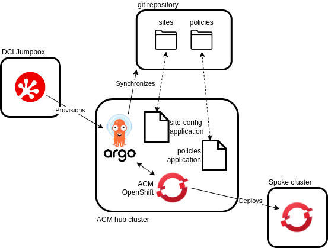
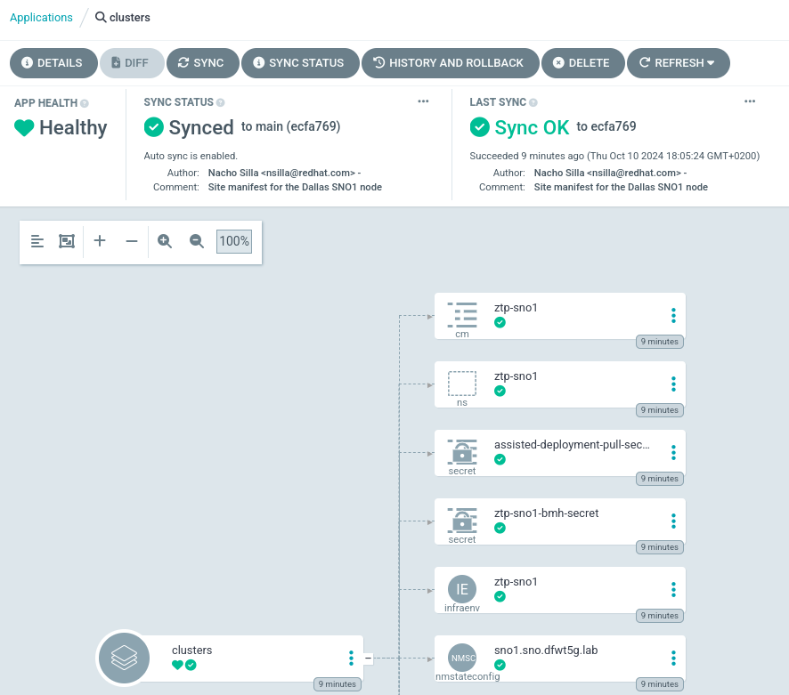
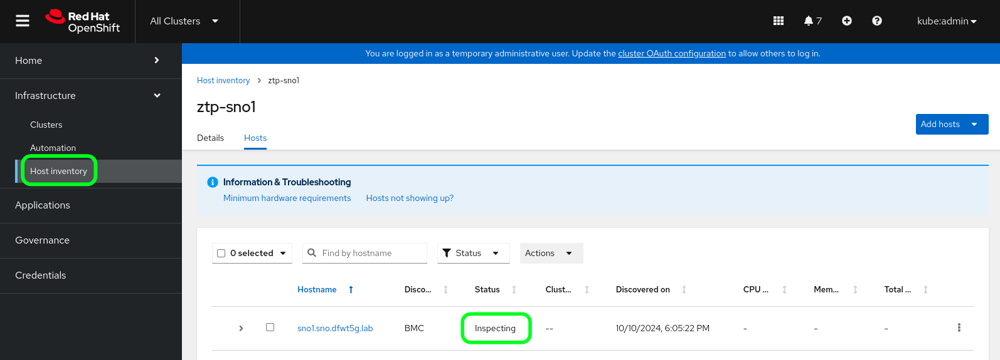
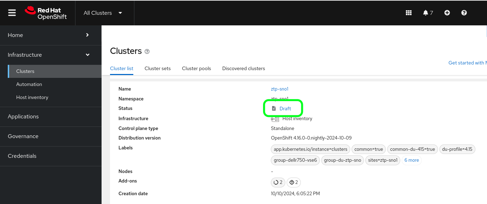
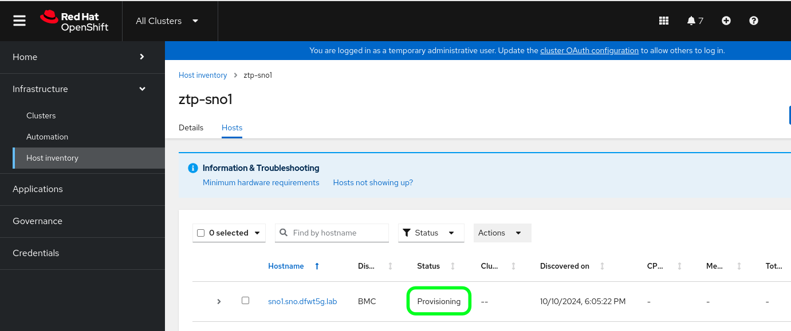
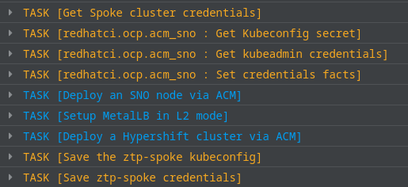
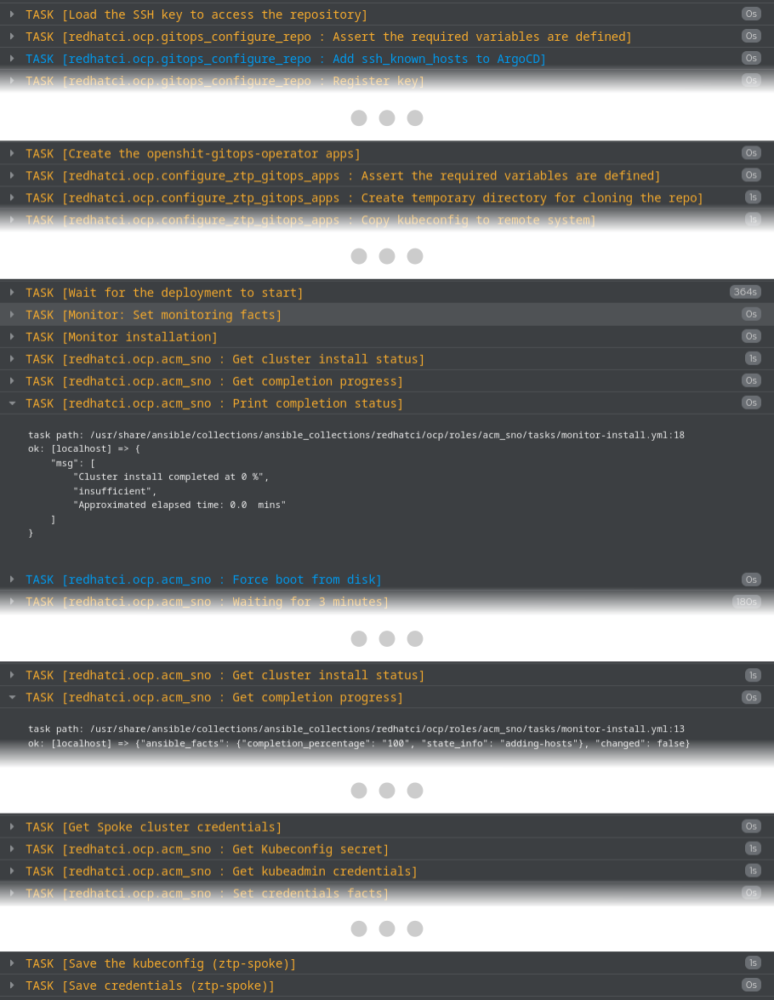

Title: GitOps-ZTP OCP deployments with DCI
Date: 2024-10-23 10:00
Category: divulgation
Tags: dci, dci-openshift-agent, dci-pipeline, gitops, ztp
Slug: gitops-ztp-with-dci
Author: Nacho Silla
Github: nsilla
Summary: One of the OCP deployment use cases getting more attention lately is the GitOps-ZTP. This article describes how to use DCI to deploy an OCP cluster following this methodology.

[TOC]

# Introduction

The Telco Partner CI team recently added support for the DCI OpenShift Agent to deploy OCP clusters following the GitOps based ZTP methodology.

GitOps defines a methodology where changes in a system configuration are managed and centralized through a Git repository. This allows leveraging some version control practices like code reviewing and rolling back.

Zero-touch Provisioning (ZTP) describes a process to remotely provision network elements, usually at a large scale, without having to manually configure each and every one of them.

In the context of OpenShift, deployments are treated as configuration objects through the Red Hat Advanced Cluster Manager (ACM).

The configuration objects can be defined as code manifests and stored in a Git repository.

The linking part between the cluster deployment manifests and the ACM configuration objects is the OpenShift GitOps Operator which synchronizes and pulls the cluster deployment manifests from the Git repository, processes them and provisions the ACM with the required configuration objects, thus triggering the deployment of the spoke cluster.

# Procedure overview

From a high level perspective, the procedure is as follows:

We first have to create a Git repository with a directory containing the ZTP manifests that describe the target (spoke) cluster settings. The OpenShift GitOps Operator supports different methods of authentication for the repository, so we recommend making the repository private.

For Day 1 operations, a second directory may be created and populated with the policies the ACM must enforce in the spoke cluster, but this is out of this article scope.

Then we will run a DCI OpenShift job set to run a ZTP spoke cluster deployment and fed with the repository details.

The DCI OpenShift Agent takes care of accessing the ACM hub cluster in order to:

- Activate the site generator and multicluster subscription plugins for the GitOps operator.
- Set up the connectivity to the Git repository.
- Create the applications to process the ZTP site configuration and the day 1 policies.

If this configuration is done properly, the operator should detect and parse the manifests in the repository and create the ACM resources.

Among other objects, it will create a Managed cluster instance and the set of (Bare Metal) Hosts comprising the cluster.

The agent will then wait for the spoke cluster installation to start and will enter a loop where it will monitor the installation progress.

If you monitor closely the installation progress described by the DCI log, it remains at 0% for some time. This is so because in the first stage of the installation the ACM must inspect the hosts which is a time consuming task.

During this time, if you log into the ACM console you'll see that the Managed cluster appears in "draft" status because there are no hosts available for the cluster yet.

Once the host inspection completes, will begin to increase and eventually reach 100%.

The last actions taken by the agent will be extracting the spoke cluster credentials and placing them in your local host.

If you're running the agent from a DCI pipeline, you may set it to output the kubeconfig file path so the next stage my directly operate the spoke cluster. In any case, set to leverage the GitOps methodology, the best way would be to operator the cluster by pushing and editing the Day 1 policies in the repository.

# Requirements

As you may guess from the overview above, in order to use DCI to deploy a GitOps-ZTP spoke cluster, your environment must meet the following requirements.

- A jumpbox host installed with the DCI tools.

- An ACM hub cluster, either deployed manually or deployed by the DCI Agent, provisioned and configured to run GitOps ZTP workflows.

- The kubeconfig to the ACM hub cluster must be available in your jumpbox filesystem.

- The credentials to the spoke cluster BMC consoles. For simplicity we recommend that all the consoles use the same credential set.

- Network connectivity from the hub cluster to the spoke cluster.

- A repository containing the Site Config and Policy manifests.

- A private key to access the repository.

# The GitOps Repository

The structure for the GitOps repository is quite simple.

The DCI agent assumes both, the Site Config and the Policy manifests are stored in the same repository, although in different directories.

In our case we recommend a structure like the following:

        gitops-repo
         +-> sites
         |    +-> kustomization.yaml
         |    +-> spoke.yaml
         |    +-> spoke-bmh-secret.yaml
         |    +-> spoke-pull-secret.yaml
         +-> policies
              +-> kustomization.yaml
              +-> host-policies.yaml
              +-> group-policies.yaml

So, we have the two directories, sites and policies, each of them containing a kustomization.yaml and a set of manifests with the site and policy data, respectively.

In the example above, the sites directory contains a Sites-Config manifest for the spoke cluster and the two secrets the hub cluster will need to deploy the spoke. By the time of writing this post, these secrets must be placed in plain in the gitops repository, but we have plans to integrate some secret management with the ZTP workflows.

The kustomization.yaml file will then define the two secret files as resources, and the Site-Config manifest as a generator for the GitOps Operator Sites Generator plugin to process:

        apiVersion: kustomize.config.k8s.io/v1beta1
        kind: Kustomization
        generators:
          - spoke.yaml
        resources:
          - spoke-pull-secret.yaml
          - spoke-bmh-secret.yaml

The Bare Metal Host (BMH) secret contains the credentials to access the host's BMC. Use the following code as an example:

        apiVersion: v1
        kind: Secret
        metadata:
          name: "ztp-spoke-bmh-secret"
          namespace: "ztp-spoke"
        data:
          username: "dXNlcm5hbWUK"
          password: "cGFzc3dvcmQK"
        type: Opaque

Where, as a good practice, we should have a namespace created specifically to host the resource for the spoke cluster. In this example: "ztp-spoke".

By default, creating the namespace is a task taken by the DCI Agent, but it's also possible to include it as a yaml manifest in the sites directory.

Then, the username and password would be the values set to access the host's BMC encoded in base64.

On the other hand, the pull-secret file contains the usual manifest:

        apiVersion: v1
        kind: Secret
        metadata:
          name: assisted-deployment-pull-secret
          namespace: ztp-spoke
        type: kubernetes.io/dockerconfigjson
        data:
          .dockerconfigjson: < base64 pull-secret >

The policies kustomization.yaml file has a similar structure.

It's worth mentioning that all the Site Configs the ACM hub finds in the kustomize manifest in the sites directory will be deployed at once.

You may have different site directories with manifests for all your different environments, for instance, staging and production.

On the other hand, the policy manifests are mapped to the site configs based on the labels assigned to them, so you may have either specific policy directories for each of your environments, or a single one for all of them.

# The pipeline file

The following is an example of a DCI pipeline file you can use to deploy the spoke cluster:

        - name: openshift-ztp-spoke
          stage: ztp-spoke
          ansible_playbook: /usr/share/dci-openshift-agent/dci-openshift-agent.yml
          ansible_cfg: /usr/share/dci-openshift-agent/ansible.cfg
          dci_credentials: /etc/dci-openshift-agent/dci_credentials.yml
          ansible_inventory: /etc/dci-openshift-agent/ztp-spoke-hosts
          configuration: "@QUEUE"
          topic: OCP-4.16
          components:
            - ocp
          ansible_extravars:
            install_type: acm
            acm_cluster_type: ztp-spoke
            hub_kubeconfig_path: /path/to/hub/kubeconfig
            dci_gitops_sites_repo:
              url: git@githost.com:org/spoke-ci-config.git
              path: files/ztp-spoke/sites
              branch: ztp_spoke
              key_path: "/path/to/ssh/private/key"
            dci_gitops_policies_repo:
              url: git@githost.com:org/spoke-ci-config.git
              path: files/ztp-spoke/policies
              branch: ztp_spoke
              key_path: "/path/to/ssh/private/key"

Where the relevant variables are those grouped under the ansible_extravars:

- **install_type: acm :** instructs the DCI agent to run an ACM based installation.
- **acm_cluster_type: ztp-spoke :** the DCI OpenShift Agent supports several ACM based installations. This setting instructs the agent to run the ztp-spoke related code.
- **hub_kubeconfig_path:** this is the path to the hub cluster kubeconfig file. Alternatively, it could be passed over as an output/input from a previous pipeline stage deploying the hub cluster itself.
- **dci_gitops_sites_repo:** it contains the data needed for the GitOps Operator to retrieve the site configs manifests from the Git repository. It requires, at minimum, the URL, path and branch to the manifests, and the SSH private key for the GitOps Operator to authenticate.
- **dci_gitops_policies_repo:** similar to the previous variable, but for the Policy Generator repository.

# Running the deployment

To use the DCI OpenShift Agent to deploy a ZTP spoke cluster just run the dci-pipeline tool over your pipeline manifest file:

        $ dci-pipeline /path/to/ztp-spoke-pipeline.yml

Which will launch a DCI job you may monitor from the [DCI Control Server](https://distributed-ci.io) with a resulting log similar to the following excerpt.

# Wrapping up

With this article we hope we made clear how, with a few configurations, it's easy to have your DCI environment running OpenShift ZTP spoke cluster deployments.

But his is only the tip of the iceberg in terms of how DCI can automate ZTP operations in your testing environments.

Some other use cases we expect to cover soon in this blog portal include Day 1 operations through ZTP policies and deployments in disconnected environments.
